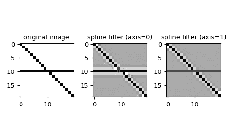

# `scipy.ndimage.spline_filter1d`

> 原始文本：[`docs.scipy.org/doc/scipy-1.12.0/reference/generated/scipy.ndimage.spline_filter1d.html#scipy.ndimage.spline_filter1d`](https://docs.scipy.org/doc/scipy-1.12.0/reference/generated/scipy.ndimage.spline_filter1d.html#scipy.ndimage.spline_filter1d)

```py
scipy.ndimage.spline_filter1d(input, order=3, axis=-1, output=<class 'numpy.float64'>, mode='mirror')
```

沿给定轴计算 1-D 样条滤波器。

沿给定轴的数组行通过样条滤波器进行滤波。样条的顺序必须 >= 2 且 <= 5。

参数：

**input**array_like

输入数组。

**order**int，可选

样条的顺序，默认为 3。

**axis**int，可选

应用样条滤波器的轴。默认为最后一个轴。

**output**ndarray 或 dtype，可选

放置输出的数组或返回数组的 dtype。默认为`numpy.float64`。

**mode**{‘reflect’, ‘grid-mirror’, ‘constant’, ‘grid-constant’, ‘nearest’, ‘mirror’, ‘grid-wrap’, ‘wrap’}，可选

*mode* 参数决定了如何扩展输入数组超出其边界。默认为‘mirror’。每个有效值的行为如下（请参见边界模式上的附加图和详细信息）：

‘reflect’（*d c b a | a b c d | d c b a*）

输入通过反射最后一个像素的边缘来扩展。这种模式有时也称为半样本对称。

‘grid-mirror’

这是‘reflect’的同义词。

‘constant’（*k k k k | a b c d | k k k k*）

通过使用由 *cval* 参数定义的相同常量值填充超出边缘的所有值来扩展输入。超出输入边缘不执行插值。

‘grid-constant’（*k k k k | a b c d | k k k k*）

通过使用由 *cval* 参数定义的相同常量值填充超出边缘的所有值来扩展输入。对于超出输入范围的样本也进行插值。

‘nearest’（*a a a a | a b c d | d d d d*）

通过复制最后一个像素来扩展输入。

‘mirror’（*d c b | a b c d | c b a*）

输入通过反射最后一个像素的中心来扩展。这种模式有时也称为全样本对称。

‘grid-wrap’（*a b c d | a b c d | a b c d*）

输入通过环绕到相对边缘来扩展。

‘wrap’（*d b c d | a b c d | b c a b*）

输入通过环绕到相对边缘，但在最后点和初始点完全重叠的方式扩展。在这种情况下，不确定在重叠点将选择哪个样本。

返回：

**spline_filter1d**ndarray

过滤后的输入。

参见

[`spline_filter`](https://docs.scipy.org/doc/scipy-1.12.0/reference/generated/scipy.ndimage.spline_filter1d.html#scipy.ndimage.spline_filter "scipy.ndimage.spline_filter")

多维样条滤波器。

注释

*ndimage*中的所有插值函数都对输入图像进行样条插值。如果使用*阶数 > 1*的 B 样条，则必须先将输入图像值转换为 B 样条系数，这是通过依次沿输入的所有轴应用此 1-D 滤波器来完成的。所有需要 B 样条系数的函数将自动过滤它们的输入，这种行为可以通过*prefilter*关键字参数进行控制。对于接受*mode*参数的函数，仅当结果与滤波时使用的*mode*匹配时，结果才正确。

对于复数*输入*，该函数独立处理实部和虚部。

新功能在版本 1.6.0 中添加：增加了对复数支持。

示例

我们可以沿指定轴使用 1-D 样条滤波来过滤图像：

```py
>>> from scipy.ndimage import spline_filter1d
>>> import numpy as np
>>> import matplotlib.pyplot as plt
>>> orig_img = np.eye(20)  # create an image
>>> orig_img[10, :] = 1.0
>>> sp_filter_axis_0 = spline_filter1d(orig_img, axis=0)
>>> sp_filter_axis_1 = spline_filter1d(orig_img, axis=1)
>>> f, ax = plt.subplots(1, 3, sharex=True)
>>> for ind, data in enumerate([[orig_img, "original image"],
...             [sp_filter_axis_0, "spline filter (axis=0)"],
...             [sp_filter_axis_1, "spline filter (axis=1)"]]):
...     ax[ind].imshow(data[0], cmap='gray_r')
...     ax[ind].set_title(data[1])
>>> plt.tight_layout()
>>> plt.show() 
```


