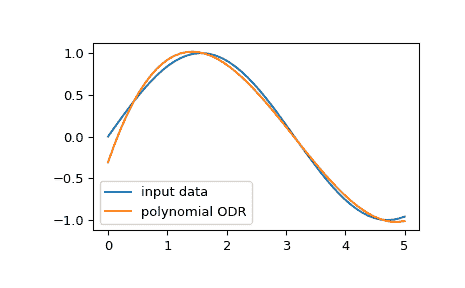

# `scipy.odr.polynomial`

> 原文：[`docs.scipy.org/doc/scipy-1.12.0/reference/generated/scipy.odr.polynomial.html#scipy.odr.polynomial`](https://docs.scipy.org/doc/scipy-1.12.0/reference/generated/scipy.odr.polynomial.html#scipy.odr.polynomial)

```py
scipy.odr.polynomial(order)
```

工厂函数用于创建一个通用的多项式模型。

参数：

**order**整数或序列

如果是一个整数，它将成为要拟合的多项式的阶数。如果是一个数字序列，那么这些数字将是多项式中的显式幂。始终包含一个常数项（幂为 0），因此不要包含 0。因此，polynomial(n)等同于 polynomial(range(1, n+1))。

返回：

**polynomial**模型实例

模型实例。

示例

我们可以使用正交距离回归（ODR）来拟合输入数据，使用一个多项式模型：

```py
>>> import numpy as np
>>> import matplotlib.pyplot as plt
>>> from scipy import odr
>>> x = np.linspace(0.0, 5.0)
>>> y = np.sin(x)
>>> poly_model = odr.polynomial(3)  # using third order polynomial model
>>> data = odr.Data(x, y)
>>> odr_obj = odr.ODR(data, poly_model)
>>> output = odr_obj.run()  # running ODR fitting
>>> poly = np.poly1d(output.beta[::-1])
>>> poly_y = poly(x)
>>> plt.plot(x, y, label="input data")
>>> plt.plot(x, poly_y, label="polynomial ODR")
>>> plt.legend()
>>> plt.show() 
```


