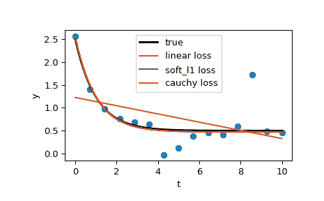

# `scipy.optimize.least_squares`

> 原文链接：[`docs.scipy.org/doc/scipy-1.12.0/reference/generated/scipy.optimize.least_squares.html#scipy.optimize.least_squares`](https://docs.scipy.org/doc/scipy-1.12.0/reference/generated/scipy.optimize.least_squares.html#scipy.optimize.least_squares)

```py
scipy.optimize.least_squares(fun, x0, jac='2-point', bounds=(-inf, inf), method='trf', ftol=1e-08, xtol=1e-08, gtol=1e-08, x_scale=1.0, loss='linear', f_scale=1.0, diff_step=None, tr_solver=None, tr_options={}, jac_sparsity=None, max_nfev=None, verbose=0, args=(), kwargs={})
```

解决带有变量边界的非线性最小二乘问题。

给定残差 f(x)（一个 m-D 实函数的 n 个实变量）和损失函数 rho(s)（一个标量函数），[`least_squares`](https://docs.scipy.org/doc/scipy-1.12.0/reference/generated/scipy.optimize.least_squares.html#scipy.optimize.least_squares "scipy.optimize.least_squares")找到成本函数 F(x)的局部最小值：

```py
minimize F(x) = 0.5 * sum(rho(f_i(x)**2), i = 0, ..., m - 1)
subject to lb <= x <= ub 
```

损失函数 rho(s)的目的是减少离群值对解决方案的影响。

参数：

**fun**可调用

计算残差向量的函数，具有签名`fun(x, *args, **kwargs)`，即最小化将相对于其第一个参数进行。传递给此函数的参数`x`是形状为(n,)的 ndarray（即使对于 n=1，也不是标量）。它必须分配并返回形状为(m,)的 1-D 数组或标量。如果参数`x`是复数或函数`fun`返回复数残差，则必须将其包装在实数参数的实函数中，如示例部分的最后所示。

**x0**array_like，形状为(n,)或 float

独立变量的初始猜测。如果是 float，它将被视为具有一个元素的 1-D 数组。当*method*为‘trf’时，初始猜测可能会被略微调整，以确保足够位于给定的*bounds*内。

**jac**{‘2-point’, ‘3-point’, ‘cs’, callable}，可选

计算雅可比矩阵的方法（一个 m×n 矩阵，其中元素(i, j)是 f[i]关于 x[j]的偏导数）。关键字选择了用于数值估计的有限差分方案。方案“3-point”更精确，但需要两倍的操作量比“2-point”（默认）多。方案“cs”使用复步长，虽然可能是最精确的，但仅当*fun*正确处理复数输入并且能在复平面上解析延续时适用。方法“lm”始终使用“2-point”方案。如果可调用，则用作`jac(x, *args, **kwargs)`，应返回雅可比矩阵的良好近似值（或确切值），作为数组（np.atleast_2d 应用），稀疏矩阵（出于性能考虑，优先使用 csr_matrix）或[`scipy.sparse.linalg.LinearOperator`](https://docs.scipy.org/doc/scipy-1.12.0/reference/generated/scipy.sparse.linalg.LinearOperator.html#scipy.sparse.linalg.LinearOperator "scipy.sparse.linalg.LinearOperator")。

**bounds**形如 2 元组的 array_like 或[`Bounds`](https://docs.scipy.org/doc/scipy-1.12.0/reference/generated/scipy.optimize.Bounds.html#scipy.optimize.Bounds "scipy.optimize.Bounds")，可选

有两种指定边界的方法：

> 1.  [`Bounds`](https://docs.scipy.org/doc/scipy-1.12.0/reference/generated/scipy.optimize.Bounds.html#scipy.optimize.Bounds "scipy.optimize.Bounds")类的实例
> 1.  
> 1.  独立变量的上下界。默认无界。每个数组必须与*x0*的大小相匹配或者是标量，在后一种情况下，所有变量的边界将相同。使用适当符号的`np.inf`以禁用所有或部分变量的边界。

**method**{‘trf’, ‘dogbox’, ‘lm’}, optional

执行最小化的算法。

> +   ‘trf’：反射信赖区域算法，特别适用于具有边界的大型稀疏问题。通常是健壮的方法。
> +   
> +   ‘dogbox’：矩形信赖区域的狗腿算法，典型应用场景是具有边界的小问题。不推荐处理秩亏的雅可比矩阵问题。
> +   
> +   ‘lm’：MINPACK 中实现的 Levenberg-Marquardt 算法。不处理边界和稀疏雅可比矩阵。通常是小型无约束问题的最有效方法。

默认为‘trf’。更多信息请参见注释。

**ftol**float 或 None，可选

终止由成本函数变化的公差。默认为 1e-8。当`dF < ftol * F`且在上一步中局部二次模型与真实模型之间有足够协议时，优化过程停止。

若为 None 且‘method’不为‘lm’，则此条件下的终止被禁用。若‘method’为‘lm’，则此公差必须高于机器 epsilon。

**xtol**float 或 None，可选

终止由独立变量变化的公差。默认为 1e-8。确切条件取决于所使用的*method*：

> +   对于‘trf’和‘dogbox’：`norm(dx) < xtol * (xtol + norm(x))`。
> +   
> +   对于‘lm’：`Delta < xtol * norm(xs)`，其中`Delta`是信赖区域半径，`xs`是根据*x_scale*参数缩放后的*x*的值（见下文）。

若为 None 且‘method’不为‘lm’，则此条件下的终止被禁用。若‘method’为‘lm’，则此公差必须高于机器 epsilon。

**gtol**float 或 None，可选

终止由梯度范数的公差。默认为 1e-8。确切条件取决于所使用的*method*：

> +   对于‘trf’：`norm(g_scaled, ord=np.inf) < gtol`，其中`g_scaled`是考虑边界存在的梯度值[[STIR]](#r20fc1df64af7-stir)。
> +   
> +   对于‘dogbox’：`norm(g_free, ord=np.inf) < gtol`，其中`g_free`是相对于在边界上不处于最佳状态的变量的梯度。
> +   
> +   对于‘lm’：雅可比矩阵的列与残差向量之间夹角的最大绝对值小于*gtol*，或者残差向量为零。

若为 None 且‘method’不为‘lm’，则此条件下的终止被禁用。若‘method’为‘lm’，则此公差必须高于机器 epsilon。

**x_scale**array_like 或‘jac’，可选

每个变量的特征尺度。设置 *x_scale* 相当于在缩放变量 `xs = x / x_scale` 中重新表述问题。另一种观点是，沿第 j 维的信任区域大小与 `x_scale[j]` 成比例。通过设置 *x_scale*，可以实现改进的收敛性，使得沿着任何缩放变量的给定大小步骤对成本函数产生类似的影响。如果设置为 ‘jac’，则使用雅可比矩阵列的逆范数进行迭代更新尺度（如 [[JJMore]](#r20fc1df64af7-jjmore) 中描述）。

**loss**str 或 callable，可选

确定损失函数。允许以下关键字值：

> +   ‘linear’（默认）：`rho(z) = z`。给出一个标准的最小二乘问题。
> +   
> +   ‘soft_l1’：`rho(z) = 2 * ((1 + z)**0.5 - 1)`。l1（绝对值）损失的平滑逼近。通常是鲁棒最小二乘的良好选择。
> +   
> +   ‘huber’ : `rho(z) = z if z <= 1 else 2*z**0.5 - 1`。与 ‘soft_l1’ 类似工作。
> +   
> +   ‘cauchy’ : `rho(z) = ln(1 + z)`. 严重削弱离群值的影响，但可能会导致优化过程中的困难。
> +   
> +   ‘arctan’：`rho(z) = arctan(z)`。限制单个残差的最大损失，具有类似 ‘cauchy’ 的特性。

如果可调用，它必须接受一个一维 ndarray `z=f**2` 并返回一个形状为 (3, m) 的 array_like，其中第 0 行包含函数值，第 1 行包含一阶导数，第 2 行包含二阶导数。方法 ‘lm’ 仅支持 ‘linear’ 损失。

**f_scale**float，可选

变量之间的软边界值，默认为 1.0。损失函数的评估如下 `rho_(f**2) = C**2 * rho(f**2 / C**2)`，其中 `C` 是 *f_scale*，而 `rho` 受 *loss* 参数控制。对于 `loss='linear'`，此参数没有影响，但对于其他 *loss* 值，它至关重要。

**max_nfev**None 或 int，可选

函数评估的最大次数在终止之前。如果为 None（默认），则自动选择该值：

> +   对于 ‘trf’ 和 ‘dogbox’：100 * n。
> +   
> +   For ‘lm’ : 100 * n if *jac* is callable and 100 * n * (n + 1) otherwise (because ‘lm’ counts function calls in Jacobian estimation).

**diff_step**None 或 array_like，可选

确定雅可比矩阵有限差分近似的相对步长。实际步长计算为 `x * diff_step`。如果为 None（默认），则 *diff_step* 被认为是用于有限差分方案的常规“最优”机器 epsilon 的幂 [[NR]](#r20fc1df64af7-nr)。

**tr_solver**{None, ‘exact’, ‘lsmr’}，可选

解决信任区域子问题的方法，仅对 ‘trf’ 和 ‘dogbox’ 方法有效。

> +   ‘exact’ 适用于问题规模不是很大且雅可比矩阵稠密的情况。每次迭代的计算复杂度与雅可比矩阵的奇异值分解相当。
> +   
> +   ‘lsmr’适用于具有稀疏和大雅可比矩阵的问题。它使用迭代过程[`scipy.sparse.linalg.lsmr`](https://docs.scipy.org/doc/scipy/reference/generated/scipy.sparse.linalg.lsmr.html#scipy.sparse.linalg.lsmr "scipy.sparse.linalg.lsmr")来找到线性最小二乘问题的解，并且只需矩阵-向量乘积评估。

如果为 None（默认值），则求解器基于第一次迭代返回的雅可比矩阵类型选择。

**tr_options**字典，可选

关键字选项传递给信任区域求解器。

> +   `tr_solver='exact'`：*tr_options*将被忽略。
> +   
> +   `tr_solver='lsmr'`：[`scipy.sparse.linalg.lsmr`](https://docs.scipy.org/doc/scipy/reference/generated/scipy.sparse.linalg.lsmr.html#scipy.sparse.linalg.lsmr "scipy.sparse.linalg.lsmr")的选项。此外，`method='trf'`支持‘regularize’选项（布尔值，默认为 True），该选项在正规方程中添加正则化项，如果雅可比矩阵是秩缺乏的[[Byrd]](#r20fc1df64af7-byrd)（eq. 3.4）时可以改善收敛性。

**jac_sparsity**{None, array_like, 稀疏矩阵}，可选

定义雅可比矩阵的稀疏结构用于有限差分估计，其形状必须为(m, n)。如果雅可比矩阵每行只有少量非零元素，则提供稀疏结构将极大加速计算[[Curtis]](#r20fc1df64af7-curtis)。零条目意味着雅可比矩阵中对应元素恒为零。如果提供，则强制使用‘lsmr’信任区域求解器。如果为 None（默认值），则将使用密集差分。对‘lm’方法无效。

**详细**{0, 1, 2}，可选

算法详细程度：

> +   0（默认值）：静默工作。
> +   
> +   1：显示终止报告。
> +   
> +   2：在迭代过程中显示进展（不支持‘lm’方法）。

**args, kwargs**元组和字典，可选

传递给*fun*和*jac*的额外参数。默认情况下两者为空。调用签名为`fun(x, *args, **kwargs)`，*jac*相同。

返回：

**result**OptimizeResult

[`OptimizeResult`](https://docs.scipy.org/doc/scipy/reference/generated/scipy.optimize.OptimizeResult.html#scipy.optimize.OptimizeResult "scipy.optimize.OptimizeResult")，定义了以下字段：

> xndarray，形状为(n,)
> 
> 找到解决方案。
> 
> costfloat
> 
> 解处成本函数的值。
> 
> funndarray，形状为(m,)
> 
> 解处的残差向量。
> 
> jacndarray、稀疏矩阵或线性算子，形状为(m, n)
> 
> 在解处的修改雅可比矩阵，即 J^T J 是成本函数海森矩阵的高斯-牛顿近似。类型与算法使用的类型相同。
> 
> gradndarray，形状为(m,)
> 
> 解处成本函数的梯度。
> 
> 优越性浮点数
> 
> 一阶最优性度量。在无约束问题中，它总是梯度的一致范数。在有约束问题中，它是在迭代过程中与*gtol*比较的量。
> 
> active_maskndarray 整数，形状为(n,)
> 
> 每个分量显示相应约束是否活跃（即变量是否位于边界处）：
> 
> > +   0：约束未生效。
> > +   
> > +   -1：下界生效。
> > +   
> > +   1 : 上限激活。
> > +   
> 对于 ‘trf’ 方法来说可能有些随意，因为它生成严格可行迭代序列，并且 *active_mask* 在容差阈值内确定。
> 
> nfevint
> 
> 函数评估次数。‘trf’ 和 ‘dogbox’ 方法不计算数值雅可比逼近的函数调用次数，而‘lm’方法则计算。
> 
> njevint 或 None
> 
> 雅可比矩阵评估次数。如果在 ‘lm’ 方法中使用数值雅可比逼近，则设置为 None。
> 
> statusint
> 
> 算法终止的原因：
> 
> > +   -1 : 从 MINPACK 返回的不合适的输入参数状态。
> > +   
> > +   0 : 超过了最大函数评估次数。
> > +   
> > +   1 : *gtol* 终止条件满足。
> > +   
> > +   2 : *ftol* 终止条件满足。
> > +   
> > +   3 : *xtol* 终止条件满足。
> > +   
> > +   4 : *ftol* 和 *xtol* 终止条件均满足。
> > +   
> messagestr
> 
> 终止原因的口头描述。
> 
> successbool
> 
> 如果满足其中一个收敛条件，则返回 True（*status* > 0）。

另见

`leastsq`

MINPACK 实现的 Levenberg-Marquadt 算法的遗留包装器。

`curve_fit`

用于曲线拟合问题的最小二乘最小化。

注释

‘lm’ 方法（Levenberg-Marquardt）调用 MINPACK 中实现的最小二乘算法的包装器（lmder, lmdif）。它以信任区域类型算法的形式运行 Levenberg-Marquardt 算法。该实现基于文献 [[JJMore]](#r20fc1df64af7-jjmore)，非常稳健和高效，采用了许多巧妙的技巧。对于无约束问题，它应该是你的首选。注意它不支持边界条件，且在 m < n 时不起作用。

方法‘trf’（Trust Region Reflective）的动机源于解决方程组的过程，这组成了形式化为[[STIR]](#r20fc1df64af7-stir)中约束边界最小化问题的一阶最优性条件。该算法通过迭代解决增强的信赖域子问题，其特殊对角二次项增强了与边界的距离和梯度方向决定的信赖域形状。这些增强有助于避免直接朝着边界步进，并有效地探索变量空间的整体。为了进一步提高收敛速度，该算法考虑了从边界反射的搜索方向。为了符合理论要求，算法保持迭代点始终可行。对于稠密雅可比矩阵，信赖域子问题通过一种与[[JJMore]](#r20fc1df64af7-jjmore)描述的方法非常相似的准确方法来解决（在 MINPACK 中实现）。与 MINPACK 实现的不同之处在于，雅可比矩阵的奇异值分解在每次迭代中只进行一次，而不是 QR 分解和一系列 Givens 旋转消元。对于大型稀疏雅可比矩阵，使用二维子空间方法解决信赖域子问题，该子空间由梯度的缩放和`scipy.sparse.linalg.lsmr`提供的近似 Gauss-Newton 解决方案所构成[[STIR]](#r20fc1df64af7-stir)，[[Byrd]](#r20fc1df64af7-byrd)。当不加约束时，该算法与 MINPACK 非常相似，并且通常具有可比较的性能。该算法在无界和有界问题中表现相当强大，因此被选择为默认算法。

方法‘dogbox’在信赖域框架中运作，但考虑到矩形信赖域，而不是传统的椭球体[[Voglis]](#r20fc1df64af7-voglis)。当前信赖域与初始边界的交集再次是矩形，因此在每次迭代中，通过 Powell 的 dogleg 方法近似地解决了一个受限二次最小化问题[[NumOpt]](#r20fc1df64af7-numopt)。对于稠密雅可比矩阵，可以通过准确计算 Gauss-Newton 步骤，或者对于大型稀疏雅可比矩阵，可以通过`scipy.sparse.linalg.lsmr`进行近似计算。当雅可比矩阵的秩小于变量数时，该算法可能展现出较慢的收敛速度。在变量数较少的有界问题中，该算法通常优于‘trf’。

鲁棒损失函数的实现如 [[BA]](#r20fc1df64af7-ba) 描述的那样。其思想是在每次迭代中修改残差向量和雅可比矩阵，使得计算的梯度和 Gauss-Newton Hessian 近似与成本函数的真实梯度和 Hessian 近似匹配。然后算法按正常方式继续，即，鲁棒损失函数被实现为标准最小二乘算法的简单包装。

新版本 0.17.0 中的新增内容。

参考文献

[STIR] (1,2,3)

M. A. Branch, T. F. Coleman 和 Y. Li，《A Subspace, Interior, and Conjugate Gradient Method for Large-Scale Bound-Constrained Minimization Problems》，《SIAM Journal on Scientific Computing》，第 21 卷，第 1 期，pp. 1-23，1999。

[牛顿拉夫逊法]

William H. Press 等人，《Numerical Recipes. The Art of Scientific Computing. 3rd edition》，第 5.7 节。

[Byrd] (1,2)

R. H. Byrd, R. B. Schnabel 和 G. A. Shultz，《Approximate solution of the trust region problem by minimization over two-dimensional subspaces》，《Math. Programming》，第 40 卷，pp. 247-263，1988。

[Curtis]

A. Curtis, M. J. D. Powell 和 J. Reid，《On the estimation of sparse Jacobian matrices》，《Journal of the Institute of Mathematics and its Applications》，第 13 卷，pp. 117-120，1974。

[JJMore] (1,2,3)

J. J. More，《The Levenberg-Marquardt Algorithm: Implementation and Theory》，《Numerical Analysis》，编者 G. A. Watson，Lecture Notes in Mathematics 630，Springer Verlag，pp. 105-116，1977。

[Voglis]

C. Voglis 和 I. E. Lagaris，《A Rectangular Trust Region Dogleg Approach for Unconstrained and Bound Constrained Nonlinear Optimization》，WSEAS International Conference on Applied Mathematics，希腊科尔富，2004。

[数值优化]

J. Nocedal 和 S. J. Wright，《Numerical optimization, 2nd edition》，第四章。

[BA]

B. Triggs 等人，《Bundle Adjustment - A Modern Synthesis》，《Proceedings of the International Workshop on Vision Algorithms: Theory and Practice》，pp. 298-372，1999。

示例

在这个例子中，我们在独立变量上找到了 Rosenbrock 函数的最小值，没有约束。

```py
>>> import numpy as np
>>> def fun_rosenbrock(x):
...     return np.array([10 * (x[1] - x[0]**2), (1 - x[0])]) 
```

注意，我们只提供残差向量。算法将成本函数构建为残差平方和，这给出了 Rosenbrock 函数。精确的最小值在 `x = [1.0, 1.0]` 处。

```py
>>> from scipy.optimize import least_squares
>>> x0_rosenbrock = np.array([2, 2])
>>> res_1 = least_squares(fun_rosenbrock, x0_rosenbrock)
>>> res_1.x
array([ 1.,  1.])
>>> res_1.cost
9.8669242910846867e-30
>>> res_1.optimality
8.8928864934219529e-14 
```

现在我们限制变量，使得先前的解决方案变得不可行。具体来说，我们要求 `x[1] >= 1.5`，而 `x[0]` 保持未约束。为此，我们在 `least_squares` 中的 *bounds* 参数中指定了形式为 `bounds=([-np.inf, 1.5], np.inf)`。

我们还提供了分析雅可比矩阵：

```py
>>> def jac_rosenbrock(x):
...     return np.array([
...         [-20 * x[0], 10],
...         [-1, 0]]) 
```

将所有这些放在一起，我们看到新解决方案位于边界上：

```py
>>> res_2 = least_squares(fun_rosenbrock, x0_rosenbrock, jac_rosenbrock,
...                       bounds=([-np.inf, 1.5], np.inf))
>>> res_2.x
array([ 1.22437075,  1.5       ])
>>> res_2.cost
0.025213093946805685
>>> res_2.optimality
1.5885401433157753e-07 
```

现在我们解一个方程组（即，成本函数在最小值处应为零），对一个有 100000 个变量的 Broyden 三对角向量值函数进行约束：

```py
>>> def fun_broyden(x):
...     f = (3 - x) * x + 1
...     f[1:] -= x[:-1]
...     f[:-1] -= 2 * x[1:]
...     return f 
```

相应的雅可比矩阵是稀疏的。我们告诉算法通过有限差分来估计它，并提供雅可比矩阵的稀疏结构，以显著加快这个过程。

```py
>>> from scipy.sparse import lil_matrix
>>> def sparsity_broyden(n):
...     sparsity = lil_matrix((n, n), dtype=int)
...     i = np.arange(n)
...     sparsity[i, i] = 1
...     i = np.arange(1, n)
...     sparsity[i, i - 1] = 1
...     i = np.arange(n - 1)
...     sparsity[i, i + 1] = 1
...     return sparsity
...
>>> n = 100000
>>> x0_broyden = -np.ones(n)
...
>>> res_3 = least_squares(fun_broyden, x0_broyden,
...                       jac_sparsity=sparsity_broyden(n))
>>> res_3.cost
4.5687069299604613e-23
>>> res_3.optimality
1.1650454296851518e-11 
```

让我们还用鲁棒损失函数解决一个曲线拟合问题，以处理数据中的离群值。定义模型函数为`y = a + b * exp(c * t)`，其中 t 是预测变量，y 是观测值，a、b、c 是要估计的参数。

首先，定义生成带有噪声和离群值数据的函数，定义模型参数，并生成数据：

```py
>>> from numpy.random import default_rng
>>> rng = default_rng()
>>> def gen_data(t, a, b, c, noise=0., n_outliers=0, seed=None):
...     rng = default_rng(seed)
...
...     y = a + b * np.exp(t * c)
...
...     error = noise * rng.standard_normal(t.size)
...     outliers = rng.integers(0, t.size, n_outliers)
...     error[outliers] *= 10
...
...     return y + error
...
>>> a = 0.5
>>> b = 2.0
>>> c = -1
>>> t_min = 0
>>> t_max = 10
>>> n_points = 15
...
>>> t_train = np.linspace(t_min, t_max, n_points)
>>> y_train = gen_data(t_train, a, b, c, noise=0.1, n_outliers=3) 
```

定义计算残差和参数初始估计的函数。

```py
>>> def fun(x, t, y):
...     return x[0] + x[1] * np.exp(x[2] * t) - y
...
>>> x0 = np.array([1.0, 1.0, 0.0]) 
```

计算标准最小二乘解：

```py
>>> res_lsq = least_squares(fun, x0, args=(t_train, y_train)) 
```

现在使用两个不同的鲁棒损失函数计算两个解。参数*f_scale*设为 0.1，意味着内点残差不应显著超过 0.1（所用的噪声水平）。

```py
>>> res_soft_l1 = least_squares(fun, x0, loss='soft_l1', f_scale=0.1,
...                             args=(t_train, y_train))
>>> res_log = least_squares(fun, x0, loss='cauchy', f_scale=0.1,
...                         args=(t_train, y_train)) 
```

最后，绘制所有曲线。我们可以看到通过选择适当的*loss*，即使在存在强离群值的情况下，我们也可以得到接近最优的估计。但请记住，通常建议首先尝试使用‘soft_l1’或‘huber’损失（如有必要），因为其他两个选项可能会在优化过程中造成困难。

```py
>>> t_test = np.linspace(t_min, t_max, n_points * 10)
>>> y_true = gen_data(t_test, a, b, c)
>>> y_lsq = gen_data(t_test, *res_lsq.x)
>>> y_soft_l1 = gen_data(t_test, *res_soft_l1.x)
>>> y_log = gen_data(t_test, *res_log.x)
...
>>> import matplotlib.pyplot as plt
>>> plt.plot(t_train, y_train, 'o')
>>> plt.plot(t_test, y_true, 'k', linewidth=2, label='true')
>>> plt.plot(t_test, y_lsq, label='linear loss')
>>> plt.plot(t_test, y_soft_l1, label='soft_l1 loss')
>>> plt.plot(t_test, y_log, label='cauchy loss')
>>> plt.xlabel("t")
>>> plt.ylabel("y")
>>> plt.legend()
>>> plt.show() 
```



在下一个示例中，我们展示了如何使用`least_squares()`来优化复变量的复值残差函数。考虑以下函数：

```py
>>> def f(z):
...     return z - (0.5 + 0.5j) 
```

我们将其封装为一个处理实部和虚部作为独立变量的实变量函数，返回实残差：

```py
>>> def f_wrap(x):
...     fx = f(x[0] + 1j*x[1])
...     return np.array([fx.real, fx.imag]) 
```

因此，我们不再优化原始的 n 个复变量的 m-D 复杂函数，而是优化一个 2n 个实变量的 2m-D 实函数：

```py
>>> from scipy.optimize import least_squares
>>> res_wrapped = least_squares(f_wrap, (0.1, 0.1), bounds=([0, 0], [1, 1]))
>>> z = res_wrapped.x[0] + res_wrapped.x[1]*1j
>>> z
(0.49999999999925893+0.49999999999925893j) 
```
