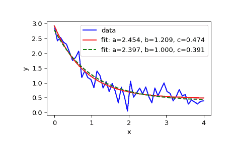

# `scipy.optimize.curve_fit`

> 原文链接：[`docs.scipy.org/doc/scipy-1.12.0/reference/generated/scipy.optimize.curve_fit.html#scipy.optimize.curve_fit`](https://docs.scipy.org/doc/scipy-1.12.0/reference/generated/scipy.optimize.curve_fit.html#scipy.optimize.curve_fit)

```py
scipy.optimize.curve_fit(f, xdata, ydata, p0=None, sigma=None, absolute_sigma=False, check_finite=None, bounds=(-inf, inf), method=None, jac=None, *, full_output=False, nan_policy=None, **kwargs)
```

使用非线性最小二乘拟合函数 f 到数据。

假设 `ydata = f(xdata, *params) + eps`。

参数：

**f**：callable

模型函数，f(x, …)。它必须将独立变量作为第一个参数，将要拟合的参数作为单独的剩余参数。

**xdata**：array_like

数据测量的自变量。通常应为长度为 M 的序列或形状为 (k,M) 的数组，对于具有 k 个预测变量的函数，如果是类似数组的对象，则每个元素应该可转换为 float。

**ydata**：array_like

依赖数据，长度为 M 的数组 - 名义上 `f(xdata, ...)`。

**p0**：array_like，可选

参数的初始猜测（长度为 N）。如果为 None，则所有初始值将为 1（如果可以使用内省确定函数的参数数量，否则会引发 ValueError）。

**sigma**：None 或标量或长度为 M 的序列或 MxM 数组，可选

确定 *ydata* 中的不确定性。如果定义残差为 `r = ydata - f(xdata, *popt)`，那么 *sigma* 的解释取决于它的维数：

> +   一个标量或 1-D *sigma* 应包含 *ydata* 中误差的标准偏差值。在这种情况下，优化的函数为 `chisq = sum((r / sigma) ** 2)`。
> +   
> +   一个 2-D *sigma* 应包含 *ydata* 中误差的协方差矩阵。在这种情况下，优化的函数为 `chisq = r.T @ inv(sigma) @ r`。
> +   
>     新版本为 0.19。

None（默认）等效于填充为 1 的 1-D *sigma*。

**absolute_sigma**：bool，可选

如果为 True，则 *sigma* 以绝对意义使用，并且估计的参数协方差 *pcov* 反映这些绝对值。

如果为 False（默认），则仅相对大小的 *sigma* 值有关。返回的参数协方差矩阵 *pcov* 是通过将 *sigma* 缩放一个常数因子来计算的。这个常数是通过要求在使用 *scaled* *sigma* 时，最优参数 *popt* 的减少的 *chisq* 等于单位来设定的。换句话说，*sigma* 被缩放以匹配拟合后残差的样本方差。默认为 False。数学上，`pcov(absolute_sigma=False) = pcov(absolute_sigma=True) * chisq(popt)/(M-N)`

**check_finite**：bool，可选

如果为 True，则检查输入数组是否不包含 nans 或 infs，并在包含时引发 ValueError。如果输入数组包含 nans，则将此参数设置为 False 可能会无声地产生荒谬的结果。如果 *nan_policy* 未明确指定，则默认为 True，否则为 False。

**bounds**：2 元组的 array_like 或 [`Bounds`](https://docs.scipy.org/doc/scipy-1.12.0/reference/generated/scipy.optimize.Bounds.html#scipy.optimize.Bounds "scipy.optimize.Bounds")

参数的下界和上界。默认无边界。有两种指定边界的方法：

> +   [`Bounds`](https://docs.scipy.org/doc/scipy/reference/generated/scipy.optimize.Bounds.html#scipy.optimize.Bounds) 类的实例。
> +   
> +   2-tuple 的 array_like：元组的每个元素必须是与参数数量相等的长度的 array 或标量（在这种情况下，边界被视为对所有参数相同）。使用 `np.inf` 和适当的符号来禁用所有或部分参数的边界。

**method** {‘lm’, ‘trf’, ‘dogbox’}，可选

优化使用的方法。详见 [`least_squares`](https://docs.scipy.org/doc/scipy/reference/generated/scipy.optimize.least_squares.html#scipy.optimize.least_squares) 以获取更多细节。默认为 ‘lm’ 用于无约束问题和 ‘trf’ 如果提供了 *bounds*。当观测数量少于变量数量时，方法 ‘lm’ 将无法工作，此时使用 ‘trf’ 或 ‘dogbox’。

新功能在版本 0.17 中引入。

**jac** 可调用函数、字符串或 None，可选

带有签名 `jac(x, ...)` 的函数，计算模型函数相对于参数的雅可比矩阵作为密集的 array_like 结构。它将根据提供的 *sigma* 进行缩放。如果为 None（默认），则将数值地估计雅可比矩阵。可以使用 ‘trf’ 和 ‘dogbox’ 方法的字符串关键字来选择有限差分方案，请参阅 [`least_squares`](https://docs.scipy.org/doc/scipy/reference/generated/scipy.optimize.least_squares.html#scipy.optimize.least_squares)。

新功能在版本 0.18 中引入。

**full_output** 布尔值，可选

如果为 True，此函数将返回额外的信息：*infodict*、*mesg* 和 *ier*。

新功能在版本 1.9 中引入。

**nan_policy** {‘raise’, ‘omit’, None}，可选

定义当输入包含 NaN 时如何处理。可用以下选项（默认为 None）：

> +   ‘raise’：抛出一个错误
> +   
> +   ‘omit’：在计算时忽略 NaN 值
> +   
> +   None：不执行 NaN 的特殊处理（除了 check_finite 执行的内容）；当存在 NaN 时的行为取决于实现，并且可能会更改。

请注意，如果显式指定了此值（而不是 None），*check_finite* 将设置为 False。

新功能在版本 1.11 中引入。

****kwargs**

传递给 `method='lm'` 的 [`leastsq`](https://docs.scipy.org/doc/scipy/reference/generated/scipy.optimize.leastsq.html#scipy.optimize.leastsq) 或否则传递给 [`least_squares`](https://docs.scipy.org/doc/scipy/reference/generated/scipy.optimize.least_squares.html#scipy.optimize.least_squares) 的关键字参数。

返回：

**popt** 数组

优化参数的最佳值，以使 `f(xdata, *popt) - ydata` 的残差平方和最小化。

**pcov** 2-D 数组

**popt** 的估计近似协方差。对角线提供参数估计的方差。要计算参数的一标准差误差，使用 `perr = np.sqrt(np.diag(pcov))`。注意 *cov* 与参数误差估计之间的关系是基于模型函数在最优解周围的线性近似 [1]。当此近似不准确时，*cov* 可能不提供准确的不确定性测量。

*sigma*参数如何影响估计协方差取决于*absolute_sigma*参数，如上所述。

如果解的雅可比矩阵没有完全秩，则‘lm’方法返回一个填满`np.inf`的矩阵，而‘trf’和‘dogbox’方法则使用 Moore-Penrose 伪逆来计算协方差矩阵。具有大条件数的协方差矩阵（例如使用[`numpy.linalg.cond`](https://numpy.org/devdocs/reference/generated/numpy.linalg.cond.html#numpy.linalg.cond "(在 NumPy v2.0.dev0 中)")计算的协方差矩阵）可能表明结果不可靠。

**infodict**dict（仅在*full_output*为 True 时返回）

一个带有键的可选输出字典：

`nfev`

函数调用次数。方法‘trf’和‘dogbox’不对数值雅可比逼近计数函数调用，而‘lm’方法则计算。

`fvec`

在解决方案处评估的残差值，对于 1-D *sigma*，这是`(f(x, *popt) - ydata)/sigma`。

`fjac`

一个 QR 因子分解的 R 矩阵的列置换，以列顺序存储。与 ipvt 一起，可以近似估计估计的协方差。‘lm’方法仅提供此信息。

`ipvt`

长度为 N 的整数数组，定义一个置换矩阵 p，使得 fjac*p = q*r，其中 r 是对角元素非递增的上三角形矩阵。p 的第 j 列是单位矩阵的 ipvt(j)列。‘lm’方法仅提供此信息。

`qtf`

向量（转置(q) * fvec）。‘lm’方法仅提供此信息。

新版本 1.9 中的新功能。

**mesg**str（仅在*full_output*为 True 时返回）

一个提供关于解决方案信息的字符串消息。

新版本 1.9 中的新功能。

**ier**int（仅在*full_output*为 True 时返回）

一个整数标志。如果等于 1、2、3 或 4，则找到了解决方案。否则，未找到解决方案。在任何情况下，可选输出变量*mesg*提供更多信息。

新版本 1.9 中的新功能。

Raises:

ValueError

如果*ydata*或*xdata*包含 NaN，或者使用不兼容的选项。

RuntimeError

如果最小二乘法最小化失败。

OptimizeWarning

如果无法估计参数的协方差。

另请参阅

`least_squares`

最小化非线性函数的平方和。

`scipy.stats.linregress`

为两组测量计算线性最小二乘回归。

注释

用户应确保输入*xdata*、*ydata*和*f*的输出为`float64`，否则优化可能返回不正确的结果。

使用`method='lm'`，算法通过`leastsq`使用 Levenberg-Marquardt 算法。请注意，此算法只能处理无约束问题。

箱约束可以通过‘trf’和‘dogbox’方法处理。有关更多信息，请参阅`least_squares`的文档字符串。

参考文献

[1] K. Vugrin 等。非线性置信区间估计技术

地下水流回归：三个案例研究。水资源研究，第 43 卷，W03423，[DOI:10.1029/2005WR004804](https://doi.org/10.1029/2005WR004804)

示例

```py
>>> import numpy as np
>>> import matplotlib.pyplot as plt
>>> from scipy.optimize import curve_fit 
```

```py
>>> def func(x, a, b, c):
...     return a * np.exp(-b * x) + c 
```

定义要拟合的带有一些噪声的数据：

```py
>>> xdata = np.linspace(0, 4, 50)
>>> y = func(xdata, 2.5, 1.3, 0.5)
>>> rng = np.random.default_rng()
>>> y_noise = 0.2 * rng.normal(size=xdata.size)
>>> ydata = y + y_noise
>>> plt.plot(xdata, ydata, 'b-', label='data') 
```

对函数*func*的参数 a、b、c 进行拟合：

```py
>>> popt, pcov = curve_fit(func, xdata, ydata)
>>> popt
array([2.56274217, 1.37268521, 0.47427475])
>>> plt.plot(xdata, func(xdata, *popt), 'r-',
...          label='fit: a=%5.3f, b=%5.3f, c=%5.3f' % tuple(popt)) 
```

优化约束在区域`0 <= a <= 3`，`0 <= b <= 1`和`0 <= c <= 0.5`：

```py
>>> popt, pcov = curve_fit(func, xdata, ydata, bounds=(0, [3., 1., 0.5]))
>>> popt
array([2.43736712, 1\.        , 0.34463856])
>>> plt.plot(xdata, func(xdata, *popt), 'g--',
...          label='fit: a=%5.3f, b=%5.3f, c=%5.3f' % tuple(popt)) 
```

```py
>>> plt.xlabel('x')
>>> plt.ylabel('y')
>>> plt.legend()
>>> plt.show() 
```



为了可靠的结果，模型*func*不应该过于参数化；多余的参数可能导致不可靠的协方差矩阵，并且在某些情况下，拟合质量较差。作为对模型是否过于参数化的快速检查，计算协方差矩阵的条件数：

```py
>>> np.linalg.cond(pcov)
34.571092161547405  # may vary 
```

值很小，所以并不引起太多关注。然而，如果我们要向*func*添加第四个参数`d`，其效果与`a`相同：

```py
>>> def func(x, a, b, c, d):
...     return a * d * np.exp(-b * x) + c  # a and d are redundant
>>> popt, pcov = curve_fit(func, xdata, ydata)
>>> np.linalg.cond(pcov)
1.13250718925596e+32  # may vary 
```

这样一个大的值是令人担忧的。协方差矩阵的对角线元素与拟合不确定性相关，提供更多信息：

```py
>>> np.diag(pcov)
array([1.48814742e+29, 3.78596560e-02, 5.39253738e-03, 2.76417220e+28])  # may vary 
```

请注意，第一个和最后一个术语远大于其他元素，表明这些参数的最优值是不明确的，模型中只需要其中一个参数。
