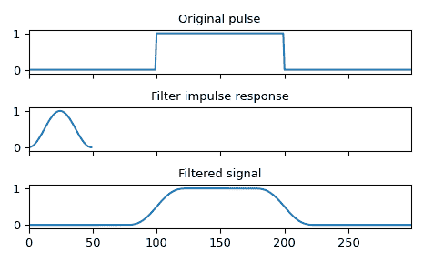

# `scipy.signal.convolve`

> 原文：[`docs.scipy.org/doc/scipy-1.12.0/reference/generated/scipy.signal.convolve.html#scipy.signal.convolve`](https://docs.scipy.org/doc/scipy-1.12.0/reference/generated/scipy.signal.convolve.html#scipy.signal.convolve)

```py
scipy.signal.convolve(in1, in2, mode='full', method='auto')
```

对两个 N 维数组进行卷积。

使用*mode*参数确定输出大小，对*in1*和*in2*进行卷积。

参数：

**in1**array_like

第一个输入。

**in2**array_like

第二输入。应与*in1*具有相同数量的维度。

**mode**str {‘full’, ‘valid’, ‘same’}，可选

一个表示输出大小的字符串：

`full`

输出是输入的完整离散线性卷积。（默认）

`valid`

输出仅包含那些不依赖于零填充的元素。在‘valid’模式下，*in1*或*in2*必须至少在每个维度上与另一个一样大。

`same`

输出与*in1*相同大小，并相对于‘full’输出中心化。

**method**str {‘auto’, ‘direct’, ‘fft’}，可选

一个表示计算卷积使用的方法的字符串。

`direct`

卷积直接来自求和，即卷积的定义。

`fft`

通过调用`fftconvolve`使用傅立叶变换执行卷积。

`auto`

根据估计选择直接方法或傅立叶方法（默认）以提高速度。更多详细信息请参见注释。

新版本 0.19.0 中引入。

返回：

**convolve**array

包含*in1*与*in2*的离散线性卷积子集的 N 维数组。

警告：

RuntimeWarning

在包含 NAN 或 INF 的输入上使用 FFT 卷积将导致整个输出为 NAN 或 INF。当输入包含 NAN 或 INF 值时，请使用 method=’direct’。

另请参见

[`numpy.polymul`](https://numpy.org/devdocs/reference/generated/numpy.polymul.html#numpy.polymul "(在 NumPy v2.0.dev0 版本中)")

执行多项式乘法（相同操作，但还接受 poly1d 对象）

`choose_conv_method`

选择最快适当的卷积方法

`fftconvolve`

始终使用 FFT 方法。

`oaconvolve`

使用重叠-添加方法进行卷积，当输入数组大且大小显著不同时通常更快。

注释

默认情况下，`convolve` 和 `correlate` 使用 `method='auto'`，这会调用 `choose_conv_method` 来选择最快的方法，使用预先计算的值（`choose_conv_method` 还可以通过关键字参数测量真实世界的时间）。因为 `fftconvolve` 依赖于浮点数，所以存在某些约束可能会强制使用 *method=direct*（详细信息请参见 `choose_conv_method` 文档字符串）。

示例

使用汉宁窗口平滑方波脉冲：

```py
>>> import numpy as np
>>> from scipy import signal
>>> sig = np.repeat([0., 1., 0.], 100)
>>> win = signal.windows.hann(50)
>>> filtered = signal.convolve(sig, win, mode='same') / sum(win) 
```

```py
>>> import matplotlib.pyplot as plt
>>> fig, (ax_orig, ax_win, ax_filt) = plt.subplots(3, 1, sharex=True)
>>> ax_orig.plot(sig)
>>> ax_orig.set_title('Original pulse')
>>> ax_orig.margins(0, 0.1)
>>> ax_win.plot(win)
>>> ax_win.set_title('Filter impulse response')
>>> ax_win.margins(0, 0.1)
>>> ax_filt.plot(filtered)
>>> ax_filt.set_title('Filtered signal')
>>> ax_filt.margins(0, 0.1)
>>> fig.tight_layout()
>>> fig.show() 
```


