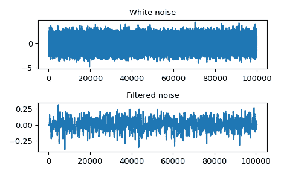

# `scipy.signal.oaconvolve`

> 原文：[`docs.scipy.org/doc/scipy-1.12.0/reference/generated/scipy.signal.oaconvolve.html#scipy.signal.oaconvolve`](https://docs.scipy.org/doc/scipy-1.12.0/reference/generated/scipy.signal.oaconvolve.html#scipy.signal.oaconvolve)

```py
scipy.signal.oaconvolve(in1, in2, mode='full', axes=None)
```

使用重叠添加方法对两个 N 维数组进行卷积。

使用重叠添加方法对*in1*和*in2*进行卷积，输出大小由*mode*参数确定。

对于大数组（n > ~500），这通常比`convolve`快得多，并且通常比`fftconvolve`快得多，当一个数组远大于另一个数组时，但当仅需要少量输出值或数组在形状上非常相似时，可能会更慢，并且只能输出浮点数组（int 或 object 数组输入将被转换为 float）。

参数：

**in1**array_like

第一个输入。

**in2**array_like

第二输入。应该与*in1*具有相同的维数。

**mode**str {‘full’, ‘valid’, ‘same’}，可选

指示输出大小的字符串：

`full`

输出是输入的完整离散线性卷积。（默认）

`valid`

输出仅由不依赖于零填充的元素组成。在“valid”模式下，*in1*或*in2*必须在每个维度上至少与另一个一样大。

`same`

输出与*in1*大小相同，相对于“full”输出居中。

**axes**int 或 int 数组或 None，可选

要计算卷积的轴。默认在所有轴上。

返回：

**out**array

包含*in1*与*in2*离散线性卷积子集的 N 维数组。

另请参阅

`convolve`

根据哪个更快，使用直接卷积或 FFT 卷积算法。

`fftconvolve`

使用 FFT 实现的卷积。

注意事项

新版本 1.4.0 中引入。

参考文献

[1]

Wikipedia，“重叠添加方法”。[`en.wikipedia.org/wiki/Overlap-add_method`](https://en.wikipedia.org/wiki/Overlap-add_method)

[2]

Richard G. Lyons. 《理解数字信号处理》，第三版，2011。第 13.10 章。ISBN 13: 978-0137-02741-5

示例

用 512 个样本的滤波器卷积一个 100,000 个样本的信号。

```py
>>> import numpy as np
>>> from scipy import signal
>>> rng = np.random.default_rng()
>>> sig = rng.standard_normal(100000)
>>> filt = signal.firwin(512, 0.01)
>>> fsig = signal.oaconvolve(sig, filt) 
```

```py
>>> import matplotlib.pyplot as plt
>>> fig, (ax_orig, ax_mag) = plt.subplots(2, 1)
>>> ax_orig.plot(sig)
>>> ax_orig.set_title('White noise')
>>> ax_mag.plot(fsig)
>>> ax_mag.set_title('Filtered noise')
>>> fig.tight_layout()
>>> fig.show() 
```


