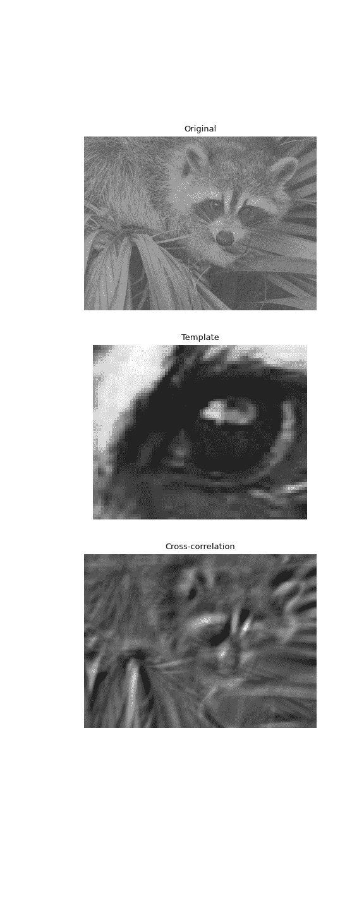

# `scipy.signal.correlate2d`

> 原文：[`docs.scipy.org/doc/scipy-1.12.0/reference/generated/scipy.signal.correlate2d.html#scipy.signal.correlate2d`](https://docs.scipy.org/doc/scipy-1.12.0/reference/generated/scipy.signal.correlate2d.html#scipy.signal.correlate2d)

```py
scipy.signal.correlate2d(in1, in2, mode='full', boundary='fill', fillvalue=0)
```

交叉相关两个二维数组。

用*mode*确定输出大小，*boundary*和*fillvalue*确定边界条件交叉相关*in1*和*in2*。

参数：

**in1**array_like

第一个输入。

**in2**array_like

第二个输入。应与*in1*具有相同数量的维度。

**mode**str {‘full’, ‘valid’, ‘same’}，可选

指示输出大小的字符串：

`full`

输出是输入的完整离散线性交叉相关。（默认）

`valid`

输出仅包含那些不依赖于零填充的元素。在“valid”模式下，*in1*或*in2*必须至少在每个维度上与另一个一样大。

`same`

输出与*in1*相同大小，相对于“full”输出居中。

**boundary**str {‘fill’, ‘wrap’, ‘symm’}，可选

指示如何处理边界的标志：

`fill`

用 fillvalue 填充输入数组。（默认）

`wrap`

循环边界条件。

`symm`

对称边界条件。

**fillvalue**scalar，可选

用于填充填充输入数组的值。默认为 0。

返回：

**correlate2d**ndarray

包含*in1*与*in2*的离散线性交叉相关子集的二维数组。

注意事项

使用偶数长度输入的“same”模式时，`correlate`和`correlate2d`的输出不同：它们之间存在 1 索引偏移。

示例

使用 2D 交叉相关在嘈杂图像中找到模板的位置：

```py
>>> import numpy as np
>>> from scipy import signal
>>> from scipy import datasets
>>> rng = np.random.default_rng()
>>> face = datasets.face(gray=True) - datasets.face(gray=True).mean()
>>> template = np.copy(face[300:365, 670:750])  # right eye
>>> template -= template.mean()
>>> face = face + rng.standard_normal(face.shape) * 50  # add noise
>>> corr = signal.correlate2d(face, template, boundary='symm', mode='same')
>>> y, x = np.unravel_index(np.argmax(corr), corr.shape)  # find the match 
```

```py
>>> import matplotlib.pyplot as plt
>>> fig, (ax_orig, ax_template, ax_corr) = plt.subplots(3, 1,
...                                                     figsize=(6, 15))
>>> ax_orig.imshow(face, cmap='gray')
>>> ax_orig.set_title('Original')
>>> ax_orig.set_axis_off()
>>> ax_template.imshow(template, cmap='gray')
>>> ax_template.set_title('Template')
>>> ax_template.set_axis_off()
>>> ax_corr.imshow(corr, cmap='gray')
>>> ax_corr.set_title('Cross-correlation')
>>> ax_corr.set_axis_off()
>>> ax_orig.plot(x, y, 'ro')
>>> fig.show() 
```


