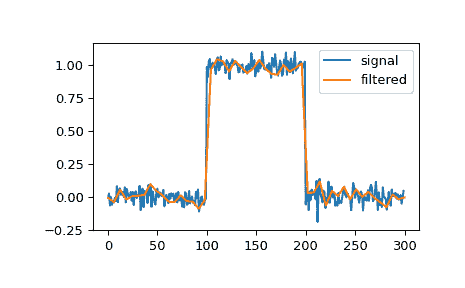

# `scipy.signal.qspline1d`

> 原文：[`docs.scipy.org/doc/scipy-1.12.0/reference/generated/scipy.signal.qspline1d.html#scipy.signal.qspline1d`](https://docs.scipy.org/doc/scipy-1.12.0/reference/generated/scipy.signal.qspline1d.html#scipy.signal.qspline1d)

```py
scipy.signal.qspline1d(signal, lamb=0.0)
```

计算秩为 1 的数组的二次样条系数。

参数：

**signal**ndarray

代表信号样本的秩为 1 的数组。

**lamb**float, optional

平滑系数（现在必须为零）。

返回：

**c**ndarray

二次样条系数。

另请参见

`qspline1d_eval`

在新的点集上评估二次样条。

注意事项

假设镜像对称边界条件，为 1-D 信号找到二次样条系数。为了从样条表示中恢复信号，使用长度为 3 的 FIR 窗口[1.0, 6.0, 1.0] / 8.0 镜像对称卷积这些系数。

示例

通过二次样条可以滤波信号，以减少和平滑高频噪声：

```py
>>> import numpy as np
>>> import matplotlib.pyplot as plt
>>> from scipy.signal import qspline1d, qspline1d_eval
>>> rng = np.random.default_rng()
>>> sig = np.repeat([0., 1., 0.], 100)
>>> sig += rng.standard_normal(len(sig))*0.05  # add noise
>>> time = np.linspace(0, len(sig))
>>> filtered = qspline1d_eval(qspline1d(sig), time)
>>> plt.plot(sig, label="signal")
>>> plt.plot(time, filtered, label="filtered")
>>> plt.legend()
>>> plt.show() 
```


