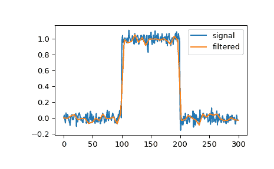

# `scipy.signal.qspline1d_eval`

> 原文：[`docs.scipy.org/doc/scipy-1.12.0/reference/generated/scipy.signal.qspline1d_eval.html#scipy.signal.qspline1d_eval`](https://docs.scipy.org/doc/scipy-1.12.0/reference/generated/scipy.signal.qspline1d_eval.html#scipy.signal.qspline1d_eval)

```py
scipy.signal.qspline1d_eval(cj, newx, dx=1.0, x0=0)
```

在新的一组点上评估二次样条。

参数：

**cj**ndarray

二次样条系数

**newx**ndarray

新的一组点。

**dx**float，可选

旧的样本间距，默认值为 1.0。

**x0**int，可选

旧原点，默认值为 0。

返回：

**res**ndarray

评估了二次样条点。

参见

`qspline1d`

为 rank-1 数组计算二次样条系数。

注意

*dx*是旧的样本间距，而*x0*是旧的原点。换句话说，旧样本点（结点点）为均匀间隔的点：

```py
oldx = x0 + j*dx  j=0...N-1, with N=len(cj) 
```

边界使用镜像对称边界条件处理。

示例

我们可以使用二次样条对信号进行滤波，以减少和平滑高频噪声：

```py
>>> import numpy as np
>>> import matplotlib.pyplot as plt
>>> from scipy.signal import qspline1d, qspline1d_eval
>>> rng = np.random.default_rng()
>>> sig = np.repeat([0., 1., 0.], 100)
>>> sig += rng.standard_normal(len(sig))*0.05  # add noise
>>> time = np.linspace(0, len(sig))
>>> filtered = qspline1d_eval(qspline1d(sig), time)
>>> plt.plot(sig, label="signal")
>>> plt.plot(time, filtered, label="filtered")
>>> plt.legend()
>>> plt.show() 
```


