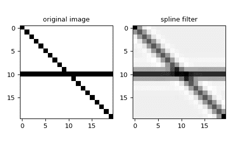

# `scipy.signal.spline_filter`

> 原文：[`docs.scipy.org/doc/scipy-1.12.0/reference/generated/scipy.signal.spline_filter.html#scipy.signal.spline_filter`](https://docs.scipy.org/doc/scipy-1.12.0/reference/generated/scipy.signal.spline_filter.html#scipy.signal.spline_filter)

```py
scipy.signal.spline_filter(Iin, lmbda=5.0)
```

对一个排名为 2 的数组进行三次样条（立方）平滑滤波。

使用（立方）平滑样条滤波器对输入数据集*Iin*进行滤波。

参数：

**Iin**array_like

输入数据集

**lmbda**float，可选

样条平滑的衰减值，默认为*5.0*。

返回：

**res**ndarray

过滤后的输入数据

示例

我们可以使用三次 B 样条滤波器来过滤多维信号（例如：2D 图像）：

```py
>>> import numpy as np
>>> from scipy.signal import spline_filter
>>> import matplotlib.pyplot as plt
>>> orig_img = np.eye(20)  # create an image
>>> orig_img[10, :] = 1.0
>>> sp_filter = spline_filter(orig_img, lmbda=0.1)
>>> f, ax = plt.subplots(1, 2, sharex=True)
>>> for ind, data in enumerate([[orig_img, "original image"],
...                             [sp_filter, "spline filter"]]):
...     ax[ind].imshow(data[0], cmap='gray_r')
...     ax[ind].set_title(data[1])
>>> plt.tight_layout()
>>> plt.show() 
```


