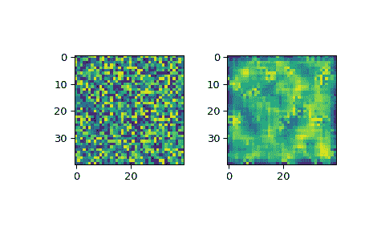

# `scipy.signal.wiener`

> 原文链接：[`docs.scipy.org/doc/scipy-1.12.0/reference/generated/scipy.signal.wiener.html#scipy.signal.wiener`](https://docs.scipy.org/doc/scipy-1.12.0/reference/generated/scipy.signal.wiener.html#scipy.signal.wiener)

```py
scipy.signal.wiener(im, mysize=None, noise=None)
```

对 N 维数组执行 Wiener 滤波。

对 N 维数组*im*应用 Wiener 滤波器。

参数：

**im**ndarray

一个 N 维数组。

**mysize**int 或 array_like，可选

一个标量或者一个长度为 N 的列表，其中的元素指定 Wiener 滤波器在每个维度上的窗口大小。mysize 的元素应为奇数。如果 mysize 是标量，则在每个维度上使用此标量作为大小。

**noise**float，可选

用于计算噪声功率。如果为 None，则噪声被估计为输入的局部方差的平均值。

返回：

**out**ndarray

Wiener 滤波后的结果与*im*具有相同的形状。

注意

此实现类似于 Matlab/Octave 中的 wiener2。更多细节参见[[1]](#r32abe11c8ae2-1)

参考文献

[1]

Lim, Jae S., 《二维信号与图像处理》，Englewood Cliffs, NJ, Prentice Hall, 1990, p. 548.

示例

```py
>>> from scipy.datasets import face
>>> from scipy.signal import wiener
>>> import matplotlib.pyplot as plt
>>> import numpy as np
>>> rng = np.random.default_rng()
>>> img = rng.random((40, 40))    #Create a random image
>>> filtered_img = wiener(img, (5, 5))  #Filter the image
>>> f, (plot1, plot2) = plt.subplots(1, 2)
>>> plot1.imshow(img)
>>> plot2.imshow(filtered_img)
>>> plt.show() 
```


