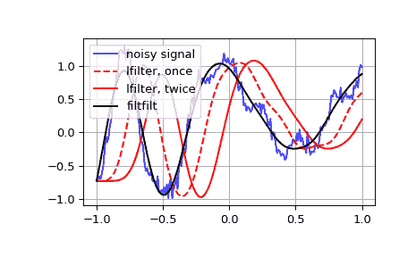

# `scipy.signal.lfilter`

> 原文：[`docs.scipy.org/doc/scipy-1.12.0/reference/generated/scipy.signal.lfilter.html#scipy.signal.lfilter`](https://docs.scipy.org/doc/scipy-1.12.0/reference/generated/scipy.signal.lfilter.html#scipy.signal.lfilter)

```py
scipy.signal.lfilter(b, a, x, axis=-1, zi=None)
```

沿着一维数据使用 IIR 或 FIR 滤波器滤波。

使用数字滤波器滤波数据序列 *x*。这适用于许多基本数据类型（包括对象类型）。滤波器是标准差分方程的直接 II 转置实现（见注意事项）。

函数 `sosfilt`（使用 `output='sos'` 进行滤波器设计）应优先于 `lfilter` 用于大多数滤波任务，因为二阶段节拍具有较少的数值问题。

参数：

**b** 数组样

1-D 序列中的分子系数向量。

**a** 数组样

1-D 序列中的分母系数向量。如果 `a[0]` 不为 1，则 *a* 和 *b* 都将被 `a[0]` 标准化。

**x** 数组样

N 维输入数组。

**axis** 整型，可选

应用线性滤波器的输入数据数组的轴。该滤波器应用于此轴上的每个子数组。默认为 -1。

**zi** 数组样，可选

滤波器延迟的初始条件。它是长度为 `max(len(a), len(b)) - 1` 的向量（或者对于 N 维输入是向量数组）。如果 *zi* 为 None 或未给出，则假定初始休息。详见 `lfiltic` 获取更多信息。

返回：

**y** 数组

数字滤波器的输出。

**zf** 数组，可选

如果 *zi* 为 None，则不返回，否则 *zf* 包含最终滤波器延迟值。

另见

`lfiltic`

构建 `lfilter` 的初始条件。

`lfilter_zi`

计算 `lfilter` 的初始状态（阶跃响应的稳态）。

`filtfilt`

前向后向滤波器，以获得零相位滤波器。

`savgol_filter`

Savitzky-Golay 滤波器。

`sosfilt`

使用级联二阶段节拍滤波数据。

`sosfiltfilt`

使用二阶段节拍进行前向后向滤波器。

注意事项

该滤波函数实现为直接 II 转置结构。这意味着滤波器实现：

```py
a[0]*y[n] = b[0]*x[n] + b[1]*x[n-1] + ... + b[M]*x[n-M]
                      - a[1]*y[n-1] - ... - a[N]*y[n-N] 
```

其中*M*是分子的次数，*N*是分母的次数，*n*是样本数。它使用以下差分方程实现（假设 M = N）：

```py
a[0]*y[n] = b[0] * x[n]               + d[0][n-1]
  d[0][n] = b[1] * x[n] - a[1] * y[n] + d[1][n-1]
  d[1][n] = b[2] * x[n] - a[2] * y[n] + d[2][n-1]
...
d[N-2][n] = b[N-1]*x[n] - a[N-1]*y[n] + d[N-1][n-1]
d[N-1][n] = b[N] * x[n] - a[N] * y[n] 
```

其中*d*是状态变量。

描述该滤波器在 z 变换域中的有理传递函数为：

```py
 -1              -M
        b[0] + b[1]z  + ... + b[M] z
Y(z) = -------------------------------- X(z)
                    -1              -N
        a[0] + a[1]z  + ... + a[N] z 
```

示例

生成一个噪声信号进行滤波：

```py
>>> import numpy as np
>>> from scipy import signal
>>> import matplotlib.pyplot as plt
>>> rng = np.random.default_rng()
>>> t = np.linspace(-1, 1, 201)
>>> x = (np.sin(2*np.pi*0.75*t*(1-t) + 2.1) +
...      0.1*np.sin(2*np.pi*1.25*t + 1) +
...      0.18*np.cos(2*np.pi*3.85*t))
>>> xn = x + rng.standard_normal(len(t)) * 0.08 
```

创建一个 3 阶低通巴特沃斯滤波器：

```py
>>> b, a = signal.butter(3, 0.05) 
```

将滤波器应用于 xn。使用 lfilter_zi 选择滤波器的初始条件：

```py
>>> zi = signal.lfilter_zi(b, a)
>>> z, _ = signal.lfilter(b, a, xn, zi=zi*xn[0]) 
```

再次应用滤波器，使得结果与 filtfilt 中的同阶滤波器相同：

```py
>>> z2, _ = signal.lfilter(b, a, z, zi=zi*z[0]) 
```

使用 filtfilt 来应用滤波器：

```py
>>> y = signal.filtfilt(b, a, xn) 
```

绘制原始信号和各种滤波版本：

```py
>>> plt.figure
>>> plt.plot(t, xn, 'b', alpha=0.75)
>>> plt.plot(t, z, 'r--', t, z2, 'r', t, y, 'k')
>>> plt.legend(('noisy signal', 'lfilter, once', 'lfilter, twice',
...             'filtfilt'), loc='best')
>>> plt.grid(True)
>>> plt.show() 
```


