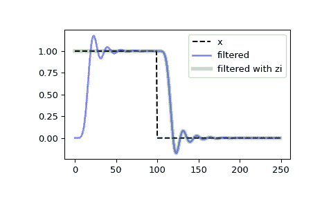

# `scipy.signal.sosfilt_zi`

> 原文链接：[`docs.scipy.org/doc/scipy-1.12.0/reference/generated/scipy.signal.sosfilt_zi.html#scipy.signal.sosfilt_zi`](https://docs.scipy.org/doc/scipy-1.12.0/reference/generated/scipy.signal.sosfilt_zi.html#scipy.signal.sosfilt_zi)

```py
scipy.signal.sosfilt_zi(sos)
```

为阶跃响应稳态的`sosfilt`构造初始条件。

计算[`sosfilt`](https://docs.scipy.org/doc/scipy-1.12.0/reference/generated/scipy.signal.sosfilt.html#scipy.signal.sosfilt "scipy.signal.sosfilt")函数的初始状态*zi*，该状态对应于阶跃响应的稳态。

该函数的典型用法是设置初始状态，使滤波器的输出与要滤波信号的第一个元素的值相同。

参数：

**sos**数组样式

第二阶滤波器系数数组，必须具有形状`(n_sections, 6)`。参见[`sosfilt`](https://docs.scipy.org/doc/scipy-1.12.0/reference/generated/scipy.signal.sosfilt.html#scipy.signal.sosfilt "scipy.signal.sosfilt")以获取 SOS 滤波器格式规范。

返回：

**zi**数组

适用于与`sosfilt`一起使用的初始条件，形状为`(n_sections, 2)`。

另请参阅

[`sosfilt`](https://docs.scipy.org/doc/scipy-1.12.0/reference/generated/scipy.signal.sosfilt.html#scipy.signal.sosfilt "scipy.signal.sosfilt"), [`zpk2sos`](https://docs.scipy.org/doc/scipy-1.12.0/reference/generated/scipy.signal.zpk2sos.html#scipy.signal.zpk2sos "scipy.signal.zpk2sos")

注释

自 0.16.0 版新增。

示例

对 0 时刻开始的矩形脉冲进行滤波，使用和不使用[`scipy.signal.sosfilt`](https://docs.scipy.org/doc/scipy-1.12.0/reference/generated/scipy.signal.sosfilt.html#scipy.signal.sosfilt "scipy.signal.sosfilt")的*zi*参数。

```py
>>> import numpy as np
>>> from scipy import signal
>>> import matplotlib.pyplot as plt 
```

```py
>>> sos = signal.butter(9, 0.125, output='sos')
>>> zi = signal.sosfilt_zi(sos)
>>> x = (np.arange(250) < 100).astype(int)
>>> f1 = signal.sosfilt(sos, x)
>>> f2, zo = signal.sosfilt(sos, x, zi=zi) 
```

```py
>>> plt.plot(x, 'k--', label='x')
>>> plt.plot(f1, 'b', alpha=0.5, linewidth=2, label='filtered')
>>> plt.plot(f2, 'g', alpha=0.25, linewidth=4, label='filtered with zi')
>>> plt.legend(loc='best')
>>> plt.show() 
```


