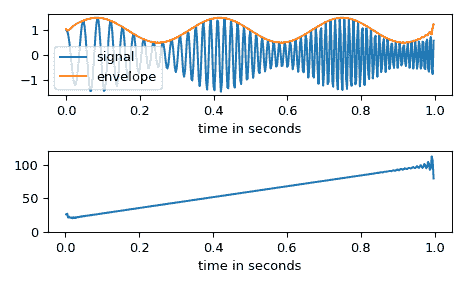

# `scipy.signal.hilbert`

> 原始文本：[`docs.scipy.org/doc/scipy-1.12.0/reference/generated/scipy.signal.hilbert.html#scipy.signal.hilbert`](https://docs.scipy.org/doc/scipy-1.12.0/reference/generated/scipy.signal.hilbert.html#scipy.signal.hilbert)

```py
scipy.signal.hilbert(x, N=None, axis=-1)
```

使用希尔伯特变换计算解析信号。

默认情况下，转换沿最后一个轴执行。

参数：

**x**array_like

信号数据。必须是实数。

**N**int，可选

傅里叶分量的数量。默认值为`x.shape[axis]`

**axis**int，可选

变换的轴线。默认值为-1。

返回：

**xa**ndarray

*x*的解析信号，沿*axis*的每个 1-D 数组

注意事项

信号*x(t)*的解析信号`x_a(t)`是：

\[x_a = F^{-1}(F(x) 2U) = x + i y\]

其中*F*是傅里叶变换，*U*是单位阶跃函数，*y*是*x*的希尔伯特变换。[[1]](#r37d8c8a6fd16-1)

换句话说，负频谱的负半部分被置零，将实值信号转换为复杂信号。希尔伯特变换信号可以通过`np.imag(hilbert(x))`获取，原始信号可以通过`np.real(hilbert(x))`获取。

参考文献

[1]

维基百科，“解析信号”。[`en.wikipedia.org/wiki/Analytic_signal`](https://en.wikipedia.org/wiki/Analytic_signal)

[2]

Leon Cohen，“时频分析”，1995. 第二章。

[3]

Alan V. Oppenheim, Ronald W. Schafer. Discrete-Time Signal Processing, Third Edition, 2009. Chapter 12. ISBN 13: 978-1292-02572-8

示例

在这个例子中，我们使用希尔伯特变换来确定调幅信号的幅度包络和即时频率。

```py
>>> import numpy as np
>>> import matplotlib.pyplot as plt
>>> from scipy.signal import hilbert, chirp 
```

```py
>>> duration = 1.0
>>> fs = 400.0
>>> samples = int(fs*duration)
>>> t = np.arange(samples) / fs 
```

我们创建一个从 20 Hz 到 100 Hz 频率增加并应用幅度调制的啁啾声。

```py
>>> signal = chirp(t, 20.0, t[-1], 100.0)
>>> signal *= (1.0 + 0.5 * np.sin(2.0*np.pi*3.0*t) ) 
```

幅度包络由解析信号的幅度给出。通过将即时相位相对于时间进行微分，即时频率可以获得。即时相位对应于解析信号的相位角。

```py
>>> analytic_signal = hilbert(signal)
>>> amplitude_envelope = np.abs(analytic_signal)
>>> instantaneous_phase = np.unwrap(np.angle(analytic_signal))
>>> instantaneous_frequency = (np.diff(instantaneous_phase) /
...                            (2.0*np.pi) * fs) 
```

```py
>>> fig, (ax0, ax1) = plt.subplots(nrows=2)
>>> ax0.plot(t, signal, label='signal')
>>> ax0.plot(t, amplitude_envelope, label='envelope')
>>> ax0.set_xlabel("time in seconds")
>>> ax0.legend()
>>> ax1.plot(t[1:], instantaneous_frequency)
>>> ax1.set_xlabel("time in seconds")
>>> ax1.set_ylim(0.0, 120.0)
>>> fig.tight_layout() 
```


