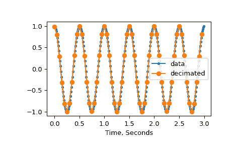

# `scipy.signal.decimate`

> 原始文本：[`docs.scipy.org/doc/scipy-1.12.0/reference/generated/scipy.signal.decimate.html#scipy.signal.decimate`](https://docs.scipy.org/doc/scipy-1.12.0/reference/generated/scipy.signal.decimate.html#scipy.signal.decimate)

```py
scipy.signal.decimate(x, q, n=None, ftype='iir', axis=-1, zero_phase=True)
```

在应用抗混叠滤波器后对信号进行降采样。

默认情况下，使用阶数为 8 的 Chebyshev I 型滤波器。如果*ftype*为‘fir’，则使用 30 点 Hamming 窗口的 FIR 滤波器。

参数：

**x**array_like

要降采样的信号，作为 N 维数组。

**q**int

下采样因子。当使用 IIR 下采样时，建议对高于 13 的下采样因子多次调用[`decimate`](https://docs.scipy.org/doc/scipy-1.12.0/reference/generated/scipy.signal.decimate.html#scipy.signal.decimate "scipy.signal.decimate")。

**n**int，可选

滤波器的阶数（对于‘fir’来说是长度减 1）。对于‘iir’默认为 8，对于‘fir’是下采样因子的 20 倍。

**ftype**str {‘iir’，‘fir’}或`dlti`实例，可选

如果是‘iir’或‘fir’，则指定低通滤波器的类型。如果是[`dlti`](https://docs.scipy.org/doc/scipy-1.12.0/reference/generated/scipy.signal.dlti.html#scipy.signal.dlti "scipy.signal.dlti")对象的实例，则使用该对象在降采样之前进行滤波。

**axis**int，可选

要降采样的轴。

**zero_phase**bool，可选

当使用 IIR 滤波器时，通过使用[`filtfilt`](https://docs.scipy.org/doc/scipy-1.12.0/reference/generated/scipy.signal.filtfilt.html#scipy.signal.filtfilt "scipy.signal.filtfilt")而不是[`lfilter`](https://docs.scipy.org/doc/scipy-1.12.0/reference/generated/scipy.signal.lfilter.html#scipy.signal.lfilter "scipy.signal.lfilter")进行滤波，并将输出向后移动滤波器的群延迟来防止相位移动。通常建议使用默认值`True`，因为通常不希望出现相位移动。

在 0.18.0 版本中新增。

返回：

**y**ndarray

降采样信号。

参见

[`resample`](https://docs.scipy.org/doc/scipy-1.12.0/reference/generated/scipy.signal.resample.html#scipy.signal.resample "scipy.signal.resample")

使用 FFT 方法上下采样。

[`resample_poly`](https://docs.scipy.org/doc/scipy-1.12.0/reference/generated/scipy.signal.resample_poly.html#scipy.signal.resample_poly "scipy.signal.resample_poly")

使用多相滤波和 FIR 滤波器重采样。

注意

`zero_phase`关键字在 0.18.0 版本中添加。允许使用`dlti`实例作为`ftype`在 0.18.0 版本中添加。

示例

```py
>>> import numpy as np
>>> from scipy import signal
>>> import matplotlib.pyplot as plt 
```

定义波参数。

```py
>>> wave_duration = 3
>>> sample_rate = 100
>>> freq = 2
>>> q = 5 
```

计算样本数。

```py
>>> samples = wave_duration*sample_rate
>>> samples_decimated = int(samples/q) 
```

创建余弦波。

```py
>>> x = np.linspace(0, wave_duration, samples, endpoint=False)
>>> y = np.cos(x*np.pi*freq*2) 
```

降采样余弦波。

```py
>>> ydem = signal.decimate(y, q)
>>> xnew = np.linspace(0, wave_duration, samples_decimated, endpoint=False) 
```

绘制原始波和降采样波。

```py
>>> plt.plot(x, y, '.-', xnew, ydem, 'o-')
>>> plt.xlabel('Time, Seconds')
>>> plt.legend(['data', 'decimated'], loc='best')
>>> plt.show() 
```


