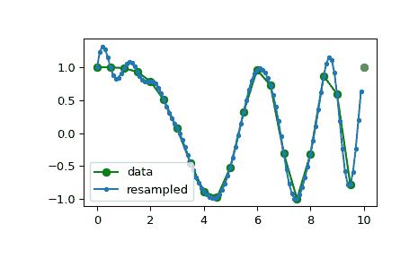

# `scipy.signal.resample`

> 原文链接：[`docs.scipy.org/doc/scipy-1.12.0/reference/generated/scipy.signal.resample.html#scipy.signal.resample`](https://docs.scipy.org/doc/scipy-1.12.0/reference/generated/scipy.signal.resample.html#scipy.signal.resample)

```py
scipy.signal.resample(x, num, t=None, axis=0, window=None, domain='time')
```

使用傅立叶方法沿给定轴将 *x* 重采样为 *num* 个样本。

重采样信号从与 *x* 相同的值开始，但采样间隔为 `len(x) / num * (spacing of x)`。由于使用了傅立叶方法，信号被假定为周期性的。

参数：

**x** 数组

要重采样的数据。

**num** 整数

重采样信号中的样本数。

**t** 数组，可选

如果给定 *t*，则假定它是与 *x* 中信号数据相关联的等间隔采样位置。

**axis** 整数，可选

被重采样的 *x* 的轴。默认为 0。

**window** 数组、可调用对象、字符串、浮点数或元组，可选

指定应用于信号的傅立叶域中的窗口。详情见下文。

**domain** 字符串，可选

指示输入 *x* 的域的字符串：`time` 将输入 *x* 视为时域（默认），`freq` 将输入 *x* 视为频域。

返回：

resampled_x 或 (resampled_x, resampled_t)

要么是重采样后的数组，要么（如果给定了 *t*）是一个包含重采样后的数组和相应重采样位置的元组。

另请参见

`decimate`

在应用 FIR 或 IIR 滤波器后对信号进行下采样。

`resample_poly`

使用多相滤波和 FIR 滤波器进行重采样。

注释

参数 *window* 控制傅立叶域窗口，在零填充前锐化傅立叶频谱，以减轻对未意图作为带限信号解释的采样信号的响应。

如果 *window* 是一个函数，则调用它并传入一个指示频率区间的输入向量（即 fftfreq(x.shape[axis])）。

如果 *window* 是与 *x.shape[axis]* 长度相同的数组，则假定它是要直接在傅立叶域中应用的窗口（带有直流分量和低频率优先）。

对于任何其他类型的 *window*，将调用函数 `scipy.signal.get_window` 来生成窗口。

返回向量的第一个样本与输入向量的第一个样本相同。样本之间的间距从 `dx` 变为 `dx * len(x) / num`。

如果 *t* 不为 None，则仅用于计算重采样位置 *resampled_t*。

如前所述，`resample` 使用 FFT 变换，如果输入或输出样本数较大且为质数，则速度可能会非常慢；参见 `scipy.fft.fft`。

示例

注意，重采样数据的末尾上升以满足下一个周期的第一个样本：

```py
>>> import numpy as np
>>> from scipy import signal 
```

```py
>>> x = np.linspace(0, 10, 20, endpoint=False)
>>> y = np.cos(-x**2/6.0)
>>> f = signal.resample(y, 100)
>>> xnew = np.linspace(0, 10, 100, endpoint=False) 
```

```py
>>> import matplotlib.pyplot as plt
>>> plt.plot(x, y, 'go-', xnew, f, '.-', 10, y[0], 'ro')
>>> plt.legend(['data', 'resampled'], loc='best')
>>> plt.show() 
```


