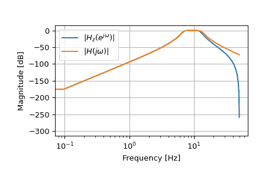

# `scipy.signal.bilinear`

> 原文：[`docs.scipy.org/doc/scipy-1.12.0/reference/generated/scipy.signal.bilinear.html#scipy.signal.bilinear`](https://docs.scipy.org/doc/scipy-1.12.0/reference/generated/scipy.signal.bilinear.html#scipy.signal.bilinear)

```py
scipy.signal.bilinear(b, a, fs=1.0)
```

使用双线性变换从模拟滤波器返回数字 IIR 滤波器。

将一组极点和零点从模拟 s 平面转换到数字 z 平面，使用 Tustin 方法，其中替换`s`为`2*fs*(z-1) / (z+1)`，保持频率响应的形状。

参数：

-   **b**array_like

模拟滤波器传递函数的分子。

-   **a**array_like

模拟滤波器传递函数的分母。

-   **fs**float

采样率，作为普通频率（例如赫兹）。此函数中不进行预弯曲。

返回：

-   **b**ndarray

转换后的数字滤波器传递函数的分子。

-   **a**ndarray

转换后的数字滤波器传递函数的分母。

参见

`lp2lp`, `lp2hp`, `lp2bp`, `lp2bs`

`bilinear_zpk`

示例

```py
>>> from scipy import signal
>>> import matplotlib.pyplot as plt
>>> import numpy as np 
```

```py
>>> fs = 100
>>> bf = 2 * np.pi * np.array([7, 13])
>>> filts = signal.lti(*signal.butter(4, bf, btype='bandpass',
...                                   analog=True))
>>> filtz = signal.lti(*signal.bilinear(filts.num, filts.den, fs))
>>> wz, hz = signal.freqz(filtz.num, filtz.den)
>>> ws, hs = signal.freqs(filts.num, filts.den, worN=fs*wz) 
```

```py
>>> plt.semilogx(wz*fs/(2*np.pi), 20*np.log10(np.abs(hz).clip(1e-15)),
...              label=r'$|H_z(e^{j \omega})|$')
>>> plt.semilogx(wz*fs/(2*np.pi), 20*np.log10(np.abs(hs).clip(1e-15)),
...              label=r'$|H(j \omega)|$')
>>> plt.legend()
>>> plt.xlabel('Frequency [Hz]')
>>> plt.ylabel('Magnitude [dB]')
>>> plt.grid(True) 
```


