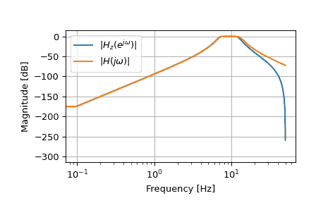

# `scipy.signal.bilinear_zpk`

> 原文：[`docs.scipy.org/doc/scipy-1.12.0/reference/generated/scipy.signal.bilinear_zpk.html#scipy.signal.bilinear_zpk`](https://docs.scipy.org/doc/scipy-1.12.0/reference/generated/scipy.signal.bilinear_zpk.html#scipy.signal.bilinear_zpk)

```py
scipy.signal.bilinear_zpk(z, p, k, fs)
```

使用双线性变换从模拟滤波器转换为数字 IIR 滤波器。

将一组模拟 s 平面的极点和零点转换为数字 z 平面，使用 Tustin 方法，用`2*fs*(z-1) / (z+1)`替换`s`，保持频率响应的形状。

Parameters:

**z**array_like

模拟滤波器传递函数的零点。

**p**array_like

模拟滤波器传递函数的极点。

**k**float

System gain of the analog filter transfer function.

**fs**float

采样率，作为普通频率（例如赫兹）。此函数中不进行预变形。

返回：

**z**ndarray

Zeros of the transformed digital filter transfer function.

**p**ndarray

Poles of the transformed digital filter transfer function.

**k**float

转换后数字滤波器的系统增益。

See also

[`lp2lp_zpk`](https://docs.scipy.org/doc/scipy-1.12.0/reference/generated/scipy.signal.lp2lp_zpk.html#scipy.signal.lp2lp_zpk "scipy.signal.lp2lp_zpk"), [`lp2hp_zpk`](https://docs.scipy.org/doc/scipy-1.12.0/reference/generated/scipy.signal.lp2hp_zpk.html#scipy.signal.lp2hp_zpk "scipy.signal.lp2hp_zpk"), [`lp2bp_zpk`](https://docs.scipy.org/doc/scipy-1.12.0/reference/generated/scipy.signal.lp2bp_zpk.html#scipy.signal.lp2bp_zpk "scipy.signal.lp2bp_zpk"), [`lp2bs_zpk`](https://docs.scipy.org/doc/scipy-1.12.0/reference/generated/scipy.signal.lp2bs_zpk.html#scipy.signal.lp2bs_zpk "scipy.signal.lp2bs_zpk")

[`bilinear`](https://docs.scipy.org/doc/scipy-1.12.0/reference/generated/scipy.signal.bilinear.html#scipy.signal.bilinear "scipy.signal.bilinear")

Notes

New in version 1.1.0.

Examples

```py
>>> import numpy as np
>>> from scipy import signal
>>> import matplotlib.pyplot as plt 
```

```py
>>> fs = 100
>>> bf = 2 * np.pi * np.array([7, 13])
>>> filts = signal.lti(*signal.butter(4, bf, btype='bandpass', analog=True,
...                                   output='zpk'))
>>> filtz = signal.lti(*signal.bilinear_zpk(filts.zeros, filts.poles,
...                                         filts.gain, fs))
>>> wz, hz = signal.freqz_zpk(filtz.zeros, filtz.poles, filtz.gain)
>>> ws, hs = signal.freqs_zpk(filts.zeros, filts.poles, filts.gain,
...                           worN=fs*wz)
>>> plt.semilogx(wz*fs/(2*np.pi), 20*np.log10(np.abs(hz).clip(1e-15)),
...              label=r'$|H_z(e^{j \omega})|$')
>>> plt.semilogx(wz*fs/(2*np.pi), 20*np.log10(np.abs(hs).clip(1e-15)),
...              label=r'$|H(j \omega)|$')
>>> plt.legend()
>>> plt.xlabel('Frequency [Hz]')
>>> plt.ylabel('Magnitude [dB]')
>>> plt.grid(True) 
```


