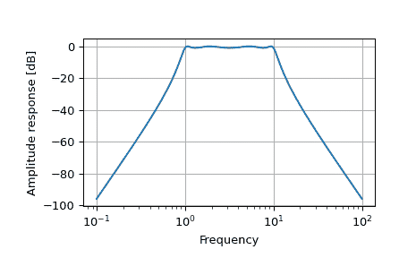

# `scipy.signal.freqs`

> 原始文本：[`docs.scipy.org/doc/scipy-1.12.0/reference/generated/scipy.signal.freqs.html#scipy.signal.freqs`](https://docs.scipy.org/doc/scipy-1.12.0/reference/generated/scipy.signal.freqs.html#scipy.signal.freqs)

```py
scipy.signal.freqs(b, a, worN=200, plot=None)
```

计算模拟滤波器的频率响应。

给定模拟滤波器的 M 阶分子*b*和 N 阶分母*a*，计算其频率响应：

```py
 b[0]*(jw)**M + b[1]*(jw)**(M-1) + ... + b[M]
H(w) = ----------------------------------------------
        a[0]*(jw)**N + a[1]*(jw)**(N-1) + ... + a[N] 
```

参数：

数组**b**

线性滤波器的分子。

数组**a**

线性滤波器的分母。

**worN**{None, int, array_like}，可选

如果为 None，则在响应曲线的有趣部分周围的 200 个频率上计算（由极点零点位置决定）。如果是单个整数，则在那么多频率上计算。否则，计算在给定的角频率（例如，rad/s）处给出的响应*worn*。

**plot**可调用函数，可选

接受两个参数的可调用函数。如果给定，则将返回参数*w*和*h*传递给 plot。用于在`freqs`内部绘制频率响应。

返回：

数组**w**

计算*h*的角频率。

数组**h**

频率响应。

另请参见

[`freqz`](https://docs.scipy.org/doc/scipy-1.12.0/reference/generated/scipy.signal.freqz.html#scipy.signal.freqz "scipy.signal.freqz")

计算数字滤波器的频率响应。

注意事项

使用 Matplotlib 的“plot”函数作为*plot*的可调用函数会产生意外的结果，这会绘制复数传递函数的实部，而不是幅度。尝试`lambda w, h: plot(w, abs(h))`。

示例

```py
>>> from scipy.signal import freqs, iirfilter
>>> import numpy as np 
```

```py
>>> b, a = iirfilter(4, [1, 10], 1, 60, analog=True, ftype='cheby1') 
```

```py
>>> w, h = freqs(b, a, worN=np.logspace(-1, 2, 1000)) 
```

```py
>>> import matplotlib.pyplot as plt
>>> plt.semilogx(w, 20 * np.log10(abs(h)))
>>> plt.xlabel('Frequency')
>>> plt.ylabel('Amplitude response [dB]')
>>> plt.grid(True)
>>> plt.show() 
```


