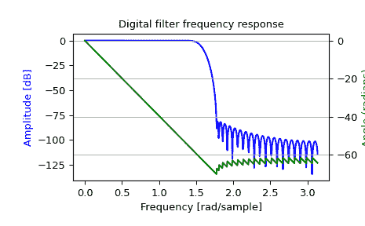

# `scipy.signal.freqz`

> 原始文本：[`docs.scipy.org/doc/scipy-1.12.0/reference/generated/scipy.signal.freqz.html#scipy.signal.freqz`](https://docs.scipy.org/doc/scipy-1.12.0/reference/generated/scipy.signal.freqz.html#scipy.signal.freqz)

```py
scipy.signal.freqz(b, a=1, worN=512, whole=False, plot=None, fs=6.283185307179586, include_nyquist=False)
```

计算数字滤波器的频率响应。

给定数字滤波器的 M 阶分子*b*和 N 阶分母*a*，计算其频率响应：

```py
 jw                 -jw              -jwM
   jw    B(e  )    b[0] + b[1]e    + ... + b[M]e
H(e  ) = ------ = -----------------------------------
            jw                 -jw              -jwN
         A(e  )    a[0] + a[1]e    + ... + a[N]e 
```

参数：

**b**：array_like

线性滤波器的分子。如果*b*的维度大于 1，则假定系数存储在第一维度中，并且*b.shape[1:]*、*a.shape[1:]*和频率数组的形状必须兼容广播。

**a**：array_like

线性滤波器的分母。如果*b*的维度大于 1，则假定系数存储在第一维度中，并且*b.shape[1:]*、*a.shape[1:]*和频率数组的形状必须兼容广播。

**worN**：{None, int, array_like}，可选

如果是单个整数，则在那么多的频率上进行计算（默认值为 N=512）。这是以下便利的替代方法：

```py
np.linspace(0, fs if whole else fs/2, N, endpoint=include_nyquist) 
```

使用快速 FFT 计算的数字可以导致更快的计算（见备注）。

如果是 array_like，则在给定的频率上计算响应。这些频率与*fs*的单位相同。

**whole**：bool，可选

通常，频率从 0 到 Nyquist 频率 fs/2（单位圆的上半部分）计算。如果*whole*为 True，则从 0 到 fs 计算频率。如果 worN 是 array_like，则忽略。

**plot**：callable

一个接受两个参数的可调用函数。如果提供了，返回参数*w*和*h*将传递给绘图函数。用于在`freqz`内绘制频率响应。

**fs**：float，可选

数字系统的采样频率。默认为 2*pi 弧度/样本（所以 w 从 0 到 pi）。

1.2.0 版的新功能。

**include_nyquist**：bool，可选

如果*whole*为 False 且*worN*为整数，则将*include_nyquist*设置为 True 将包括最后一个频率（Nyquist 频率），否则将被忽略。

1.5.0 版的新功能。

返回：

**w**：ndarray

计算*h*的频率，单位与*fs*相同。默认情况下，*w*被归一化为范围 0, pi)（弧度/样本）。

**h**：ndarray

频率响应，作为复数。

另请参阅

[`freqz_zpk`

`sosfreqz`

备注

当使用 Matplotlib 的[`matplotlib.pyplot.plot`](https://matplotlib.org/stable/api/_as_gen/matplotlib.pyplot.plot.html#matplotlib.pyplot.plot "(在 Matplotlib v3.8.2 中)")函数作为*plot*的可调用函数时，会产生意外的结果，因为这会绘制复数传递函数的实部而不是幅度。尝试`lambda w, h: plot(w, np.abs(h))`。

在满足以下条件时使用直接计算（R）FFT 来计算频率响应：

1.  *worN* 是一个整数值。

1.  *worN* 通过 FFT 计算快速（即，`next_fast_len(worN)` 等于 *worN*)。

1.  分母系数是单个值（`a.shape[0] == 1`）。

1.  *worN* 至少与分子系数的长度相同（`worN >= b.shape[0]`）。

1.  如果 `b.ndim > 1`，那么 `b.shape[-1] == 1`。

对于长 FIR 滤波器，FFT 方法的误差可能比等效的直接多项式计算低，并且速度要快得多。

示例

```py
>>> from scipy import signal
>>> import numpy as np
>>> b = signal.firwin(80, 0.5, window=('kaiser', 8))
>>> w, h = signal.freqz(b) 
```

```py
>>> import matplotlib.pyplot as plt
>>> fig, ax1 = plt.subplots()
>>> ax1.set_title('Digital filter frequency response') 
```

```py
>>> ax1.plot(w, 20 * np.log10(abs(h)), 'b')
>>> ax1.set_ylabel('Amplitude [dB]', color='b')
>>> ax1.set_xlabel('Frequency [rad/sample]') 
```

```py
>>> ax2 = ax1.twinx()
>>> angles = np.unwrap(np.angle(h))
>>> ax2.plot(w, angles, 'g')
>>> ax2.set_ylabel('Angle (radians)', color='g')
>>> ax2.grid(True)
>>> ax2.axis('tight')
>>> plt.show() 
```



广播示例

假设我们有两个 FIR 滤波器，它们的系数存储在形状为（2, 25）的数组的行中。为了演示，我们将使用随机数据：

```py
>>> rng = np.random.default_rng()
>>> b = rng.random((2, 25)) 
```

为了一次调用`freqz`计算这两个滤波器的频率响应，我们必须传入`b.T`，因为`freqz`期望第一个轴包含系数。然后我们必须通过在长度为 1 的虚拟维度上扩展形状来允许与频率数组进行广播。也就是说，我们传入`b.T[..., np.newaxis]`，其形状为（25, 2, 1）：

```py
>>> w, h = signal.freqz(b.T[..., np.newaxis], worN=1024)
>>> w.shape
(1024,)
>>> h.shape
(2, 1024) 
```

现在，假设我们有两个传递函数，分子系数相同 `b = [0.5, 0.5]`。这两个分母的系数存储在 2-D 数组 *a* 的第一个维度中：

```py
a = [   1      1  ]
    [ -0.25, -0.5 ] 
```

```py
>>> b = np.array([0.5, 0.5])
>>> a = np.array([[1, 1], [-0.25, -0.5]]) 
```

只有 *a* 是多于 1 维的。为了使其与频率广播兼容，在调用`freqz`时，我们通过在虚拟维度上扩展它来实现：

```py
>>> w, h = signal.freqz(b, a[..., np.newaxis], worN=1024)
>>> w.shape
(1024,)
>>> h.shape
(2, 1024) 
```
