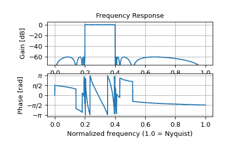
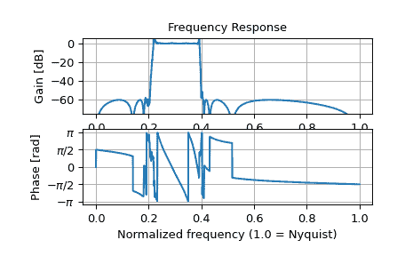

# `scipy.signal.sosfreqz`

> 原始文本：[`docs.scipy.org/doc/scipy-1.12.0/reference/generated/scipy.signal.sosfreqz.html#scipy.signal.sosfreqz`](https://docs.scipy.org/doc/scipy-1.12.0/reference/generated/scipy.signal.sosfreqz.html#scipy.signal.sosfreqz)

```py
scipy.signal.sosfreqz(sos, worN=512, whole=False, fs=6.283185307179586)
```

计算 SOS 格式数字滤波器的频率响应。

给定*sos*，一个形状为(n, 6)的数组，其中包含数字滤波器的二阶段。计算系统函数的频率响应：

```py
 B0(z)   B1(z)         B{n-1}(z)
H(z) = ----- * ----- * ... * ---------
       A0(z)   A1(z)         A{n-1}(z) 
```

对于 z = exp(omega*1j)，其中 B{k}(z)和 A{k}(z)分别是第 k 个二阶段传递函数的分子和分母。

参数：

**sos** 类似数组

数组的二阶滤波器系数，必须具有形状`(n_sections, 6)`。每行对应一个二阶段，前三列提供分子系数，后三列提供分母系数。

**worN**{无，整数，类似数组}，可选

如果是单个整数，则计算那么多频率（默认为 N=512）。使用 FFT 计算快速的数字可以导致更快的计算（见[`freqz`](https://docs.scipy.org/doc/scipy-1.12.0/reference/generated/scipy.signal.freqz.html#scipy.signal.freqz "scipy.signal.freqz")的注意事项）。

如果是类似数组，则在给定频率处计算响应（必须是 1-D）。这些单位与*fs*相同。

**whole** 布尔值，可选

通常，频率从 0 到 Nyquist 频率 fs/2 计算（单位圆的上半部分）。如果*whole*为 True，则从 0 到 fs 计算频率。

**fs** 浮点数，可选

数字系统的采样频率。默认为 2*pi 弧度/样本（所以 w 是从 0 到 pi）。

新版本 1.2.0 中。

返回：

**w** ndarray

计算*h*的频率，单位与*fs*相同。默认情况下，*w*被归一化到范围[0, pi)（弧度/样本）。

**h** ndarray

频率响应，作为复数。

另请参见

[`freqz`](https://docs.scipy.org/doc/scipy-1.12.0/reference/generated/scipy.signal.freqz.html#scipy.signal.freqz "scipy.signal.freqz")，[`sosfilt`](https://docs.scipy.org/doc/scipy-1.12.0/reference/generated/scipy.signal.sosfilt.html#scipy.signal.sosfilt "scipy.signal.sosfilt")

注意

新版本 0.19.0 中。

示例

设计一个 15 阶带通滤波器的 SOS 格式。

```py
>>> from scipy import signal
>>> import numpy as np
>>> sos = signal.ellip(15, 0.5, 60, (0.2, 0.4), btype='bandpass',
...                    output='sos') 
```

在 1500 点处从 DC 到 Nyquist 计算频率响应。

```py
>>> w, h = signal.sosfreqz(sos, worN=1500) 
```

绘制响应。

```py
>>> import matplotlib.pyplot as plt
>>> plt.subplot(2, 1, 1)
>>> db = 20*np.log10(np.maximum(np.abs(h), 1e-5))
>>> plt.plot(w/np.pi, db)
>>> plt.ylim(-75, 5)
>>> plt.grid(True)
>>> plt.yticks([0, -20, -40, -60])
>>> plt.ylabel('Gain [dB]')
>>> plt.title('Frequency Response')
>>> plt.subplot(2, 1, 2)
>>> plt.plot(w/np.pi, np.angle(h))
>>> plt.grid(True)
>>> plt.yticks([-np.pi, -0.5*np.pi, 0, 0.5*np.pi, np.pi],
...            [r'$-\pi$', r'$-\pi/2$', '0', r'$\pi/2$', r'$\pi$'])
>>> plt.ylabel('Phase [rad]')
>>> plt.xlabel('Normalized frequency (1.0 = Nyquist)')
>>> plt.show() 
```



如果将相同的滤波器实现为单个传递函数，数值误差会损坏频率响应：

```py
>>> b, a = signal.ellip(15, 0.5, 60, (0.2, 0.4), btype='bandpass',
...                    output='ba')
>>> w, h = signal.freqz(b, a, worN=1500)
>>> plt.subplot(2, 1, 1)
>>> db = 20*np.log10(np.maximum(np.abs(h), 1e-5))
>>> plt.plot(w/np.pi, db)
>>> plt.ylim(-75, 5)
>>> plt.grid(True)
>>> plt.yticks([0, -20, -40, -60])
>>> plt.ylabel('Gain [dB]')
>>> plt.title('Frequency Response')
>>> plt.subplot(2, 1, 2)
>>> plt.plot(w/np.pi, np.angle(h))
>>> plt.grid(True)
>>> plt.yticks([-np.pi, -0.5*np.pi, 0, 0.5*np.pi, np.pi],
...            [r'$-\pi$', r'$-\pi/2$', '0', r'$\pi/2$', r'$\pi$'])
>>> plt.ylabel('Phase [rad]')
>>> plt.xlabel('Normalized frequency (1.0 = Nyquist)')
>>> plt.show() 
```


