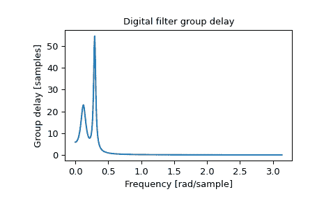

# `scipy.signal.group_delay`

> 原文：[`docs.scipy.org/doc/scipy-1.12.0/reference/generated/scipy.signal.group_delay.html#scipy.signal.group_delay`](https://docs.scipy.org/doc/scipy-1.12.0/reference/generated/scipy.signal.group_delay.html#scipy.signal.group_delay)

```py
scipy.signal.group_delay(system, w=512, whole=False, fs=6.283185307179586)
```

计算数字滤波器的组延迟。

组延迟测量信号各谱成分幅度包络被滤波器延迟多少个样本。形式上定义为连续（展开）相位的导数：

```py
 d        jw
D(w) = - -- arg H(e)
         dw 
```

参数：

**system**数组对（b, a）

滤波器传输函数的分子和分母系数。

**w**{无，整数，数组形式}，可选

如果是单个整数，则在那么多的频率上进行计算（默认为 N=512）。

如果是数组形式，则计算给定频率下的延迟。这些频率与*fs*单位相同。

**whole**布尔值，可选

通常，频率从 0 到奈奎斯特频率 fs/2（单位圆的上半部分）计算。如果*whole*为 True，则从 0 到 fs 计算频率。如果 w 是数组形式，则忽略。

**fs**浮点数，可选

数字系统的采样频率。默认为 2*pi 弧度/样本（所以 w 在 0 到 pi 之间）。

新版功能于版本 1.2.0 中添加。

返回：

**w**ndarray

计算组延迟的频率，单位与*fs*相同。默认情况下，*w*被归一化到范围 0, pi)（弧度/样本）。

**gd**ndarray

组延迟。

另请参阅

[`freqz`

数字滤波器的频率响应

注释

MATLAB 中的类似函数称为*grpdelay*。

如果数字系统的传输函数\(H(z)\)在单位圆上有零点或极点，则在相应频率下的组延迟是未定义的。当出现这种情况时，会发出警告，并将组延迟设置为这些频率上的 0。

关于组延迟的数值计算的详细信息，请参考[[1]](#r618f8c293c1c-1)。

新版功能于版本 0.16.0 中添加。

参考文献

[1]

Richard G. Lyons，《理解数字信号处理，第 3 版》，第 830 页。

示例

```py
>>> from scipy import signal
>>> b, a = signal.iirdesign(0.1, 0.3, 5, 50, ftype='cheby1')
>>> w, gd = signal.group_delay((b, a)) 
```

```py
>>> import matplotlib.pyplot as plt
>>> plt.title('Digital filter group delay')
>>> plt.plot(w, gd)
>>> plt.ylabel('Group delay [samples]')
>>> plt.xlabel('Frequency [rad/sample]')
>>> plt.show() 
```


