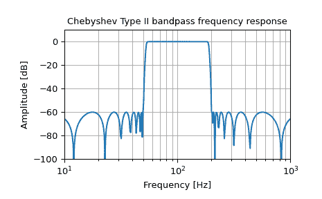
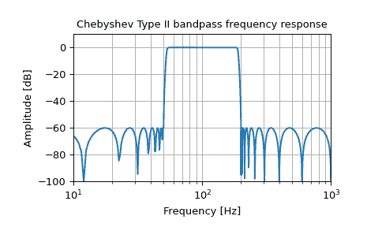

# `scipy.signal.iirfilter`

> 原始文本：[`docs.scipy.org/doc/scipy-1.12.0/reference/generated/scipy.signal.iirfilter.html#scipy.signal.iirfilter`](https://docs.scipy.org/doc/scipy-1.12.0/reference/generated/scipy.signal.iirfilter.html#scipy.signal.iirfilter)

```py
scipy.signal.iirfilter(N, Wn, rp=None, rs=None, btype='band', analog=False, ftype='butter', output='ba', fs=None)
```

给定阶数和临界点，设计 IIR 数字和模拟滤波器。

设计一个 N 阶数字或模拟滤波器，并返回滤波器系数。

参数：

**N** 整数

滤波器的阶数。

**Wn** 类似数组

给出临界频率的标量或长度为 2 的序列。

对于数字滤波器，*Wn*的单位与*fs*相同。默认情况下，*fs*为每个采样 2 个半周期，因此这些值从 0 到 1 进行归一化，其中 1 为奈奎斯特频率。(*Wn*因此是半周期/每个样本。)

对于模拟滤波器，*Wn* 是一个角频率（例如，rad/s）。

当 Wn 是长度为 2 的序列时，`Wn[0]`必须小于`Wn[1]`。

**rp** 浮点数, 可选

对于 Chebyshev 和 elliptic 滤波器，提供通带中的最大波纹。（dB）

**rs** 浮点数, 可选

对于 Chebyshev 和 elliptic 滤波器，提供阻带中的最小衰减。（dB）

**btype** {'bandpass', 'lowpass', 'highpass', 'bandstop'}, 可选

滤波器类型。默认为‘bandpass’。

**analog** 布尔值, 可选

当为 True 时，返回模拟滤波器，否则返回数字滤波器。

**ftype** 字符串, 可选

要设计的 IIR 滤波器类型：

> +   Butterworth：‘butter’
> +   
> +   Chebyshev I：‘cheby1’
> +   
> +   Chebyshev II：‘cheby2’
> +   
> +   Cauer/elliptic：‘ellip’
> +   
> +   Bessel/Thomson：‘bessel’

**output** {'ba', 'zpk', 'sos'}, 可选

输出的过滤器形式：

> +   二阶段形式（推荐）：‘sos’
> +   
> +   默认的分子/分母形式：‘ba’
> +   
> +   极点-零点形式：‘zpk’

一般推荐使用二阶段形式（‘sos’），因为推断出分子/分母形式（‘ba’）的系数会受到数值不稳定性的影响。出于向后兼容性的考虑，默认形式为分子/分母形式（‘ba’），其中‘b’和‘a’分别指代所用系数的常用名称。

注意：使用二阶段形式（‘sos’）有时会伴随额外的计算成本：因此，建议对于数据密集的用例也研究分子/分母形式（‘ba’）。

**fs** 浮点数, 可选

数字系统的采样频率。

1.2.0 版中新增。

返回：

**b, a** 数组, 数组

IIR 滤波器的分子（*b*）和分母（*a*）多项式。仅在`output='ba'`时返回。

**z, p, k** 数组, 数组, 浮点数

IIR 滤波器传递函数的零点、极点和系统增益。仅在`output='zpk'`时返回。

**sos** 数组

IIR 滤波器的二阶段形式表示。仅在`output='sos'`时返回。

另请参阅

`butter`

使用阶数和临界点进行滤波器设计。

`cheby1`, `cheby2`, `ellip`, `bessel`

`buttord`

从通带和阻带规范中找到阶数和临界点。

`cheb1ord`, `cheb2ord`, `ellipord`

`iirdesign`

使用通带和阻带规范进行通用滤波器设计。

注意

`'sos'`输出参数在 0.16.0 版本中被添加。

示例

生成一个从 50 Hz 到 200 Hz 的 17 阶 Chebyshev II 模拟带通滤波器，并绘制频率响应图：

```py
>>> import numpy as np
>>> from scipy import signal
>>> import matplotlib.pyplot as plt 
```

```py
>>> b, a = signal.iirfilter(17, [2*np.pi*50, 2*np.pi*200], rs=60,
...                         btype='band', analog=True, ftype='cheby2')
>>> w, h = signal.freqs(b, a, 1000)
>>> fig = plt.figure()
>>> ax = fig.add_subplot(1, 1, 1)
>>> ax.semilogx(w / (2*np.pi), 20 * np.log10(np.maximum(abs(h), 1e-5)))
>>> ax.set_title('Chebyshev Type II bandpass frequency response')
>>> ax.set_xlabel('Frequency [Hz]')
>>> ax.set_ylabel('Amplitude [dB]')
>>> ax.axis((10, 1000, -100, 10))
>>> ax.grid(which='both', axis='both')
>>> plt.show() 
```



在采样率为 2000 Hz 的系统中创建具有相同特性的数字滤波器，并绘制频率响应图。（需要使用二阶段实现以确保这一阶数的滤波器稳定性）：

```py
>>> sos = signal.iirfilter(17, [50, 200], rs=60, btype='band',
...                        analog=False, ftype='cheby2', fs=2000,
...                        output='sos')
>>> w, h = signal.sosfreqz(sos, 2000, fs=2000)
>>> fig = plt.figure()
>>> ax = fig.add_subplot(1, 1, 1)
>>> ax.semilogx(w, 20 * np.log10(np.maximum(abs(h), 1e-5)))
>>> ax.set_title('Chebyshev Type II bandpass frequency response')
>>> ax.set_xlabel('Frequency [Hz]')
>>> ax.set_ylabel('Amplitude [dB]')
>>> ax.axis((10, 1000, -100, 10))
>>> ax.grid(which='both', axis='both')
>>> plt.show() 
```


