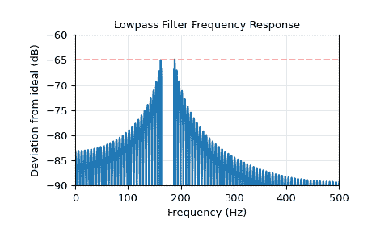

# `scipy.signal.kaiserord`

> 原文链接：[`docs.scipy.org/doc/scipy-1.12.0/reference/generated/scipy.signal.kaiserord.html#scipy.signal.kaiserord`](https://docs.scipy.org/doc/scipy-1.12.0/reference/generated/scipy.signal.kaiserord.html#scipy.signal.kaiserord)

```py
scipy.signal.kaiserord(ripple, width)
```

确定 Kaiser 窗口方法的滤波器窗口参数。

此函数返回的参数通常用于使用窗口法创建有限冲激响应滤波器，可以使用[`firwin`](https://docs.scipy.org/doc/scipy-1.12.0/reference/generated/scipy.signal.firwin.html#scipy.signal.firwin "scipy.signal.firwin")或[`firwin2`](https://docs.scipy.org/doc/scipy-1.12.0/reference/generated/scipy.signal.firwin2.html#scipy.signal.firwin2 "scipy.signal.firwin2")。

参数：

**ripple**浮点数

滤波器的频率响应的幅度与所需滤波器的频率响应的偏差的上限（不包括任何过渡区间中的频率）。也就是说，如果 w 是以 Nyquist 频率的分数表示的频率，则 A(w)是滤波器的实际频率响应，D(w)是期望的频率响应，则设计要求是：

```py
abs(A(w) - D(w))) < 10**(-ripple/20) 
```

对于 0 <= w <= 1 且 w 不在过渡区间内。

**width**浮点数

过渡区域的宽度，标准化为对应于每个采样π弧度。也就是说，频率表示为 Nyquist 频率的分数。

返回：

**numtaps**整数

Kaiser 窗口的长度。

**beta**浮点数

Kaiser 窗口的 beta 参数。

另见

[`kaiser_beta`](https://docs.scipy.org/doc/scipy-1.12.0/reference/generated/scipy.signal.kaiser_beta.html#scipy.signal.kaiser_beta "scipy.signal.kaiser_beta"), [`kaiser_atten`](https://docs.scipy.org/doc/scipy-1.12.0/reference/generated/scipy.signal.kaiser_atten.html#scipy.signal.kaiser_atten "scipy.signal.kaiser_atten")

注意事项

有几种方法可以获取 Kaiser 窗口：

+   `signal.windows.kaiser(numtaps, beta, sym=True)`

+   `signal.get_window(beta, numtaps)`

+   `signal.get_window(('kaiser', beta), numtaps)`

Kaiser 发现的经验方程式被使用。

参考文献

Oppenheim, Schafer, “离散时间信号处理”, pp.475-476.

示例

我们将使用 Kaiser 窗口方法为 1000 Hz 采样的信号设计低通 FIR 滤波器。

我们希望在阻带中至少有 65 dB 的抑制，在通带中增益变化不超过 0.5%。

我们希望截止频率为 175 Hz，通带和阻带之间的过渡为 24 Hz。也就是说，在区间[0, 163]内，增益变化不超过 0.5%，在区间[187, 500]内，信号至少被 65 dB 衰减。

```py
>>> import numpy as np
>>> from scipy.signal import kaiserord, firwin, freqz
>>> import matplotlib.pyplot as plt
>>> fs = 1000.0
>>> cutoff = 175
>>> width = 24 
```

**Kaiser 方法**接受一个参数来控制通带波动和阻带抑制，因此我们选择两者中较为严格的一个。在这种情况下，通带波动为 0.005，即 46.02 dB，因此我们将使用 65 dB 作为设计参数。

使用`kaiserord`确定滤波器的长度和 Kaiser 窗口的参数。

```py
>>> numtaps, beta = kaiserord(65, width/(0.5*fs))
>>> numtaps
167
>>> beta
6.20426 
```

使用[`firwin`](https://docs.scipy.org/doc/scipy-1.12.0/reference/generated/scipy.signal.firwin.html#scipy.signal.firwin "scipy.signal.firwin")创建 FIR 滤波器。

```py
>>> taps = firwin(numtaps, cutoff, window=('kaiser', beta),
...               scale=False, fs=fs) 
```

计算滤波器的频率响应。`w` 是频率数组，`h` 是相应的复数频率响应数组。

```py
>>> w, h = freqz(taps, worN=8000)
>>> w *= 0.5*fs/np.pi  # Convert w to Hz. 
```

计算滤波器响应的幅度与理想低通滤波器的偏差。过渡区域的数值设为`nan`，因此它们不会出现在绘图中。

```py
>>> ideal = w < cutoff  # The "ideal" frequency response.
>>> deviation = np.abs(np.abs(h) - ideal)
>>> deviation[(w > cutoff - 0.5*width) & (w < cutoff + 0.5*width)] = np.nan 
```

绘制偏差图。仔细观察阻带左端，显示出第一个主瓣中 65 dB 的衰减要求被超过约 0.125 dB。这对于凯泽窗方法并不罕见。

```py
>>> plt.plot(w, 20*np.log10(np.abs(deviation)))
>>> plt.xlim(0, 0.5*fs)
>>> plt.ylim(-90, -60)
>>> plt.grid(alpha=0.25)
>>> plt.axhline(-65, color='r', ls='--', alpha=0.3)
>>> plt.xlabel('Frequency (Hz)')
>>> plt.ylabel('Deviation from ideal (dB)')
>>> plt.title('Lowpass Filter Frequency Response')
>>> plt.show() 
```


