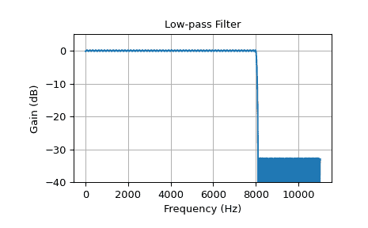
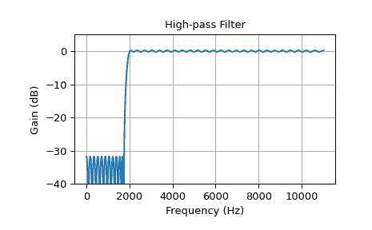
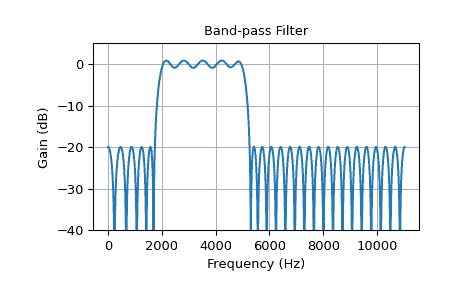
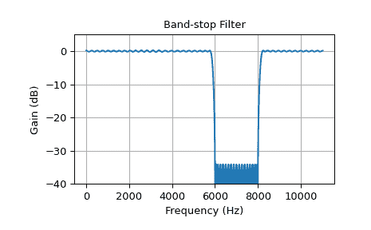

# `scipy.signal.remez`

> 原文：[`docs.scipy.org/doc/scipy-1.12.0/reference/generated/scipy.signal.remez.html#scipy.signal.remez`](https://docs.scipy.org/doc/scipy-1.12.0/reference/generated/scipy.signal.remez.html#scipy.signal.remez)

```py
scipy.signal.remez(numtaps, bands, desired, *, weight=None, Hz=<object object>, type='bandpass', maxiter=25, grid_density=16, fs=None)
```

使用 Remez 交换算法计算极小值最优滤波器。

使用 Remez 交换算法在指定频段中最小化所需增益与实际增益之间的最大误差，计算有限脉冲响应（FIR）滤波器的滤波器系数。

参数：

**numtaps**整数

滤波器中所需的阶数。阶数是滤波器中的项数，或者是滤波器阶数加一。

**bands**数组型

包含带边缘的单调序列。所有元素必须为非负且小于由 *fs* 给出的采样频率的一半。

**desired**数组型

包含每个指定频段中所需增益的带的一半大小的序列。

**weight**数组型，可选

给每个带区域赋予的相对权重。*weight* 的长度必须是 *bands* 长度的一半。

**Hz**标量，可选，已弃用

信号的采样频率（单位：赫兹）。默认为 1。

自 1.0.0 版起弃用：`remez`关键字参数*Hz*，将被*fs*取代，并将在 SciPy 1.14.0 中删除。

**type**{‘bandpass’, ‘differentiator’, ‘hilbert’}，可选

滤波器类型：

> +   ‘bandpass’：带通响应。这是默认设置。
> +   
> +   ‘differentiator’：频率比例响应带。
> +   
> +   ‘hilbert’滤波器，具有奇对称性，即类型 III
> +   
>     （对于偶数阶）或类型 IV（对于奇数阶）线性相位滤波器。

**maxiter**整数，可选

算法的最大迭代次数。默认为 25。

**grid_density**整数，可选

网格密度。在`remez`中使用的密集网格大小为`(numtaps + 1) * grid_density`。默认为 16。

**fs**浮点数，可选

信号的采样频率。默认为 1。

返回：

**out**ndarray

一个秩为 1 的数组，包含最优（在最小最大意义上）滤波器的系数。

另见

`firls`

`firwin`

`firwin2`

`minimum_phase`

参考文献

[1]

J. H. McClellan 和 T. W. Parks，“一种统一的最优 FIR 线性相位数字滤波器设计方法”，IEEE Trans. Circuit Theory, vol. CT-20, pp. 697-701, 1973 年。

[2]

J. H. McClellan, T. W. Parks 和 L. R. Rabiner，“用于设计最优 FIR 线性相位数字滤波器的计算机程序”，IEEE Trans. Audio Electroacoust., vol. AU-21, pp. 506-525, 1973 年。

示例

在这些示例中，`remez` 用于设计低通、高通、带通和带阻滤波器。定义每个滤波器的参数包括滤波器阶数、频带边界、边界过渡宽度、每个频带中的期望增益以及采样频率。

在所有示例中，我们将使用 22050 Hz 的采样频率。在每个示例中，每个频带中的期望增益为 0（阻带）或 1（通带）。

`freqz` 用于计算每个滤波器的频率响应，下面定义的实用函数 `plot_response` 用于绘制响应。

```py
>>> import numpy as np
>>> from scipy import signal
>>> import matplotlib.pyplot as plt 
```

```py
>>> fs = 22050   # Sample rate, Hz 
```

```py
>>> def plot_response(w, h, title):
...     "Utility function to plot response functions"
...     fig = plt.figure()
...     ax = fig.add_subplot(111)
...     ax.plot(w, 20*np.log10(np.abs(h)))
...     ax.set_ylim(-40, 5)
...     ax.grid(True)
...     ax.set_xlabel('Frequency (Hz)')
...     ax.set_ylabel('Gain (dB)')
...     ax.set_title(title) 
```

第一个示例是一个低通滤波器，截止频率为 8 kHz。滤波器长度为 325，从通带到阻带的过渡宽度为 100 Hz。

```py
>>> cutoff = 8000.0    # Desired cutoff frequency, Hz
>>> trans_width = 100  # Width of transition from pass to stop, Hz
>>> numtaps = 325      # Size of the FIR filter.
>>> taps = signal.remez(numtaps, [0, cutoff, cutoff + trans_width, 0.5*fs],
...                     [1, 0], fs=fs)
>>> w, h = signal.freqz(taps, [1], worN=2000, fs=fs)
>>> plot_response(w, h, "Low-pass Filter")
>>> plt.show() 
```



此示例展示了一个高通滤波器：

```py
>>> cutoff = 2000.0    # Desired cutoff frequency, Hz
>>> trans_width = 250  # Width of transition from pass to stop, Hz
>>> numtaps = 125      # Size of the FIR filter.
>>> taps = signal.remez(numtaps, [0, cutoff - trans_width, cutoff, 0.5*fs],
...                     [0, 1], fs=fs)
>>> w, h = signal.freqz(taps, [1], worN=2000, fs=fs)
>>> plot_response(w, h, "High-pass Filter")
>>> plt.show() 
```



此示例展示了一个带通滤波器，通带从 2 kHz 到 5 kHz。过渡宽度为 260 Hz，滤波器长度为 63，比其他示例中的要小：

```py
>>> band = [2000, 5000]  # Desired pass band, Hz
>>> trans_width = 260    # Width of transition from pass to stop, Hz
>>> numtaps = 63         # Size of the FIR filter.
>>> edges = [0, band[0] - trans_width, band[0], band[1],
...          band[1] + trans_width, 0.5*fs]
>>> taps = signal.remez(numtaps, edges, [0, 1, 0], fs=fs)
>>> w, h = signal.freqz(taps, [1], worN=2000, fs=fs)
>>> plot_response(w, h, "Band-pass Filter")
>>> plt.show() 
```



低阶数导致更高的波动和更缓的过渡。

接下来的示例展示了一个带阻滤波器。

```py
>>> band = [6000, 8000]  # Desired stop band, Hz
>>> trans_width = 200    # Width of transition from pass to stop, Hz
>>> numtaps = 175        # Size of the FIR filter.
>>> edges = [0, band[0] - trans_width, band[0], band[1],
...          band[1] + trans_width, 0.5*fs]
>>> taps = signal.remez(numtaps, edges, [1, 0, 1], fs=fs)
>>> w, h = signal.freqz(taps, [1], worN=2000, fs=fs)
>>> plot_response(w, h, "Band-stop Filter")
>>> plt.show() 
```


