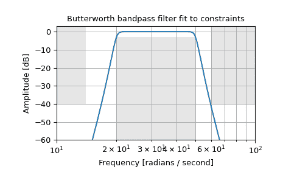

# `scipy.signal.buttord`

> 原文链接：[`docs.scipy.org/doc/scipy-1.12.0/reference/generated/scipy.signal.buttord.html#scipy.signal.buttord`](https://docs.scipy.org/doc/scipy-1.12.0/reference/generated/scipy.signal.buttord.html#scipy.signal.buttord)

```py
scipy.signal.buttord(wp, ws, gpass, gstop, analog=False, fs=None)
```

巴特沃斯滤波器阶数选择。

返回损失不超过*gpass* dB 的通带和阻带至少*gstop* dB 衰减的最低阶数字或模拟巴特沃斯滤波器的阶数。

参数：

**wp, ws**float

通带和阻带边缘频率。

对于数字滤波器，这些单位与*fs*相同。默认情况下，*fs*为 2 个半周期/样本，因此这些单位在 0 到 1 之间归一化，其中 1 为奈奎斯特频率。因此，*wp*和*ws*以半周期/样本计。例如：

> +   低通：wp = 0.2，ws = 0.3
> +   
> +   高通：wp = 0.3，ws = 0.2
> +   
> +   带通：wp = [0.2, 0.5]，ws = [0.1, 0.6]
> +   
> +   带阻：wp = [0.1, 0.6]，ws = [0.2, 0.5]

对于模拟滤波器，*wp*和*ws*是角频率（例如，rad/s）。

**gpass**float

通带中的最大损失（dB）。

**gstop**float

阻带中的最小衰减（dB）。

**analog**bool，可选

当为 True 时，返回模拟滤波器，否则返回数字滤波器。

**fs**float，可选

数字系统的采样频率。

自 1.2.0 版本新增。

返回：

**ord**int

满足规格的最低巴特沃斯滤波器阶数。

**wn**ndarray 或 float

巴特沃斯自然频率（即“3dB 频率”）。应与[`butter`](https://docs.scipy.org/doc/scipy-1.12.0/reference/generated/scipy.signal.butter.html#scipy.signal.butter "scipy.signal.butter")一起使用以提供滤波器结果。如果指定了*fs*，则单位相同，同时必须将*fs*传递给[`butter`](https://docs.scipy.org/doc/scipy-1.12.0/reference/generated/scipy.signal.butter.html#scipy.signal.butter "scipy.signal.butter")。

参见：

[`butter`](https://docs.scipy.org/doc/scipy-1.12.0/reference/generated/scipy.signal.butter.html#scipy.signal.butter "scipy.signal.butter")

使用阶数和关键点进行滤波器设计

[`cheb1ord`](https://docs.scipy.org/doc/scipy-1.12.0/reference/generated/scipy.signal.cheb1ord.html#scipy.signal.cheb1ord "scipy.signal.cheb1ord")

从通带和阻带规格中查找阶数和关键点

[`cheb2ord`](https://docs.scipy.org/doc/scipy-1.12.0/reference/generated/scipy.signal.cheb2ord.html#scipy.signal.cheb2ord "scipy.signal.cheb2ord")，[`ellipord`](https://docs.scipy.org/doc/scipy-1.12.0/reference/generated/scipy.signal.ellipord.html#scipy.signal.ellipord "scipy.signal.ellipord")

[`iirfilter`](https://docs.scipy.org/doc/scipy-1.12.0/reference/generated/scipy.signal.iirfilter.html#scipy.signal.iirfilter "scipy.signal.iirfilter")

使用阶数和关键频率进行一般滤波器设计

[`iirdesign`](https://docs.scipy.org/doc/scipy-1.12.0/reference/generated/scipy.signal.iirdesign.html#scipy.signal.iirdesign "scipy.signal.iirdesign")

使用通带和阻带规格进行一般滤波器设计

示例

设计一个模拟带通滤波器，通带内从 20 到 50 rad/s 的损失不超过 3 dB，同时在 14 rad/s 以下和 60 rad/s 以上至少有-40 dB 的衰减。绘制其频率响应图，显示通带和阻带约束为灰色。

```py
>>> from scipy import signal
>>> import matplotlib.pyplot as plt
>>> import numpy as np 
```

```py
>>> N, Wn = signal.buttord([20, 50], [14, 60], 3, 40, True)
>>> b, a = signal.butter(N, Wn, 'band', True)
>>> w, h = signal.freqs(b, a, np.logspace(1, 2, 500))
>>> plt.semilogx(w, 20 * np.log10(abs(h)))
>>> plt.title('Butterworth bandpass filter fit to constraints')
>>> plt.xlabel('Frequency [radians / second]')
>>> plt.ylabel('Amplitude [dB]')
>>> plt.grid(which='both', axis='both')
>>> plt.fill([1,  14,  14,   1], [-40, -40, 99, 99], '0.9', lw=0) # stop
>>> plt.fill([20, 20,  50,  50], [-99, -3, -3, -99], '0.9', lw=0) # pass
>>> plt.fill([60, 60, 1e9, 1e9], [99, -40, -40, 99], '0.9', lw=0) # stop
>>> plt.axis([10, 100, -60, 3])
>>> plt.show() 
```


