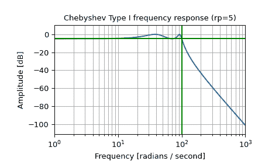
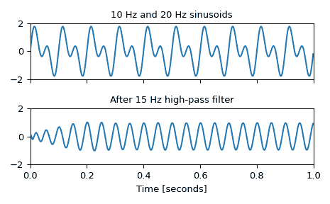

# `scipy.signal.cheby1`

> 原文链接：[`docs.scipy.org/doc/scipy-1.12.0/reference/generated/scipy.signal.cheby1.html#scipy.signal.cheby1`](https://docs.scipy.org/doc/scipy-1.12.0/reference/generated/scipy.signal.cheby1.html#scipy.signal.cheby1)

```py
scipy.signal.cheby1(N, rp, Wn, btype='low', analog=False, output='ba', fs=None)
```

Chebyshev 类型 I 数字和模拟滤波器设计。

设计 N 阶数字或模拟 Chebyshev 类型 I 滤波器并返回滤波器系数。

参数：

**N**整数

滤波器的阶数。

**rp**浮点数

允许通过通带下方的最大纹波。以分贝为单位，作为正数。

**Wn**数组类型

一个标量或长度为 2 的序列，给出关键频率。对于类型 I 滤波器，这是在增益首次降至-*rp*的过渡带中的点。

对于数字滤波器，*Wn*与*fs*具有相同的单位。默认情况下，*fs*为每样本 2 个半周期，因此这些被归一化为 0 到 1，其中 1 为奈奎斯特频率。 （*Wn*因此在半周期/样本中。）

对于模拟滤波器，*Wn*是角频率（例如，rad/s）。

**btype**{‘lowpass’，‘highpass’，‘bandpass’，‘bandstop’}，可选

滤波器的类型。默认为‘低通’。

**analog**布尔型，可选

当为 True 时，返回模拟滤波器，否则返回数字滤波器。

**output**{‘ba’，‘zpk’，‘sos’}，可选

输出类型：分子/分母（‘ba’），极点-零点（‘zpk’）或二阶段（‘sos’）。默认为‘ba’以保持向后兼容性，但一般用于过滤的‘sos’应该使用。

**fs**浮点数，可选

数字系统的采样频率。

新版本 1.2.0 中新增。

返回：

**b, a**数组，数组

IIR 滤波器的分子（*b*）和分母（*a*）多项式。仅在`output='ba'`时返回。

**z, p, k**数组，数组，浮点数

IIR 滤波器传递函数的零点、极点和系统增益。仅在`output='zpk'`时返回。

**sos**数组

IIR 滤波器的二阶段表示。仅在`output='sos'`时返回。

另请参阅

[`cheb1ord`](https://docs.scipy.org/doc/scipy-1.12.0/reference/generated/scipy.signal.cheb1ord.html#scipy.signal.cheb1ord)，[`cheb1ap`](https://docs.scipy.org/doc/scipy-1.12.0/reference/generated/scipy.signal.cheb1ap.html#scipy.signal.cheb1ap)

注意事项

Chebyshev 类型 I 滤波器在频率响应的通带和阻带之间的切换速率最大化，但代价是通带中的纹波增加和阶跃响应中的增加振荡。

类型 I 滤波器比类型 II 滤波器（[`cheby2`](https://docs.scipy.org/doc/scipy-1.12.0/reference/generated/scipy.signal.cheby2.html#scipy.signal.cheby2)）更快地衰减，但类型 II 滤波器在通带中没有任何纹波。

均波通带有 N 个最大或最小值（例如，5 阶滤波器具有 3 个最大值和 2 个最小值）。因此，奇数阶滤波器的直流增益为单位，偶数阶滤波器为-rp dB。

`'sos'`输出参数在 0.16.0 中添加。

示例

设计模拟滤波器并绘制其频率响应图，显示关键点：

```py
>>> from scipy import signal
>>> import matplotlib.pyplot as plt
>>> import numpy as np 
```

```py
>>> b, a = signal.cheby1(4, 5, 100, 'low', analog=True)
>>> w, h = signal.freqs(b, a)
>>> plt.semilogx(w, 20 * np.log10(abs(h)))
>>> plt.title('Chebyshev Type I frequency response (rp=5)')
>>> plt.xlabel('Frequency [radians / second]')
>>> plt.ylabel('Amplitude [dB]')
>>> plt.margins(0, 0.1)
>>> plt.grid(which='both', axis='both')
>>> plt.axvline(100, color='green') # cutoff frequency
>>> plt.axhline(-5, color='green') # rp
>>> plt.show() 
```



生成一个由 10 Hz 和 20 Hz 组成的信号，采样频率为 1 kHz

```py
>>> t = np.linspace(0, 1, 1000, False)  # 1 second
>>> sig = np.sin(2*np.pi*10*t) + np.sin(2*np.pi*20*t)
>>> fig, (ax1, ax2) = plt.subplots(2, 1, sharex=True)
>>> ax1.plot(t, sig)
>>> ax1.set_title('10 Hz and 20 Hz sinusoids')
>>> ax1.axis([0, 1, -2, 2]) 
```

设计一个数字高通滤波器，在 15 Hz 处去除 10 Hz 的音调，并将其应用到信号中。（在滤波时建议使用二阶段格式，以避免使用传递函数（`ba`）格式时的数值误差）：

```py
>>> sos = signal.cheby1(10, 1, 15, 'hp', fs=1000, output='sos')
>>> filtered = signal.sosfilt(sos, sig)
>>> ax2.plot(t, filtered)
>>> ax2.set_title('After 15 Hz high-pass filter')
>>> ax2.axis([0, 1, -2, 2])
>>> ax2.set_xlabel('Time [seconds]')
>>> plt.tight_layout()
>>> plt.show() 
```


