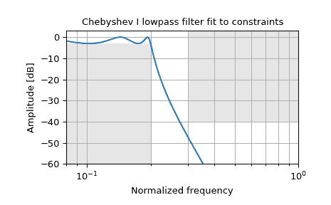

# `scipy.signal.cheb1ord`

> 原文：[`docs.scipy.org/doc/scipy-1.12.0/reference/generated/scipy.signal.cheb1ord.html#scipy.signal.cheb1ord`](https://docs.scipy.org/doc/scipy-1.12.0/reference/generated/scipy.signal.cheb1ord.html#scipy.signal.cheb1ord)

```py
scipy.signal.cheb1ord(wp, ws, gpass, gstop, analog=False, fs=None)
```

切比雪夫 I 型滤波器阶数选择。

返回数字或模拟切比雪夫 I 型滤波器的最低阶数，其在通带内不超过*gpass* dB 的损失，并且在阻带至少有*gstop* dB 的衰减。

参数：

**wp, ws**float

通带和阻带的边缘频率。

对于数字滤波器，这些单位与*fs*相同。默认情况下，*fs*是每样本 2 个半周期，因此这些单位归一化为 0 到 1，其中 1 是奈奎斯特频率。 (*wp*和*ws*因此在半周期/样本中。) 例如：

> +   低通：wp = 0.2, ws = 0.3
> +   
> +   高通：wp = 0.3, ws = 0.2
> +   
> +   带通：wp = [0.2, 0.5], ws = [0.1, 0.6]
> +   
> +   带阻：wp = [0.1, 0.6], ws = [0.2, 0.5]

对于模拟滤波器，*wp*和*ws*是角频率（例如，rad/s）。

**gpass**float

通带内的最大损失（dB）。

**gstop**float

阻带中的最小衰减（dB）。

**analog**bool, optional

如果为 True，则返回模拟滤波器，否则返回数字滤波器。

**fs**float, optional

数字系统的采样频率。

1.2.0 版本的新功能。

返回：

**ord**int

满足规格的切比雪夫 I 型滤波器的最低阶数。

**wn**ndarray 或 float

切比雪夫自然频率（“3 dB 频率”），用于与`cheby1`一起提供滤波器结果。如果指定了*fs*，则以相同的单位表示，必须同时传递给`cheby1`。

另请参见

`cheby1`

使用通带和阻带规格进行滤波器设计

`buttord`

从通带和阻带规格中找到阶数和关键点

`cheb2ord`, `ellipord`

`iirfilter`

使用阶数和关键频率进行通用滤波器设计。

`iirdesign`

使用通带和阻带规格查找阶数和关键点

示例

设计数字低通滤波器，使其通带在 0.2*(fs/2)内保持在 3 dB 以内，同时在 0.3*(fs/2)以上至少拒绝-40 dB。在灰色中显示其频率响应曲线，展示通带和阻带的限制。

```py
>>> from scipy import signal
>>> import matplotlib.pyplot as plt
>>> import numpy as np 
```

```py
>>> N, Wn = signal.cheb1ord(0.2, 0.3, 3, 40)
>>> b, a = signal.cheby1(N, 3, Wn, 'low')
>>> w, h = signal.freqz(b, a)
>>> plt.semilogx(w / np.pi, 20 * np.log10(abs(h)))
>>> plt.title('Chebyshev I lowpass filter fit to constraints')
>>> plt.xlabel('Normalized frequency')
>>> plt.ylabel('Amplitude [dB]')
>>> plt.grid(which='both', axis='both')
>>> plt.fill([.01, 0.2, 0.2, .01], [-3, -3, -99, -99], '0.9', lw=0) # stop
>>> plt.fill([0.3, 0.3,   2,   2], [ 9, -40, -40,  9], '0.9', lw=0) # pass
>>> plt.axis([0.08, 1, -60, 3])
>>> plt.show() 
```


