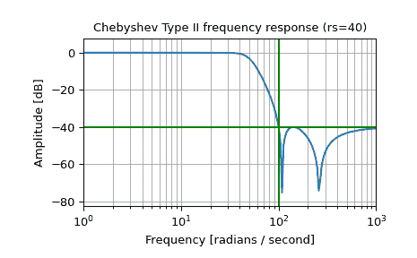
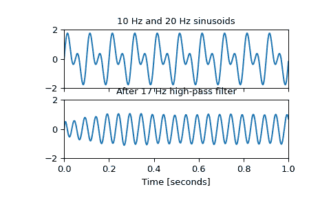

# `scipy.signal.cheby2`

> 原文链接：[`docs.scipy.org/doc/scipy-1.12.0/reference/generated/scipy.signal.cheby2.html#scipy.signal.cheby2`](https://docs.scipy.org/doc/scipy-1.12.0/reference/generated/scipy.signal.cheby2.html#scipy.signal.cheby2)

```py
scipy.signal.cheby2(N, rs, Wn, btype='low', analog=False, output='ba', fs=None)
```

Chebyshev type II 数字和模拟滤波器设计。

设计一个 N 阶数字或模拟 Chebyshev type II 滤波器并返回滤波器系数。

参数：

**N**int

滤波器的阶数。

**rs**float

在停止带中所需的最小衰减。以分贝表示，作为正数。

**Wn** array_like

一个标量或长度为 2 的序列，给出关键频率。对于 Type II 滤波器，这是增益首次达到 -*rs* 的过渡带中的点。

对于数字滤波器，*Wn* 的单位与 *fs* 相同。默认情况下，*fs* 是每样本 2 个半周期，因此这些值在 0 到 1 之间归一化，其中 1 是奈奎斯特频率。 (*Wn* 因此是半周期 / 样本。)

对于模拟滤波器，*Wn* 是一个角频率（例如，rad/s）。

**类型**{‘低通’, ‘高通’, ‘带通’, ‘带阻’}，可选

滤波器类型。默认为‘低通’。

**模拟**bool，可选

当为 True 时，返回模拟滤波器，否则返回数字滤波器。

**输出**{‘ba’, ‘zpk’, ‘sos’}，可选

输出类型：分子/分母（‘ba’）、极点-零点（‘zpk’）或二阶段（‘sos’）。默认为 ‘ba’，为了向后兼容性，但一般用于滤波的 ‘sos’ 应该使用。

**fs**float，可选

数字系统的采样频率。

新功能，版本 1.2.0 中添加。

返回：

**b, a** ndarray, ndarray

IIR 滤波器的分子（*b*）和分母（*a*）多项式。仅当 `output='ba'` 时返回。

**z, p, k** ndarray, ndarray, float

IIR 滤波器传递函数的零点、极点和系统增益。仅当 `output='zpk'` 时返回。

**sos** ndarray

IIR 滤波器的二阶段表示。仅当 `output='sos'` 时返回。

另见

[`cheb2ord`](https://docs.scipy.org/doc/scipy-1.12.0/reference/generated/scipy.signal.cheb2ord.html#scipy.signal.cheb2ord)、[`cheb2ap`](https://docs.scipy.org/doc/scipy-1.12.0/reference/generated/scipy.signal.cheb2ap.html#scipy.signal.cheb2ap)

注：

Chebyshev type II 滤波器最大化通频带和阻带之间的截止速率，但以阻带中的波纹和阶跃响应中的增加振荡为代价。

Type II 滤波器不像 Type I 那样快速衰减（[`cheby1`](https://docs.scipy.org/doc/scipy-1.12.0/reference/generated/scipy.signal.cheby1.html#scipy.signal.cheby1)）。

`'sos'` 输出参数在版本 0.16.0 中添加。

示例

设计一个模拟滤波器并绘制其频率响应，显示关键点：

```py
>>> from scipy import signal
>>> import matplotlib.pyplot as plt
>>> import numpy as np 
```

```py
>>> b, a = signal.cheby2(4, 40, 100, 'low', analog=True)
>>> w, h = signal.freqs(b, a)
>>> plt.semilogx(w, 20 * np.log10(abs(h)))
>>> plt.title('Chebyshev Type II frequency response (rs=40)')
>>> plt.xlabel('Frequency [radians / second]')
>>> plt.ylabel('Amplitude [dB]')
>>> plt.margins(0, 0.1)
>>> plt.grid(which='both', axis='both')
>>> plt.axvline(100, color='green') # cutoff frequency
>>> plt.axhline(-40, color='green') # rs
>>> plt.show() 
```



生成一个由 10 Hz 和 20 Hz 组成的信号，采样频率为 1 kHz

```py
>>> t = np.linspace(0, 1, 1000, False)  # 1 second
>>> sig = np.sin(2*np.pi*10*t) + np.sin(2*np.pi*20*t)
>>> fig, (ax1, ax2) = plt.subplots(2, 1, sharex=True)
>>> ax1.plot(t, sig)
>>> ax1.set_title('10 Hz and 20 Hz sinusoids')
>>> ax1.axis([0, 1, -2, 2]) 
```

设计一个数字高通滤波器，截止频率为 17 Hz，以去除 10 Hz 音调，并将其应用于信号。（在滤波时推荐使用二阶段格式，以避免传递函数 (`ba`) 格式的数值误差）：

```py
>>> sos = signal.cheby2(12, 20, 17, 'hp', fs=1000, output='sos')
>>> filtered = signal.sosfilt(sos, sig)
>>> ax2.plot(t, filtered)
>>> ax2.set_title('After 17 Hz high-pass filter')
>>> ax2.axis([0, 1, -2, 2])
>>> ax2.set_xlabel('Time [seconds]')
>>> plt.show() 
```


