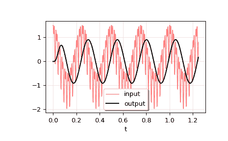
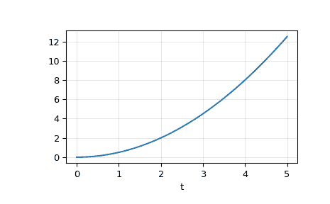

# `scipy.signal.lsim`

> 原文链接：[`docs.scipy.org/doc/scipy-1.12.0/reference/generated/scipy.signal.lsim.html#scipy.signal.lsim`](https://docs.scipy.org/doc/scipy-1.12.0/reference/generated/scipy.signal.lsim.html#scipy.signal.lsim)

```py
scipy.signal.lsim(system, U, T, X0=None, interp=True)
```

模拟连续时间线性系统的输出。

参数：

**system**LTI 类的实例或描述系统的元组。

下面给出元组中元素的数量和解释：

+   1：（`lti`的实例）

+   2：（num，den）

+   3：（zeros，poles，gain）

+   4：（A，B，C，D）

**U**array_like

描述每个时间*T*的输入的输入数组（假设在给定时间之间进行插值）。如果有多个输入，则二维数组的每列表示一个输入。如果 U = 0 或 None，则使用零输入。

**T**array_like

定义输入和期望输出的时间步长。必须是非负、递增且等间距的。

**X0**array_like，可选

状态向量的初始条件（默认为零）。

**interp**布尔值，可选

是否使用线性（True，默认）或零阶保持（False）插值输入数组。

返回：

**T**1D ndarray

输出的时间值。

**yout**1D ndarray

系统响应。

**xout**ndarray

状态向量的时间演变。

注意事项

如果`system`传入`(num, den)`，则分子和分母系数应按降幂顺序指定（例如，`s² + 3s + 5`应表示为`[1, 3, 5]`）。

示例

我们将使用`lsim`来模拟应用于信号的模拟 Bessel 滤波器。

```py
>>> import numpy as np
>>> from scipy.signal import bessel, lsim
>>> import matplotlib.pyplot as plt 
```

创建一个 12 Hz 截止频率的低通 Bessel 滤波器。

```py
>>> b, a = bessel(N=5, Wn=2*np.pi*12, btype='lowpass', analog=True) 
```

生成要应用滤波器的数据。

```py
>>> t = np.linspace(0, 1.25, 500, endpoint=False) 
```

输入信号是三个正弦曲线的和，频率分别为 4 Hz、40 Hz 和 80 Hz。滤波器应大部分消除 40 Hz 和 80 Hz 分量，只留下 4 Hz 信号。

```py
>>> u = (np.cos(2*np.pi*4*t) + 0.6*np.sin(2*np.pi*40*t) +
...      0.5*np.cos(2*np.pi*80*t)) 
```

使用`lsim`模拟滤波器。

```py
>>> tout, yout, xout = lsim((b, a), U=u, T=t) 
```

绘制结果。

```py
>>> plt.plot(t, u, 'r', alpha=0.5, linewidth=1, label='input')
>>> plt.plot(tout, yout, 'k', linewidth=1.5, label='output')
>>> plt.legend(loc='best', shadow=True, framealpha=1)
>>> plt.grid(alpha=0.3)
>>> plt.xlabel('t')
>>> plt.show() 
```



在第二个示例中，我们模拟双积分器`y'' = u`，具有恒定输入`u = 1`。我们将使用积分器的状态空间表示。

```py
>>> from scipy.signal import lti
>>> A = np.array([[0.0, 1.0], [0.0, 0.0]])
>>> B = np.array([[0.0], [1.0]])
>>> C = np.array([[1.0, 0.0]])
>>> D = 0.0
>>> system = lti(A, B, C, D) 
```

*t*和*u*定义要模拟的系统的时间和输入信号。

```py
>>> t = np.linspace(0, 5, num=50)
>>> u = np.ones_like(t) 
```

计算仿真，然后绘制*y*。如预期，图形显示曲线`y = 0.5*t**2`。

```py
>>> tout, y, x = lsim(system, u, t)
>>> plt.plot(t, y)
>>> plt.grid(alpha=0.3)
>>> plt.xlabel('t')
>>> plt.show() 
```


