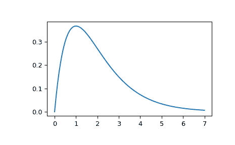

# `scipy.signal.impulse2`

> 原文：[`docs.scipy.org/doc/scipy-1.12.0/reference/generated/scipy.signal.impulse2.html#scipy.signal.impulse2`](https://docs.scipy.org/doc/scipy-1.12.0/reference/generated/scipy.signal.impulse2.html#scipy.signal.impulse2)

```py
scipy.signal.impulse2(system, X0=None, T=None, N=None, **kwargs)
```

单输入连续时间线性系统的冲激响应。

自版本 1.11.0 起弃用：函数`impulse2`已弃用，建议用户切换到更快、更精确的[`impulse`](https://docs.scipy.org/doc/scipy-1.12.0/reference/generated/scipy.signal.impulse.html#scipy.signal.impulse "scipy.signal.impulse")函数。`impulse2`将在 SciPy 1.13 中移除。

参数：

**system**LTI 类的实例或数组样式的元组

描述系统的整数。以下给出了元组中元素的数量和解释：

> +   1 (实例[`lti`](https://docs.scipy.org/doc/scipy-1.12.0/reference/generated/scipy.signal.lti.html#scipy.signal.lti "scipy.signal.lti"))
> +   
> +   2 (num, den)
> +   
> +   3 (零点、极点、增益)
> +   
> +   4 (A、B、C、D)

**X0**1-D array_like，可选

状态向量的初始条件。默认值为 0（零向量）。

**T**1-D array_like, 可选

输入定义和输出所需的时间步长。如果未给定 *T*，则函数将自动生成一组时间样本。

**N**int，可选

要计算的时间点数。默认值为 100。

**kwargs**各种类型

额外的关键字参数被传递给函数[`scipy.signal.lsim2`](https://docs.scipy.org/doc/scipy-1.12.0/reference/generated/scipy.signal.lsim2.html#scipy.signal.lsim2 "scipy.signal.lsim2")，该函数进一步将其传递给[`scipy.integrate.odeint`](https://docs.scipy.org/doc/scipy-1.12.0/reference/generated/scipy.integrate.odeint.html#scipy.integrate.odeint "scipy.integrate.odeint")；请参阅后者的文档以获取有关这些参数的信息。

返回：

**T**ndarray

输出的时间值。

**yout**ndarray

系统的输出响应。

另请参见

[`impulse`](https://docs.scipy.org/doc/scipy-1.12.0/reference/generated/scipy.signal.impulse.html#scipy.signal.impulse "scipy.signal.impulse")，[`lsim2`](https://docs.scipy.org/doc/scipy-1.12.0/reference/generated/scipy.signal.lsim2.html#scipy.signal.lsim2 "scipy.signal.lsim2")，[`scipy.integrate.odeint`](https://docs.scipy.org/doc/scipy-1.12.0/reference/generated/scipy.integrate.odeint.html#scipy.integrate.odeint "scipy.integrate.odeint")

注释

通过调用[`scipy.signal.lsim2`](https://docs.scipy.org/doc/scipy-1.12.0/reference/generated/scipy.signal.lsim2.html#scipy.signal.lsim2 "scipy.signal.lsim2")生成解，该函数使用微分方程求解器[`scipy.integrate.odeint`](https://docs.scipy.org/doc/scipy-1.12.0/reference/generated/scipy.integrate.odeint.html#scipy.integrate.odeint "scipy.integrate.odeint")。

由于现在`impulse2`已被弃用，建议用户切换到速度更快、更精确的[`impulse`](https://docs.scipy.org/doc/scipy-1.12.0/reference/generated/scipy.signal.impulse.html#scipy.signal.impulse "scipy.signal.impulse")函数。[`scipy.integrate.odeint`](https://docs.scipy.org/doc/scipy-1.12.0/reference/generated/scipy.integrate.odeint.html#scipy.integrate.odeint "scipy.integrate.odeint")的关键字参数在[`impulse`](https://docs.scipy.org/doc/scipy-1.12.0/reference/generated/scipy.signal.impulse.html#scipy.signal.impulse "scipy.signal.impulse")中不受支持，但通常不需要。

如果 `system` 参数传入 `(num, den)`，则分子和分母的系数都应按降幂顺序指定（例如，`s² + 3s + 5` 应表示为 `[1, 3, 5]`）。

新功能在版本 0.8.0 中引入。

示例

计算具有重复根的二阶系统的冲激响应：`x''(t) + 2*x'(t) + x(t) = u(t)`

```py
>>> from scipy import signal 
```

```py
>>> system = ([1.0], [1.0, 2.0, 1.0]) 
```

```py
>>> t, y = signal.impulse2(system)
>>> import matplotlib.pyplot as plt
>>> plt.plot(t, y) 
```


