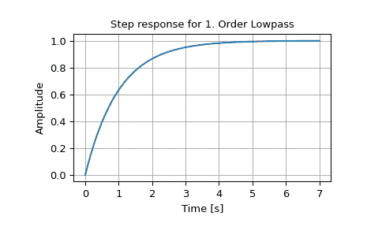

# `scipy.signal.step2`

> 原文链接：[`docs.scipy.org/doc/scipy-1.12.0/reference/generated/scipy.signal.step2.html#scipy.signal.step2`](https://docs.scipy.org/doc/scipy-1.12.0/reference/generated/scipy.signal.step2.html#scipy.signal.step2)

```py
scipy.signal.step2(system, X0=None, T=None, N=None, **kwargs)
```

连续时间系统的阶跃响应。

此函数与`scipy.signal.step`功能上相同，但使用函数`scipy.signal.lsim2`计算阶跃响应。

自版本 1.11.0 起弃用：函数`step2`已弃用，建议使用更快的`step`函数。`step2`将在 SciPy 1.13 中移除。

参数：

**system**LTI 类的实例或 array_like 元组

描述系统。以下给出了元组中元素数量及其解释：

> +   1（`lti`的实例）
> +   
> +   2（num、den）
> +   
> +   3（零点、极点、增益）
> +   
> +   4（A、B、C、D）

**X0**array_like，可选

初始状态向量（默认为零）。

**T**array_like，可选

时间点（如果未给出则计算）。

**N**int，可选

如果未提供*T*，则计算的时间点数。

**kwargs**各种类型

额外的关键字参数传递给函数`scipy.signal.lsim2`，后者再传递给`scipy.integrate.odeint`。有关这些参数的信息，请参阅`scipy.integrate.odeint`的文档。

返回：

**T**1 维 ndarray

输出时间点。

**yout**1 维 ndarray

系统的阶跃响应。

另请参阅

`scipy.signal.step`

注

由于`step2`已被弃用，建议用户转而使用更快、更准确的`step`函数。一般情况下，不支持`scipy.signal.step`中的`scipy.integrate.odeint`的关键字参数，但通常也不需要。

如果对于`system`传递了(num, den)，则分子和分母的系数应按降幂顺序指定（例如，`s² + 3s + 5`应表示为`[1, 3, 5]`）。

新版本 0.8.0 中新增。

示例

```py
>>> from scipy import signal
>>> import matplotlib.pyplot as plt 
```

```py
>>> lti = signal.lti([1.0], [1.0, 1.0])
>>> t, y = signal.step2(lti) 
```

```py
>>> plt.plot(t, y)
>>> plt.xlabel('Time [s]')
>>> plt.ylabel('Amplitude')
>>> plt.title('Step response for 1\. Order Lowpass')
>>> plt.grid() 
```


