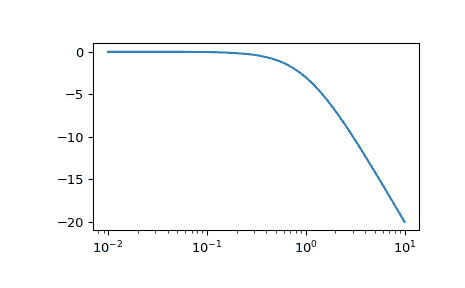
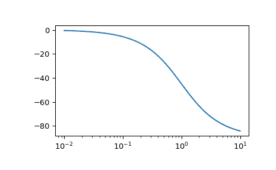

# `scipy.signal.bode`

> 原文链接：[`docs.scipy.org/doc/scipy-1.12.0/reference/generated/scipy.signal.bode.html#scipy.signal.bode`](https://docs.scipy.org/doc/scipy-1.12.0/reference/generated/scipy.signal.bode.html#scipy.signal.bode)

```py
scipy.signal.bode(system, w=None, n=100)
```

计算连续时间系统的波德幅度和相位数据。

参数：

**system**LTI 类的实例或描述系统的元组。

以下给出元组中的元素数和解释：

> +   1 (一个 `lti` 实例)
> +   
> +   2 (num, den)
> +   
> +   3 (零点、极点、增益)
> +   
> +   4 (A, B, C, D)

**w**array_like, optional

频率数组（以 rad/s 为单位）。对于该数组中的每个值都计算幅度和相位数据。如果未给定，将计算一组合理的值。

**n**int, optional

若*w*未给定，则计算的频率点数。*n*个频率在一个区间内对数间隔，选定以包括系统的极点和零点的影响。

返回值：

**w**1D ndarray

频率数组 [rad/s]

**mag**1D ndarray

幅度数组 [dB]

**phase**1D ndarray

相位数组 [deg]

注意

如果`system`传入`(num, den)`，则应按降幂顺序指定系统的分子和分母系数（例如，`s² + 3s + 5` 应表示为 `[1, 3, 5]`）。

新版本 0.11.0 中新增。

示例

```py
>>> from scipy import signal
>>> import matplotlib.pyplot as plt 
```

```py
>>> sys = signal.TransferFunction([1], [1, 1])
>>> w, mag, phase = signal.bode(sys) 
```

```py
>>> plt.figure()
>>> plt.semilogx(w, mag)    # Bode magnitude plot
>>> plt.figure()
>>> plt.semilogx(w, phase)  # Bode phase plot
>>> plt.show() 
```


