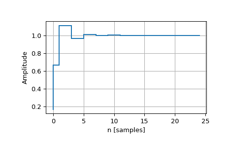

# `scipy.signal.dstep`

> 原文：[`docs.scipy.org/doc/scipy-1.12.0/reference/generated/scipy.signal.dstep.html#scipy.signal.dstep`](https://docs.scipy.org/doc/scipy-1.12.0/reference/generated/scipy.signal.dstep.html#scipy.signal.dstep)

```py
scipy.signal.dstep(system, x0=None, t=None, n=None)
```

离散时间系统的阶跃响应。

参数：

**system**array_like 元组

描述系统的元组。以下提供元组中元素的数量及其解释：

> +   1: (实例`dlti`)
> +   
> +   3: (num, den, dt)
> +   
> +   4: (zeros, poles, gain, dt)
> +   
> +   5: (A, B, C, D, dt)

**x0**array_like, optional

初始状态向量，默认为零。

**t**array_like, optional

时间点。如果未给出，则计算。

**n**int, optional

计算时间点的数量（如果未给出*t*）。

返回：

**tout**ndarray

输出时间点，作为 1-D 数组。

**yout**ndarray 元组

系统的阶跃响应。元组的每个元素表示基于每个输入的阶跃响应的系统输出。

另请参见

`step`, `dimpulse`, `dlsim`, `cont2discrete`

示例

```py
>>> import numpy as np
>>> from scipy import signal
>>> import matplotlib.pyplot as plt 
```

```py
>>> butter = signal.dlti(*signal.butter(3, 0.5))
>>> t, y = signal.dstep(butter, n=25)
>>> plt.step(t, np.squeeze(y))
>>> plt.grid()
>>> plt.xlabel('n [samples]')
>>> plt.ylabel('Amplitude') 
```


