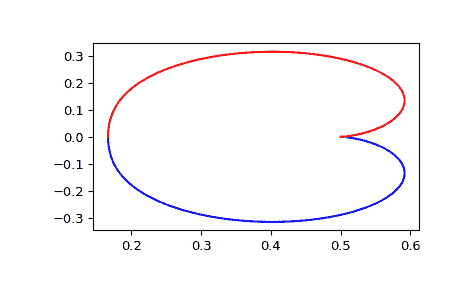

# `scipy.signal.dfreqresp`

> 原文链接：[`docs.scipy.org/doc/scipy-1.12.0/reference/generated/scipy.signal.dfreqresp.html#scipy.signal.dfreqresp`](https://docs.scipy.org/doc/scipy-1.12.0/reference/generated/scipy.signal.dfreqresp.html#scipy.signal.dfreqresp)

```py
scipy.signal.dfreqresp(system, w=None, n=10000, whole=False)
```

计算离散时间系统的频率响应。

参数：

**system**`dlti`类的一个实例或描述系统的元组。

以下内容给出元组中的元素数量及其解释：

> +   1 (一个实例`dlti`的)
> +   
> +   2 (分子、分母、采样时间)
> +   
> +   3 (零点、极点、增益、采样时间)
> +   
> +   4 (A、B、C、D、采样时间)

**w**array_like, 可选

频率数组（以弧度/样本表示）。将为此数组中的每个值计算幅度和相位数据。如果未给出一个合理的集合将被计算。

**n**int, 可选

如果未给出*w*，计算的频率点数。*n*频率在一个被选择的区间内对数间隔地分布，该区间包括系统的极点和零点的影响。

**whole**bool, 可选

通常情况下，如果未提供‘w’，则从 0 到奈奎斯特频率 pi 弧度/样本（单位圆的上半部分）计算频率。如果*whole*为 True，则从 0 到 2*pi 弧度/样本计算。

返回：

**w**1D ndarray

频率数组[弧度/样本]

**H**1D ndarray

复数幅值数组

注意事项

如果`system`传递(num, den)，则应在降序指数顺序（例如，`z² + 3z + 5`表示为`[1, 3, 5]`）中指定分子和分母的系数。

0.18.0 版本中的新内容。

示例

生成传递函数的奈奎斯特图

```py
>>> from scipy import signal
>>> import matplotlib.pyplot as plt 
```

使用采样时间为 0.05 秒构造传递函数 \(H(z) = \frac{1}{z² + 2z + 3}\)：

```py
>>> sys = signal.TransferFunction([1], [1, 2, 3], dt=0.05) 
```

```py
>>> w, H = signal.dfreqresp(sys) 
```

```py
>>> plt.figure()
>>> plt.plot(H.real, H.imag, "b")
>>> plt.plot(H.real, -H.imag, "r")
>>> plt.show() 
```


