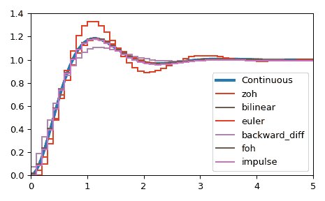

# `scipy.signal.cont2discrete`

> 原始文本：[`docs.scipy.org/doc/scipy-1.12.0/reference/generated/scipy.signal.cont2discrete.html#scipy.signal.cont2discrete`](https://docs.scipy.org/doc/scipy-1.12.0/reference/generated/scipy.signal.cont2discrete.html#scipy.signal.cont2discrete)

```py
scipy.signal.cont2discrete(system, dt, method='zoh', alpha=None)
```

将连续状态空间系统转换为离散系统。

参数：

**system**：描述系统的元组或 `lti` 的实例

以下内容给出元组中的元素数量和解释：

> +   1: （`lti` 的实例）
> +   
> +   2: （分子，分母）
> +   
> +   3: （零点，极点，增益）
> +   
> +   4: （A, B, C, D）

**dt**：浮点数

离散化时间步长。

**method**：字符串，可选

使用哪种方法：

> +   gbt：广义双线性变换
> +   
> +   bilinear：Tustin 逼近法（“gbt” with alpha=0.5）
> +   
> +   euler: 欧拉（或向前差分）方法（“gbt” with alpha=0）
> +   
> +   backward_diff：后向差分（“gbt” with alpha=1.0）
> +   
> +   zoh：零阶保持（默认）
> +   
> +   foh：一阶保持（*versionadded: 1.3.0*）
> +   
> +   impulse：等效冲激响应（*versionadded: 1.3.0*）

**alpha**：在 [0, 1] 范围内的浮点数，可选

应仅在 method=”gbt” 时指定的广义双线性变换加权参数，否则将被忽略

返回：

**sysd**：包含离散系统的元组

根据输入类型，输出将采用以下形式

+   (num, den, dt)：用于传递函数输入

+   (zeros, poles, gain, dt)：用于零点-极点-增益输入

+   (A, B, C, D, dt)：用于状态空间系统输入

注意事项

默认情况下，该例程使用零阶保持（zoh）方法执行转换。也可以使用广义双线性变换，其中包括常见的 Tustin 双线性逼近法、欧拉方法技术或后向差分技术。

零阶保持（zoh）方法基于 [[1]](#r08a5e60792a7-1)，广义双线性逼近基于 [[2]](#r08a5e60792a7-2) 和 [[3]](#r08a5e60792a7-3)，一阶保持（foh）方法基于 [[4]](#r08a5e60792a7-4)。

参考文献

[1]

[`en.wikipedia.org/wiki/Discretization#Discretization_of_linear_state_space_models`](https://en.wikipedia.org/wiki/Discretization#Discretization_of_linear_state_space_models)

[2]

[`techteach.no/publications/discretetime_signals_systems/discrete.pdf`](http://techteach.no/publications/discretetime_signals_systems/discrete.pdf)

[3]

G. Zhang, X. Chen 和 T. Chen，《Digital redesign via the generalized bilinear transformation》，Int. J. Control，第 82 卷，第 4 期，2009 年，页码 741-754。([`www.mypolyuweb.hk/~magzhang/Research/ZCC09_IJC.pdf`](https://www.mypolyuweb.hk/~magzhang/Research/ZCC09_IJC.pdf))

[4]

G. F. Franklin, J. D. Powell 和 M. L. Workman，《Digital control of dynamic systems》，第 3 版，Menlo Park, Calif: Addison-Wesley，1998 年，页码 204-206。

示例

我们可以将连续状态空间系统转换为离散系统：

```py
>>> import numpy as np
>>> import matplotlib.pyplot as plt
>>> from scipy.signal import cont2discrete, lti, dlti, dstep 
```

定义一个连续状态空间系统。

```py
>>> A = np.array([[0, 1],[-10., -3]])
>>> B = np.array([[0],[10.]])
>>> C = np.array([[1., 0]])
>>> D = np.array([[0.]])
>>> l_system = lti(A, B, C, D)
>>> t, x = l_system.step(T=np.linspace(0, 5, 100))
>>> fig, ax = plt.subplots()
>>> ax.plot(t, x, label='Continuous', linewidth=3) 
```

使用多种方法将其转换为离散状态空间系统。

```py
>>> dt = 0.1
>>> for method in ['zoh', 'bilinear', 'euler', 'backward_diff', 'foh', 'impulse']:
...    d_system = cont2discrete((A, B, C, D), dt, method=method)
...    s, x_d = dstep(d_system)
...    ax.step(s, np.squeeze(x_d), label=method, where='post')
>>> ax.axis([t[0], t[-1], x[0], 1.4])
>>> ax.legend(loc='best')
>>> fig.tight_layout()
>>> plt.show() 
```


