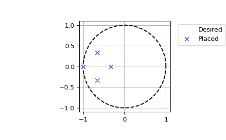

# `scipy.signal.place_poles`

> 原文链接：[`docs.scipy.org/doc/scipy-1.12.0/reference/generated/scipy.signal.place_poles.html#scipy.signal.place_poles`](https://docs.scipy.org/doc/scipy-1.12.0/reference/generated/scipy.signal.place_poles.html#scipy.signal.place_poles)

```py
scipy.signal.place_poles(A, B, poles, method='YT', rtol=0.001, maxiter=30)
```

计算 K，使得特征值`(A - dot(B, K))=poles`。

K 是增益矩阵，使得由线性系统`AX+BU`描述的过程的闭环极点，即特征值`A - B*K`，尽可能接近所要求的极点。

支持 SISO、MISO 和 MIMO 系统。

参数：

**A, B**ndarray

线性系统`AX + BU`的状态空间表示。

**poles**array_like

所需的实部极点和/或共轭复极点。仅支持`method="YT"`（默认）的复极点。

**method: {‘YT’, ‘KNV0’}, optional**

选择用于找到增益矩阵 K 的方法之一：

> +   ‘YT’：Yang Tits
> +   
> +   ‘KNV0’：Kautsky、Nichols、Van Dooren 更新方法 0

有关算法的详细信息，请参见参考文献和注释。

**rtol: float, optional**

每次迭代后，比较`A - B*K`的特征向量的行列式与其先前值，当这两个值之间的相对误差低于*rtol*时，算法停止。默认值为 1e-3。

**maxiter: int, optional**

计算增益矩阵的最大迭代次数。默认值为 30。

返回：

**full_state_feedback**Bunch 对象

full_state_feedback 由以下组成：

gain_matrix1-D ndarray

闭环矩阵 K，使得`A-BK`的特征值尽可能接近要求的极点。

computed_poles1-D ndarray

与`A-BK`对应的极点，首先按升序排列实部极点，然后按字典顺序排列共轭复极点。

requested_poles1-D ndarray

算法要求的极点如上所述排序，可能与实际实现的不同。

X2-D ndarray

传递矩阵如`X * diag(poles) = (A - B*K)*X`（参见注释）

rtolfloat

实现在`det(X)`上实现的相对容差（参见注释）。如果能够解决系统`diag(poles) = (A - B*K)`，则*rtol*将为 NaN；当优化算法无法做任何事情，即`B.shape[1] == 1`时，为 0。

nb_iterint

在收敛之前执行的迭代次数。如果能够解决系统`diag(poles) = (A - B*K)`，则*nb_iter*将为 NaN；当优化算法无法做任何事情，即`B.shape[1] == 1`时，为 0。

注释

Tits 和 Yang（YT）论文[[2]](#r05297b315da4-2)是 Kautsky 等人（KNV）原始论文[[1]](#r05297b315da4-1)的更新。KNV 依赖于秩-1 更新，以找到传递矩阵 X，使得`X * diag(poles) = (A - B*K)*X`，而 YT 使用秩-2 更新。这通常会产生更为健壮的解决方案（参见[[2]](#r05297b315da4-2)第 21-22 页），此外 YT 算法支持复极点，而 KNV 原始版本不支持。此处仅实现了 KNV 提出的更新方法 0，因此命名为'KNV0'。

KNV 扩展到复极点被用于 Matlab 的`place`函数，YT 以非自由许可证由 Slicot 发布，名称为`robpole`。目前尚不清楚和未记录如何将 KNV0 扩展到复极点（Tits 和 Yang 在其论文第 14 页声称他们的方法不能用于扩展 KNV 到复极点），因此只有 YT 在这个实现中支持它们。

由于对于 MIMO 系统来说，极点配置问题的解并不唯一，因此两种方法都从一个试探性的传递矩阵开始，该矩阵以不同的方式改变以增加其行列式。已经证明这两种方法都会收敛到一个稳定的解，然而，根据初始传递矩阵的选择方式，它们将收敛到不同的解，因此使用`'KNV0'`不能保证产生与 Matlab 或任何其他实现这些算法的结果相似。

在大多数情况下，使用默认方法`'YT'`应该是可以的；`'KNV0'`仅提供是因为在某些特定情况下`'YT'`需要。此外，`'YT'`比使用绝对值`abs(det(X))`作为鲁棒性指标时，`'KNV0'`平均提供更稳健的结果。

[[2]](#r05297b315da4-2) 可作为技术报告在以下网址获取：[`hdl.handle.net/1903/5598`](https://hdl.handle.net/1903/5598)

参考文献

[1] (1,2)

J. Kautsky, N.K. Nichols 和 P. van Dooren，“线性状态反馈中的鲁棒极点分配”，《国际控制杂志》，第 41 卷，第 1129-1155 页，1985 年。

[2] (1,2,3)

A.L. Tits 和 Y. Yang，“用于鲁棒状态反馈极点分配的全局收敛算法”，《IEEE 自动控制杂志》，第 41 卷，第 1432-1452 页，1996 年。

示例

一个简单的示例，展示了使用 KNV 和 YT 算法进行实际极点配置的方法。这是参考 KNV 出版物第四部分中的示例 1（1）：

```py
>>> import numpy as np
>>> from scipy import signal
>>> import matplotlib.pyplot as plt 
```

```py
>>> A = np.array([[ 1.380,  -0.2077,  6.715, -5.676  ],
...               [-0.5814, -4.290,   0,      0.6750 ],
...               [ 1.067,   4.273,  -6.654,  5.893  ],
...               [ 0.0480,  4.273,   1.343, -2.104  ]])
>>> B = np.array([[ 0,      5.679 ],
...               [ 1.136,  1.136 ],
...               [ 0,      0,    ],
...               [-3.146,  0     ]])
>>> P = np.array([-0.2, -0.5, -5.0566, -8.6659]) 
```

现在使用 KNV 方法 0 计算 K，使用默认的 YT 方法以及使用强制算法 100 次迭代的 YT 方法，并在每次调用后打印一些结果。

```py
>>> fsf1 = signal.place_poles(A, B, P, method='KNV0')
>>> fsf1.gain_matrix
array([[ 0.20071427, -0.96665799,  0.24066128, -0.10279785],
 [ 0.50587268,  0.57779091,  0.51795763, -0.41991442]]) 
```

```py
>>> fsf2 = signal.place_poles(A, B, P)  # uses YT method
>>> fsf2.computed_poles
array([-8.6659, -5.0566, -0.5   , -0.2   ]) 
```

```py
>>> fsf3 = signal.place_poles(A, B, P, rtol=-1, maxiter=100)
>>> fsf3.X
array([[ 0.52072442+0.j, -0.08409372+0.j, -0.56847937+0.j,  0.74823657+0.j],
 [-0.04977751+0.j, -0.80872954+0.j,  0.13566234+0.j, -0.29322906+0.j],
 [-0.82266932+0.j, -0.19168026+0.j, -0.56348322+0.j, -0.43815060+0.j],
 [ 0.22267347+0.j,  0.54967577+0.j, -0.58387806+0.j, -0.40271926+0.j]]) 
```

X 的行列式的绝对值是检查结果鲁棒性的良好指标，`'KNV0'`和`'YT'`都旨在最大化它。以下是上述结果鲁棒性的比较：

```py
>>> abs(np.linalg.det(fsf1.X)) < abs(np.linalg.det(fsf2.X))
True
>>> abs(np.linalg.det(fsf2.X)) < abs(np.linalg.det(fsf3.X))
True 
```

现在是一个复极点的简单示例：

```py
>>> A = np.array([[ 0,  7/3.,  0,   0   ],
...               [ 0,   0,    0,  7/9. ],
...               [ 0,   0,    0,   0   ],
...               [ 0,   0,    0,   0   ]])
>>> B = np.array([[ 0,  0 ],
...               [ 0,  0 ],
...               [ 1,  0 ],
...               [ 0,  1 ]])
>>> P = np.array([-3, -1, -2-1j, -2+1j]) / 3.
>>> fsf = signal.place_poles(A, B, P, method='YT') 
```

我们可以在复平面上绘制期望和计算的极点：

```py
>>> t = np.linspace(0, 2*np.pi, 401)
>>> plt.plot(np.cos(t), np.sin(t), 'k--')  # unit circle
>>> plt.plot(fsf.requested_poles.real, fsf.requested_poles.imag,
...          'wo', label='Desired')
>>> plt.plot(fsf.computed_poles.real, fsf.computed_poles.imag, 'bx',
...          label='Placed')
>>> plt.grid()
>>> plt.axis('image')
>>> plt.axis([-1.1, 1.1, -1.1, 1.1])
>>> plt.legend(bbox_to_anchor=(1.05, 1), loc=2, numpoints=1) 
```


