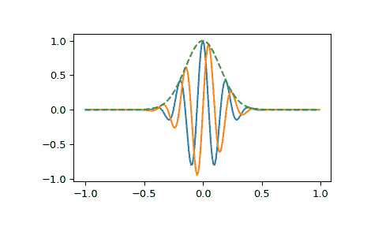

# `scipy.signal.gausspulse`

> 原文：[`docs.scipy.org/doc/scipy-1.12.0/reference/generated/scipy.signal.gausspulse.html#scipy.signal.gausspulse`](https://docs.scipy.org/doc/scipy-1.12.0/reference/generated/scipy.signal.gausspulse.html#scipy.signal.gausspulse)

```py
scipy.signal.gausspulse(t, fc=1000, bw=0.5, bwr=-6, tpr=-60, retquad=False, retenv=False)
```

返回一个高斯调制的正弦波：

> `exp(-a t²) exp(1j*2*pi*fc*t).`

如果 *retquad* 为 True，则返回实部和虚部（同相和象限）。如果 *retenv* 为 True，则返回包络（未调制信号）。否则，返回调制正弦波的实部。

参数：

**t**ndarray 或字符串 'cutoff'

输入数组。

**fc**float，可选

中心频率（例如 Hz）。默认为 1000。

**bw**float，可选

脉冲在频率域的分数带宽（例如 Hz）。默认为 0.5。

**bwr**float，可选

用于计算分数带宽的参考级别（dB）。默认为 -6。

**tpr**float，可选

如果 *t* 为 'cutoff'，则函数返回脉冲幅度下降至 *tpr*（以 dB 为单位）的截止时间。默认为 -60。

**retquad**bool，可选

如果为 True，则返回信号的象限（虚部）以及实部。默认为 False。

**retenv**bool，可选

如果为 True，则返回信号的包络。默认为 False。

返回：

**yI**ndarray

信号的实部。始终返回。

**yQ**ndarray

信号的虚部。仅在 *retquad* 为 True 时返回。

**yenv**ndarray

信号的包络。仅在 *retenv* 为 True 时返回。

另请参阅

`scipy.signal.morlet`

示例

绘制实部、虚部和 5 Hz 脉冲的包络，以 100 Hz 采样 2 秒：

```py
>>> import numpy as np
>>> from scipy import signal
>>> import matplotlib.pyplot as plt
>>> t = np.linspace(-1, 1, 2 * 100, endpoint=False)
>>> i, q, e = signal.gausspulse(t, fc=5, retquad=True, retenv=True)
>>> plt.plot(t, i, t, q, t, e, '--') 
```


