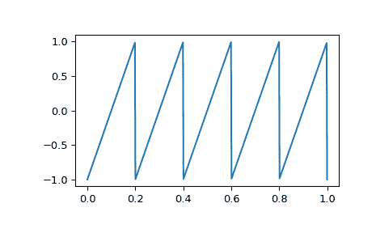

# `scipy.signal.sawtooth`

> 原文：[`docs.scipy.org/doc/scipy-1.12.0/reference/generated/scipy.signal.sawtooth.html#scipy.signal.sawtooth`](https://docs.scipy.org/doc/scipy-1.12.0/reference/generated/scipy.signal.sawtooth.html#scipy.signal.sawtooth)

```py
scipy.signal.sawtooth(t, width=1)
```

返回一个周期性的锯齿波或三角波形。

锯齿波形的周期是 `2*pi`，在区间 0 到 `width*2*pi` 上升从-1 到 1，然后在区间 `width*2*pi` 到 `2*pi` 下降从 1 到-1。*width* 必须在区间 [0, 1] 内。

请注意这不是带限制的。它产生无限多的谐波，这些谐波在频率谱上来回反射。

参数：

**t**array_like

时间。

**width**array_like, 可选

上升斜坡的宽度，作为总周期的比例。默认为 1，生成上升斜坡，而 0 生成下降斜坡。*width* = 0.5 生成三角波。如果是一个数组，则导致波形随时间变化，并且必须与 t 具有相同的长度。

返回：

**y**ndarray

包含锯齿波形的输出数组。

示例

以 500 Hz 对 1 秒钟进行采样的 5 Hz 波形：

```py
>>> import numpy as np
>>> from scipy import signal
>>> import matplotlib.pyplot as plt
>>> t = np.linspace(0, 1, 500)
>>> plt.plot(t, signal.sawtooth(2 * np.pi * 5 * t)) 
```


