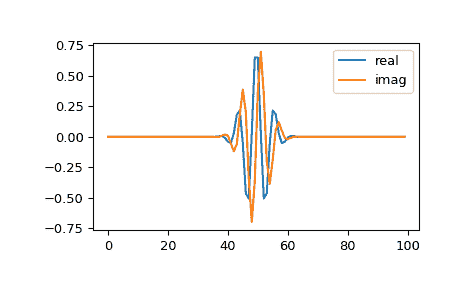

# `scipy.signal.morlet`

> 原文链接：[`docs.scipy.org/doc/scipy-1.12.0/reference/generated/scipy.signal.morlet.html#scipy.signal.morlet`](https://docs.scipy.org/doc/scipy-1.12.0/reference/generated/scipy.signal.morlet.html#scipy.signal.morlet)

```py
scipy.signal.morlet(M, w=5.0, s=1.0, complete=True)
```

复数 Morlet 小波。

自版本 1.12.0 起不建议使用：scipy.signal.morlet 在 SciPy 1.12 中已弃用，并将在 SciPy 1.15 中移除。我们建议改用 PyWavelets。

参数：

**M**整数

小波的长度。

**w**浮点数，可选

Omega0\. 默认值为 5。

**s**浮点数，可选

缩放因子，从`-s*2*pi`到`+s*2*pi`窗口化。默认值为 1。

**complete**布尔值，可选

是否使用完整版或标准版。

返回：

**morlet**(M,) ndarray

另请参阅

`morlet2`

Morlet 小波的实现，与`cwt`兼容。

`scipy.signal.gausspulse`

注意事项

标准版本：

```py
pi**-0.25 * exp(1j*w*x) * exp(-0.5*(x**2)) 
```

这种常用的小波通常被简称为 Morlet 小波。请注意，这个简化版本在*w*的低值时可能会导致可接受性问题。

完整版本：

```py
pi**-0.25 * (exp(1j*w*x) - exp(-0.5*(w**2))) * exp(-0.5*(x**2)) 
```

此版本具有改正项以改善可接受性。对于*w*大于 5，改正项可忽略不计。

注意，返回小波的能量未根据*s*进行标准化。

此小波的基本频率（以 Hz 为单位）由`f = 2*s*w*r / M`给出，其中*r*是采样率。

注意：此函数在`cwt`之前创建，与其不兼容。

示例

```py
>>> from scipy import signal
>>> import matplotlib.pyplot as plt 
```

```py
>>> M = 100
>>> s = 4.0
>>> w = 2.0
>>> wavelet = signal.morlet(M, s, w)
>>> plt.plot(wavelet.real, label="real")
>>> plt.plot(wavelet.imag, label="imag")
>>> plt.legend()
>>> plt.show() 
```


