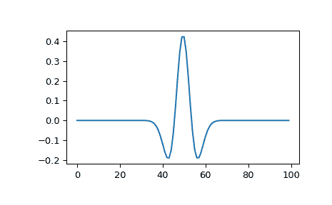

# `scipy.signal.ricker`

> 原文链接：[`docs.scipy.org/doc/scipy-1.12.0/reference/generated/scipy.signal.ricker.html#scipy.signal.ricker`](https://docs.scipy.org/doc/scipy-1.12.0/reference/generated/scipy.signal.ricker.html#scipy.signal.ricker)

```py
scipy.signal.ricker(points, a)
```

返回一个 Ricker 小波，也称为“墨西哥帽小波”。

自 SciPy 1.12 版本起已弃用：scipy.signal.ricker 在 SciPy 1.12 中已弃用，并将在 SciPy 1.15 中移除。我们建议改用 PyWavelets。

它模拟函数：

> `A * (1 - (x/a)**2) * exp(-0.5*(x/a)**2)`,

其中 `A = 2/(sqrt(3*a)*(pi**0.25))`。

参数：

**points**整数

*vector* 中的点数。将以 0 为中心。

**a**标量

小波的宽度参数。

返回值：

**向量**(N,) ndarray

形状为 ricker 曲线的长度为 *points* 的数组。

示例

```py
>>> from scipy import signal
>>> import matplotlib.pyplot as plt 
```

```py
>>> points = 100
>>> a = 4.0
>>> vec2 = signal.ricker(points, a)
>>> print(len(vec2))
100
>>> plt.plot(vec2)
>>> plt.show() 
```


