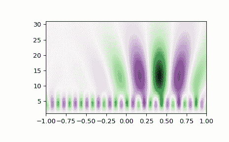

# `scipy.signal.cwt`

> 原文链接：[`docs.scipy.org/doc/scipy-1.12.0/reference/generated/scipy.signal.cwt.html#scipy.signal.cwt`](https://docs.scipy.org/doc/scipy-1.12.0/reference/generated/scipy.signal.cwt.html#scipy.signal.cwt)

```py
scipy.signal.cwt(data, wavelet, widths, dtype=None, **kwargs)
```

连续小波变换。

自版本 1.12.0 起弃用：scipy.signal.cwt 在 SciPy 1.12 中已弃用，并将在 SciPy 1.15 中删除。我们建议改用 PyWavelets。

对*data*执行连续小波变换，使用*wavelet*函数。 CWT 使用*wavelet*函数对*data*进行卷积，该函数以宽度参数和长度参数为特征。 *wavelet*函数允许是复数。

参数：

**data**(N,) ndarray

执行变换的数据。

**wavelet**函数

小波函数，应该接受 2 个参数。第一个参数是返回的向量将具有的点数（len(wavelet(length,width)) == length）。第二个是宽度参数，定义小波的大小（例如，高斯标准差）。参见`ricker`，满足这些要求。

**widths**(M,) 序列

用于变换的宽度。

**dtype**数据类型，可选

输出的期望数据类型。如果*wavelet*的输出是实数，则默认为`float64`，如果是复数，则为`complex128`。

新版本 1.4.0 中新增。

**kwargs**

传递给小波函数的关键字参数。

新版本 1.4.0 中新增。

返回：

cwt：(M, N) ndarray

将具有形状(len(widths), len(data))。

注意事项

新版本 1.4.0 中新增。

对于非对称的复数值小波，输入信号与小波数据的时间反转共轭卷积[1]。

```py
length = min(10 * width[ii], len(data))
cwt[ii,:] = signal.convolve(data, np.conj(wavelet(length, width[ii],
                                **kwargs))[::-1], mode='same') 
```

参考资料

[1]

S. Mallat，“信号处理的小波之旅（第 3 版）”，Academic Press，2009。

示例

```py
>>> import numpy as np
>>> from scipy import signal
>>> import matplotlib.pyplot as plt
>>> t = np.linspace(-1, 1, 200, endpoint=False)
>>> sig  = np.cos(2 * np.pi * 7 * t) + signal.gausspulse(t - 0.4, fc=2)
>>> widths = np.arange(1, 31)
>>> cwtmatr = signal.cwt(sig, signal.ricker, widths) 
```

注意

对于 cwt 矩阵绘图，建议翻转 y 轴

```py
>>> cwtmatr_yflip = np.flipud(cwtmatr)
>>> plt.imshow(cwtmatr_yflip, extent=[-1, 1, 1, 31], cmap='PRGn', aspect='auto',
...            vmax=abs(cwtmatr).max(), vmin=-abs(cwtmatr).max())
>>> plt.show() 
```


