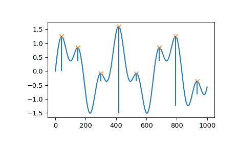
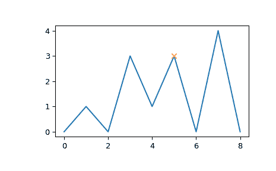

# `scipy.signal.peak_prominences`

> 原文：[`docs.scipy.org/doc/scipy-1.12.0/reference/generated/scipy.signal.peak_prominences.html#scipy.signal.peak_prominences`](https://docs.scipy.org/doc/scipy-1.12.0/reference/generated/scipy.signal.peak_prominences.html#scipy.signal.peak_prominences)

```py
scipy.signal.peak_prominences(x, peaks, wlen=None)
```

计算信号中每个峰值的显著性。

峰值的显著性衡量了峰值在信号周围基线的突出程度，并定义为峰值与其最低轮廓线之间的垂直距离。

参数：

**x**序列

一个具有峰值的信号。

**peaks**序列

*x*中的峰值索引。

**wlen**int，可选

采样中的窗口长度，可选地限制每个峰值的评估区域为*x*的子集。峰值始终位于窗口的中间，因此给定的长度会向上舍入为下一个奇数整数。此参数可以加速计算（见注释）。

返回：

**prominences**ndarray

每个*peaks*中的峰值的计算显著性。

**left_bases, right_bases**ndarray

峰值的基准作为*x*中每个峰值左右的索引。每对中较高的基准是峰值的最低轮廓线。

Raises:

ValueError

如果*peaks*中的值是*x*的无效索引。

警告：

PeakPropertyWarning

对于*peaks*中不指向*x*中有效局部最大值的索引，返回的显著性将为 0，并引发此警告。如果*wlen*小于峰值的平台大小，则也会发生这种情况。

警告

对于包含 NaN 的数据，此函数可能返回意外的结果。为避免此情况，应移除或替换 NaN。

另请参阅

`find_peaks`

根据峰值属性在信号内查找峰值。

`peak_widths`

计算峰值的宽度。

注释

计算峰值显著性的策略：

1.  从当前峰值水平线向左右延伸，直到该线到达窗口边界（参见*wlen*）或再次在较高峰值的斜率处与信号相交。与相同高度的峰值的交叉将被忽略。

1.  在每侧找到定义的区间内的最小信号值。这些点是峰值的基准。

1.  两个基准中较高的一个标记了峰值的最低轮廓线。然后可以计算显著性，作为峰值本身高度与其最低轮廓线之间的垂直差异。

对于具有周期性行为的大*x*，寻找峰值基线可能会很慢，因为需要评估大块或甚至整个信号作为第一个算法步骤。可以使用参数*wlen*来限制评估区域，该参数将算法限制在当前峰值周围的窗口内，并且如果窗口长度相对于*x*较短，则可以缩短计算时间。然而，如果峰值的真实基线超出此窗口，则可能阻止算法找到真正的全局等高线。相反，会在限制的窗口内找到一个更高的等高线，导致计算出的突出度较小。实际上，这仅对*x*中最高一组峰值相关。此行为甚至可能会被有意用来计算“局部”突出度。

新版本 1.1.0 中的内容。

参考资料

[1]

维基百科关于地形突出度的文章: [`zh.wikipedia.org/wiki/地形突出度`](https://zh.wikipedia.org/wiki/地形突出度)

示例

```py
>>> import numpy as np
>>> from scipy.signal import find_peaks, peak_prominences
>>> import matplotlib.pyplot as plt 
```

创建一个带有两个重叠谐波的测试信号

```py
>>> x = np.linspace(0, 6 * np.pi, 1000)
>>> x = np.sin(x) + 0.6 * np.sin(2.6 * x) 
```

查找所有峰值并计算突出度

```py
>>> peaks, _ = find_peaks(x)
>>> prominences = peak_prominences(x, peaks)[0]
>>> prominences
array([1.24159486, 0.47840168, 0.28470524, 3.10716793, 0.284603  ,
 0.47822491, 2.48340261, 0.47822491]) 
```

计算每个峰值的等高线高度并绘制结果

```py
>>> contour_heights = x[peaks] - prominences
>>> plt.plot(x)
>>> plt.plot(peaks, x[peaks], "x")
>>> plt.vlines(x=peaks, ymin=contour_heights, ymax=x[peaks])
>>> plt.show() 
```



让我们评估第二个示例，该示例演示了索引为 5 的一个峰值的几种边缘情况。

```py
>>> x = np.array([0, 1, 0, 3, 1, 3, 0, 4, 0])
>>> peaks = np.array([5])
>>> plt.plot(x)
>>> plt.plot(peaks, x[peaks], "x")
>>> plt.show() 
```



```py
>>> peak_prominences(x, peaks)  # -> (prominences, left_bases, right_bases)
(array([3.]), array([2]), array([6])) 
```

注意在寻找左边界时，同高度的索引为 3 的峰值不被视为边界。相反，在寻找左边界时找到了两个最小值，索引为 0 和 2，在这种情况下，总是选择离评估峰值更近的那个。然而，在右侧，基线必须放在 6 处，因为更高的峰值代表了评估区域的右边界。

```py
>>> peak_prominences(x, peaks, wlen=3.1)
(array([2.]), array([4]), array([6])) 
```

在这里，我们将算法限制在从 3 到 7 的窗口范围内（长度为 5 个样本，因为*wlen*被四舍五入到下一个奇整数）。因此，在评估区域内只有两个候选样本，即两个相邻的样本和一个较小的突出度被计算。
