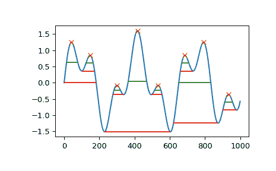

# `scipy.signal.peak_widths`

> 原文：[`docs.scipy.org/doc/scipy-1.12.0/reference/generated/scipy.signal.peak_widths.html#scipy.signal.peak_widths`](https://docs.scipy.org/doc/scipy-1.12.0/reference/generated/scipy.signal.peak_widths.html#scipy.signal.peak_widths)

```py
scipy.signal.peak_widths(x, peaks, rel_height=0.5, prominence_data=None, wlen=None)
```

计算信号中每个峰的宽度。

此函数计算峰的宽度，以样本为单位，相对于峰的高度和显著性的相对距离。

参数：

**x**sequence

一个带有峰的信号。

**peaks**sequence

*x* 中峰值的索引。

**rel_height**float，可选

选择峰宽度被测量的相对高度，作为其显著性的百分比。1.0 计算峰在其最低等高线处的宽度，而 0.5 在其显著性高度的一半处进行评估。必须至少为 0。详见注释以进一步解释。

**prominence_data**tuple，可选

一个元组，包含三个数组，与使用相同参数 *x* 和 *peaks* 调用 `peak_prominences` 时的输出相匹配。如果未提供此数据，则在内部计算。

**wlen**int，可选

作为内部计算 *prominence_data* 可选参数传递给 `peak_prominences` 的样本窗口长度。如果提供了 *prominence_data*，则忽略此参数。

返回：

**widths**ndarray

每个峰的宽度（以样本为单位）。

**width_heights**ndarray

*widths* 被评估的等高线高度。

**left_ips, right_ips**ndarray

在左右交点的插值位置，水平线分别在相应的评估高度。

引发：

ValueError

如果提供了 *prominence_data* 但不满足每个峰的条件 `0 <= left_base <= peak <= right_base < x.shape[0]`，具有错误的 dtype，不是 C 连续的或形状不同。

警告：

PeakPropertyWarning

如果计算得到的任何宽度为 0，则引发此错误。这可能源于提供的 *prominence_data* 或如果 *rel_height* 设置为 0。

警告

此函数可能对包含 NaN 的数据返回意外结果。为了避免这种情况，应删除或替换 NaN。

另请参见

`find_peaks`

基于峰的特性在信号内找到峰。

`peak_prominences`

计算峰的显著性。

注释

计算峰宽度的基本算法如下：

+   使用公式计算评估高度 \(h_{eval} = h_{Peak} - P \cdot R\)，其中 \(h_{Peak}\) 是峰本身的高度，\(P\) 是峰的显著性，\(R\) 是用参数 *rel_height* 指定的正比例。

+   在评估高度处绘制水平线，向两侧延伸，从峰值当前的垂直位置开始，直到这些线与斜坡、信号边界相交或越过峰值基底的垂直位置（详见`peak_prominences`的定义）。对于第一种情况，与信号相交，使用线性插值估算真实的交点。

+   将宽度计算为两侧选择的端点之间的水平距离。因此，每个峰值的最大可能宽度是其基底之间的水平距离。

如上所示，要计算峰值的宽度，必须了解其突出和基底。您可以通过参数*prominence_data*自行提供这些数据。否则，它们将内部计算（详见`peak_prominences`）。

新版本 1.1.0 中引入。

示例

```py
>>> import numpy as np
>>> from scipy.signal import chirp, find_peaks, peak_widths
>>> import matplotlib.pyplot as plt 
```

创建一个包含两个重叠谐波的测试信号

```py
>>> x = np.linspace(0, 6 * np.pi, 1000)
>>> x = np.sin(x) + 0.6 * np.sin(2.6 * x) 
```

找到所有峰值，并计算它们在相对高度为 0.5（在高度的一半处的等高线）和 1（在完全突出高度处的最低等高线）时的宽度。

```py
>>> peaks, _ = find_peaks(x)
>>> results_half = peak_widths(x, peaks, rel_height=0.5)
>>> results_half[0]  # widths
array([ 64.25172825,  41.29465463,  35.46943289, 104.71586081,
 35.46729324,  41.30429622, 181.93835853,  45.37078546])
>>> results_full = peak_widths(x, peaks, rel_height=1)
>>> results_full[0]  # widths
array([181.9396084 ,  72.99284945,  61.28657872, 373.84622694,
 61.78404617,  72.48822812, 253.09161876,  79.36860878]) 
```

绘制信号、峰值和计算宽度的等高线

```py
>>> plt.plot(x)
>>> plt.plot(peaks, x[peaks], "x")
>>> plt.hlines(*results_half[1:], color="C2")
>>> plt.hlines(*results_full[1:], color="C3")
>>> plt.show() 
```


