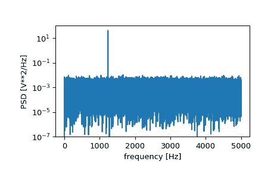
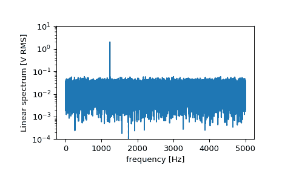

# `scipy.signal.periodogram`

> 原文链接：[`docs.scipy.org/doc/scipy-1.12.0/reference/generated/scipy.signal.periodogram.html#scipy.signal.periodogram`](https://docs.scipy.org/doc/scipy-1.12.0/reference/generated/scipy.signal.periodogram.html#scipy.signal.periodogram)

```py
scipy.signal.periodogram(x, fs=1.0, window='boxcar', nfft=None, detrend='constant', return_onesided=True, scaling='density', axis=-1)
```

使用周期图估计功率谱密度。

参数：

**x**array_like

测量值的时间序列

**fs**float，可选项

*x* 时间序列的采样频率。默认为 1.0。

**window**str 或 元组 或 类似数组，可选项

需要使用的期望窗口。如果 *window* 是字符串或元组，则传递给 [`get_window`](https://docs.scipy.org/doc/scipy-1.12.0/reference/generated/scipy.signal.get_window.html#scipy.signal.get_window "scipy.signal.get_window") 以生成窗口值，默认情况下是 DFT-偶数。参见 [`get_window`](https://docs.scipy.org/doc/scipy-1.12.0/reference/generated/scipy.signal.get_window.html#scipy.signal.get_window "scipy.signal.get_window") 获取窗口列表及所需参数。如果 *window* 是类似数组，则直接用作窗口，并且其长度必须等于计算周期图的轴的长度。默认为 ‘boxcar’。

**nfft**int，可选项

使用的 FFT 长度。如果 *None*，则使用 *x* 的长度。

**detrend**str 或 函数 或 *False*，可选项

指定如何去趋势化每个段。如果 [`detrend`](https://docs.scipy.org/doc/scipy-1.12.0/reference/generated/scipy.signal.detrend.html#scipy.signal.detrend "scipy.signal.detrend") 是字符串，则传递给 [`detrend`](https://docs.scipy.org/doc/scipy-1.12.0/reference/generated/scipy.signal.detrend.html#scipy.signal.detrend "scipy.signal.detrend") 函数的 *type* 参数。如果是函数，则接受一个段并返回去趋势化的段。如果 [`detrend`](https://docs.scipy.org/doc/scipy-1.12.0/reference/generated/scipy.signal.detrend.html#scipy.signal.detrend "scipy.signal.detrend") 是 *False*，则不进行去趋势化。默认为 ‘constant’。

**return_onesided**bool，可选项

如果 *True*，则为实数数据返回单边谱。如果 *False*，则返回双边谱。默认为 *True*，但对于复杂数据，始终返回双边谱。

**scaling**{ ‘density’, ‘spectrum’ }，可选项

选择计算功率谱密度（‘density’），其中 *Pxx* 的单位为 V**2/Hz，或计算功率谱（‘spectrum’），其中 *Pxx* 的单位为 V**2，如果 *x* 单位为 V，*fs* 单位为 Hz。默认为 ‘density’。

**axis**int，可选项

计算周期图的轴；默认为最后一个轴（即 `axis=-1`）。

返回：

**f**ndarray

样本频率数组。

**Pxx**ndarray

*x* 的功率谱密度或功率谱。

参见

[`welch`](https://docs.scipy.org/doc/scipy-1.12.0/reference/generated/scipy.signal.welch.html#scipy.signal.welch "scipy.signal.welch")

使用 Welch 方法估计功率谱密度

[`lombscargle`](https://docs.scipy.org/doc/scipy-1.12.0/reference/generated/scipy.signal.lombscargle.html#scipy.signal.lombscargle "scipy.signal.lombscargle")

用于不均匀采样数据的 Lomb-Scargle 周期图

注意事项

版本 0.12.0 中的新功能。

示例

```py
>>> import numpy as np
>>> from scipy import signal
>>> import matplotlib.pyplot as plt
>>> rng = np.random.default_rng() 
```

生成测试信号，2 Vrms 正弦波，频率为 1234 Hz，受 0.001 V**2/Hz 白噪声干扰，采样频率为 10 kHz。

```py
>>> fs = 10e3
>>> N = 1e5
>>> amp = 2*np.sqrt(2)
>>> freq = 1234.0
>>> noise_power = 0.001 * fs / 2
>>> time = np.arange(N) / fs
>>> x = amp*np.sin(2*np.pi*freq*time)
>>> x += rng.normal(scale=np.sqrt(noise_power), size=time.shape) 
```

计算并绘制功率谱密度。

```py
>>> f, Pxx_den = signal.periodogram(x, fs)
>>> plt.semilogy(f, Pxx_den)
>>> plt.ylim([1e-7, 1e2])
>>> plt.xlabel('frequency [Hz]')
>>> plt.ylabel('PSD [V**2/Hz]')
>>> plt.show() 
```



如果我们对谱密度的后半部分进行平均，以排除峰值，我们可以恢复信号上的噪声功率。

```py
>>> np.mean(Pxx_den[25000:])
0.000985320699252543 
```

现在计算并绘制功率谱。

```py
>>> f, Pxx_spec = signal.periodogram(x, fs, 'flattop', scaling='spectrum')
>>> plt.figure()
>>> plt.semilogy(f, np.sqrt(Pxx_spec))
>>> plt.ylim([1e-4, 1e1])
>>> plt.xlabel('frequency [Hz]')
>>> plt.ylabel('Linear spectrum [V RMS]')
>>> plt.show() 
```



功率谱中的峰值高度是 RMS 振幅的估计。

```py
>>> np.sqrt(Pxx_spec.max())
2.0077340678640727 
```
