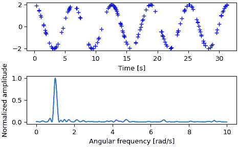

# `scipy.signal.lombscargle`

> 原文链接：[`docs.scipy.org/doc/scipy-1.12.0/reference/generated/scipy.signal.lombscargle.html#scipy.signal.lombscargle`](https://docs.scipy.org/doc/scipy-1.12.0/reference/generated/scipy.signal.lombscargle.html#scipy.signal.lombscargle)

```py
scipy.signal.lombscargle(x, y, freqs)
```

计算 Lomb-Scargle 周期图。

Lomb-Scargle 周期图由 Lomb [[1]](#r0520a0371844-1)开发，并由 Scargle [[2]](#r0520a0371844-2)进一步扩展，用于发现和测试不均匀时间采样中弱周期信号的显著性。

当 *normalize* 设置为 False（默认值）时，计算得到的周期图未归一化，对于具有振幅 A 的谐波信号，对于足够大的 N，它取值为`(A**2) * N/4`。

当 *normalize* 设置为 True 时，计算得到的周期图将通过数据围绕常数参考模型（在零点）的残差进行归一化。

输入数组应为 1-D，并将转换为 float64 类型。

参数：

**x**array_like

样本时间。

**y**array_like

测量值。

**freqs**array_like

输出周期图的角频率。

**precenter**bool, optional

通过减去均值预置测量值。

**normalize**bool, optional

计算归一化周期图。

返回：

**pgram**array_like

Lomb-Scargle 周期图。

Raises：

ValueError

如果输入数组 *x* 和 *y* 的形状不同。

另见

`istft`

逆短时傅立叶变换

`check_COLA`

检查是否满足常数重叠加（COLA）约束

`welch`

Welch 方法的功率谱密度

`spectrogram`

Welch 方法的谱图

`csd`

Welch 方法的交叉谱密度

Notes

此子程序使用了由 Townsend 稍作修改的算法来计算周期图[[3]](#r0520a0371844-3)，该算法允许在每个频率上仅通过输入数组的一次传递计算周期图。

算法运行时间大致按 O(x * freqs)或 O(N²)缩放，适用于大量样本和频率。

参考文献

[1]

N.R. Lomb，“不等间隔数据的最小二乘频率分析”，《天体物理学和空间科学》，第 39 卷，第 447-462 页，1976 年

[2]

J.D. Scargle，“天文时间序列分析研究 II - 不均匀间隔数据谱分析的统计方面”，《天体物理学期刊》，第 263 卷，第 835-853 页，1982 年

[3]

R.H.D. Townsend，“使用图形处理单元快速计算 Lomb-Scargle 周期图”，《天体物理学期刊增刊》，第 191 卷，第 247-253 页，2010 年

示例

```py
>>> import numpy as np
>>> import matplotlib.pyplot as plt
>>> rng = np.random.default_rng() 
```

首先为信号定义一些输入参数：

```py
>>> A = 2.
>>> w0 = 1.  # rad/sec
>>> nin = 150
>>> nout = 100000 
```

随机生成样本时间：

```py
>>> x = rng.uniform(0, 10*np.pi, nin) 
```

绘制所选时间的正弦波：

```py
>>> y = A * np.cos(w0*x) 
```

定义用于计算周期图的频率数组：

```py
>>> w = np.linspace(0.01, 10, nout) 
```

计算 Lomb-Scargle 周期图：

```py
>>> import scipy.signal as signal
>>> pgram = signal.lombscargle(x, y, w, normalize=True) 
```

现在制作输入数据的图表：

```py
>>> fig, (ax_t, ax_w) = plt.subplots(2, 1, constrained_layout=True)
>>> ax_t.plot(x, y, 'b+')
>>> ax_t.set_xlabel('Time [s]') 
```

然后绘制归一化周期图：

```py
>>> ax_w.plot(w, pgram)
>>> ax_w.set_xlabel('Angular frequency [rad/s]')
>>> ax_w.set_ylabel('Normalized amplitude')
>>> plt.show() 
```


