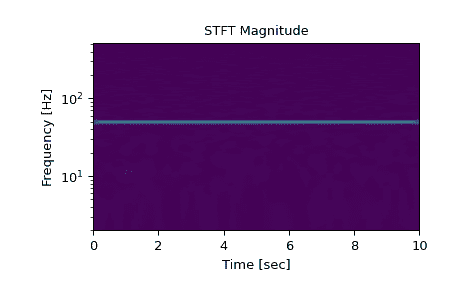
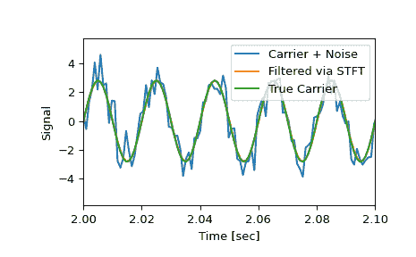
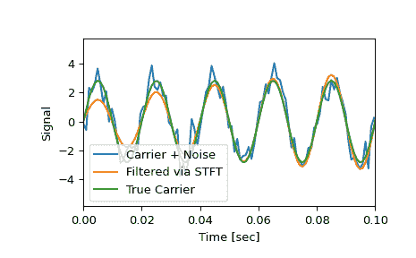

# `scipy.signal.istft`

> 原文链接：[`docs.scipy.org/doc/scipy-1.12.0/reference/generated/scipy.signal.istft.html#scipy.signal.istft`](https://docs.scipy.org/doc/scipy-1.12.0/reference/generated/scipy.signal.istft.html#scipy.signal.istft)

```py
scipy.signal.istft(Zxx, fs=1.0, window='hann', nperseg=None, noverlap=None, nfft=None, input_onesided=True, boundary=True, time_axis=-1, freq_axis=-2, scaling='spectrum')
```

执行反短时傅立叶变换（iSTFT）。

传统

此函数被视为遗留版本，将不再接收更新。这也可能意味着它将在未来的 SciPy 版本中删除。[`ShortTimeFFT`](https://docs.scipy.org/doc/scipy-1.12.0/reference/generated/scipy.signal.ShortTimeFFT.html#scipy.signal.ShortTimeFFT "scipy.signal.ShortTimeFFT")是一个新的 STFT / ISTFT 实现，具有更多功能。可以在[SciPy 用户指南](https://docs.scipy.org/doc/scipy-1.12.0/tutorial/signal.html#tutorial-stft-legacy-stft)的[短时傅立叶变换](https://docs.scipy.org/doc/scipy-1.12.0/tutorial/signal.html#tutorial-stft)部分找到这些实现的比较。

参数：

**Zxx**array_like

要重构的信号的 STFT。如果传递的是纯实数组，则将其转换为复杂数据类型。

**fs**float，可选

时间序列的采样频率。默认为 1.0。

**window**str 或 tuple 或 array_like，可选

所需使用的窗口。如果*window*是字符串或元组，则将其传递给[`get_window`](https://docs.scipy.org/doc/scipy-1.12.0/reference/generated/scipy.signal.get_window.html#scipy.signal.get_window "scipy.signal.get_window")以生成窗口值，默认为 DFT-even。详见[`get_window`](https://docs.scipy.org/doc/scipy-1.12.0/reference/generated/scipy.signal.get_window.html#scipy.signal.get_window "scipy.signal.get_window")获取窗口列表和所需参数。如果*window*是 array_like，则直接用作窗口，其长度必须为 nperseg。默认为 Hann 窗口。必须与用于生成 STFT 的窗口匹配，以确保忠实反演。

**nperseg**int，可选

数据点数对应于每个 STFT 段。如果每段数据点数为奇数，或者 STFT 通过`nfft > nperseg`进行填充，则必须指定此参数。如果为*None*，则其值取决于*Zxx*和*input_onesided*的形状。如果*input_onesided*为 True，则`nperseg=2*(Zxx.shape[freq_axis] - 1)`。否则，`nperseg=Zxx.shape[freq_axis]`。默认为*None*。

**noverlap**int，可选

点之间重叠的点数。如果为*None*，则为段长度的一半。默认为*None*。在指定时，必须满足 COLA 约束（参见下面的注释），并且应与用于生成 STFT 的参数匹配。默认为*None*。

**nfft**int，可选

FFT 点数对应于每个 STFT 段。如果 STFT 通过`nfft > nperseg`进行填充，则必须指定此参数。如果为*None*，则默认值与*nperseg*相同，详见上文，但有一例外：如果*input_onesided*为 True 且`nperseg==2*Zxx.shape[freq_axis] - 1`，则*nfft*也取该值。这种情况允许使用`nfft=None`正确反演奇数长度未填充的 STFT。默认为*None*。

**input_onesided**bool，可选

如果为*True*，将输入数组解释为单边 FFT，例如由`stft`返回的`return_onesided=True`和[`numpy.fft.rfft`](https://numpy.org/devdocs/reference/generated/numpy.fft.rfft.html#numpy.fft.rfft "(in NumPy v2.0.dev0)")。如果为*False*，将输入解释为双边 FFT。默认为*True*。

**boundary**bool, 可选

指定输入信号是否通过向 `stft` 提供非*None* `boundary` 参数来在其边界上扩展。默认为*True*。

**time_axis**int, 可选

STFT 的时间段所在位置；默认为最后一轴（即`axis=-1`）。

**freq_axis**int, 可选

STFT 的频率轴所在位置；默认为倒数第二轴（即`axis=-2`）。

**scaling: {‘spectrum’, ‘psd’}**

默认的'spectrum'缩放允许解释*Zxx*的每个频率线为幅度谱。'psd'选项将每行缩放到功率谱密度 - 允许通过数值积分计算信号的能量 `abs(Zxx)**2`。

返回:

**t**ndarray

输出数据数组的时间。

**x**ndarray

*Zxx*的逆短时傅立叶变换。

另请参阅

`stft`

短时傅立叶变换

`ShortTimeFFT`

更多功能的新 STFT/ISTFT 实现。

`check_COLA`

检查是否满足 Constant OverLap Add (COLA)约束

`check_NOLA`

检查是否满足 Nonzero Overlap Add (NOLA)约束

注意事项

为了通过`istft`反转 STFT 以进行反 STFT，信号窗必须遵守“非零重叠添加”（NOLA）约束：

\[\sum_{t}w^{2}[n-tH] \ne 0\]

这确保了出现在重叠添加重建方程分母中的归一化因子

\[x[n]=\frac{\sum_{t}x_{t}[n]w[n-tH]}{\sum_{t}w^{2}[n-tH]}\]

不为零。使用`check_NOLA`函数可以检查 NOLA 约束。

已修改的 STFT（通过掩蔽或其他方式）不能保证与确切可实现信号对应。该函数通过最小二乘估计算法实现了 iSTFT，该算法详细说明见[[2]](#r9884493677cb-2)，其生成的信号最小化了返回信号的 STFT 和修改后 STFT 之间的均方误差。

版本 0.19.0 中的新功能。

参考文献

[1]

Oppenheim, Alan V., Ronald W. Schafer, John R. Buck “离散时间信号处理”，Prentice Hall，1999 年。

[2]

Daniel W. Griffin, Jae S. Lim “从修改后的短时傅里叶变换估计信号”, IEEE 1984, 10.1109/TASSP.1984.1164317

示例

```py
>>> import numpy as np
>>> from scipy import signal
>>> import matplotlib.pyplot as plt
>>> rng = np.random.default_rng() 
```

生成一个测试信号，一个 2 Vrms 的 50Hz 正弦波，受 1024 Hz 采样的 0.001 V**2/Hz 白噪声的影响。

```py
>>> fs = 1024
>>> N = 10*fs
>>> nperseg = 512
>>> amp = 2 * np.sqrt(2)
>>> noise_power = 0.001 * fs / 2
>>> time = np.arange(N) / float(fs)
>>> carrier = amp * np.sin(2*np.pi*50*time)
>>> noise = rng.normal(scale=np.sqrt(noise_power),
...                    size=time.shape)
>>> x = carrier + noise 
```

计算 STFT，并绘制其幅度

```py
>>> f, t, Zxx = signal.stft(x, fs=fs, nperseg=nperseg)
>>> plt.figure()
>>> plt.pcolormesh(t, f, np.abs(Zxx), vmin=0, vmax=amp, shading='gouraud')
>>> plt.ylim([f[1], f[-1]])
>>> plt.title('STFT Magnitude')
>>> plt.ylabel('Frequency [Hz]')
>>> plt.xlabel('Time [sec]')
>>> plt.yscale('log')
>>> plt.show() 
```



将幅度为载波幅度的 10%或更少的分量置零，然后通过逆 STFT 转换回时间序列

```py
>>> Zxx = np.where(np.abs(Zxx) >= amp/10, Zxx, 0)
>>> _, xrec = signal.istft(Zxx, fs) 
```

将清理后的信号与原始和真实的载波信号进行比较。

```py
>>> plt.figure()
>>> plt.plot(time, x, time, xrec, time, carrier)
>>> plt.xlim([2, 2.1])
>>> plt.xlabel('Time [sec]')
>>> plt.ylabel('Signal')
>>> plt.legend(['Carrier + Noise', 'Filtered via STFT', 'True Carrier'])
>>> plt.show() 
```



注意，清理后的信号并不像原始信号那样突然开始，因为某些瞬态的系数也被移除了：

```py
>>> plt.figure()
>>> plt.plot(time, x, time, xrec, time, carrier)
>>> plt.xlim([0, 0.1])
>>> plt.xlabel('Time [sec]')
>>> plt.ylabel('Signal')
>>> plt.legend(['Carrier + Noise', 'Filtered via STFT', 'True Carrier'])
>>> plt.show() 
```


