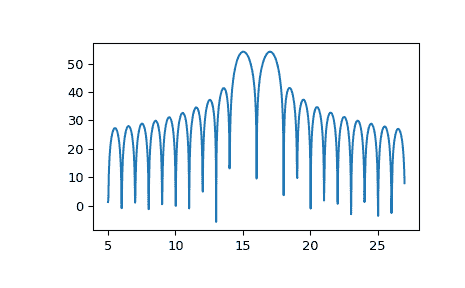

# `scipy.signal.zoom_fft`

> 原文链接：[`docs.scipy.org/doc/scipy-1.12.0/reference/generated/scipy.signal.zoom_fft.html#scipy.signal.zoom_fft`](https://docs.scipy.org/doc/scipy-1.12.0/reference/generated/scipy.signal.zoom_fft.html#scipy.signal.zoom_fft)

```py
scipy.signal.zoom_fft(x, fn, m=None, *, fs=2, endpoint=False, axis=-1)
```

仅计算范围在 *fn* 中的频率的 *x* 的 DFT。

参数：

**x**：数组

要变换的信号。

**fn**：类似数组

长度为 2 的序列 [*f1*, *f2*] 给出频率范围，或者一个标量，其中假设范围为 [0, *fn*]。

**m**：整数，可选

要评估的点数。默认为 *x* 的长度。

**fs**：浮点数，可选

采样频率。例如，如果 `fs=10` 表示 10 kHz，那么 *f1* 和 *f2* 也应该以 kHz 表示。默认采样频率为 2，因此 *f1* 和 *f2* 应在 [0, 1] 范围内以保持变换低于奈奎斯特频率。

**endpoint**：布尔值，可选

如果为 True，*f2* 是最后一个样本。否则，不包括它。默认为 False。

**axis**：整数，可选

计算 FFT 的轴。如果未给出，则使用最后一个轴。

返回：

**out**：ndarray

转换后的信号。傅里叶变换将在点 f1, f1+df, f1+2df, …, f2 处计算，其中 df=(f2-f1)/m。

另请参阅

`ZoomFFT`

创建一个可调用的部分 FFT 函数的类。

注意事项

默认选择这样，使得 `signal.zoom_fft(x, 2)` 等价于 `fft.fft(x)`，如果 `m > len(x)`，那么 `signal.zoom_fft(x, 2, m)` 等价于 `fft.fft(x, m)`。

要绘制结果变换的幅度图，请使用：

```py
plot(linspace(f1, f2, m, endpoint=False), abs(zoom_fft(x, [f1, f2], m))) 
```

如果需要重复变换，请使用 `ZoomFFT` 构建一个专门的变换函数，可以在不重新计算常数的情况下重复使用。

示例

要绘制变换结果，请使用类似以下的方法：

```py
>>> import numpy as np
>>> from scipy.signal import zoom_fft
>>> t = np.linspace(0, 1, 1021)
>>> x = np.cos(2*np.pi*15*t) + np.sin(2*np.pi*17*t)
>>> f1, f2 = 5, 27
>>> X = zoom_fft(x, [f1, f2], len(x), fs=1021)
>>> f = np.linspace(f1, f2, len(x))
>>> import matplotlib.pyplot as plt
>>> plt.plot(f, 20*np.log10(np.abs(X)))
>>> plt.show() 
```


