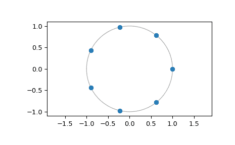

# `scipy.signal.CZT`

> 原文：[`docs.scipy.org/doc/scipy-1.12.0/reference/generated/scipy.signal.CZT.html#scipy.signal.CZT`](https://docs.scipy.org/doc/scipy-1.12.0/reference/generated/scipy.signal.CZT.html#scipy.signal.CZT)

```py
class scipy.signal.CZT(n, m=None, w=None, a=1 + 0j)
```

创建一个可调用的啁啾变换函数。

转换以计算螺旋周围的频率响应。此类对象是可调用的，可以在其输入上计算啁啾变换。此对象预先计算给定变换中使用的恒定啁啾。

参数：

**n**int

信号的大小。

**m**int，可选

所需的输出点数。默认为*n*。

**w**complex，可选

每个步骤中点之间的比例。这必须是精确的，否则累积误差将降低输出序列的尾部。默认为整个单位圆周围均匀分布的点。

**a**complex，可选

复平面中的起始点。默认为 1+0j。

返回：

**f**CZT

用于在*x*上计算啁啾变换的可调用对象`f(x, axis=-1)`。

另请参见

`czt`

用于快速计算 CZT 的便利函数。

`ZoomFFT`

创建可调用的部分 FFT 函数的类。

注意事项

默认值选为使`f(x)`等同于`fft.fft(x)`，如果`m > len(x)`，则使`f(x, m)`等同于`fft.fft(x, m)`。

如果*w*不位于单位圆上，则变换将围绕指数增长半径的螺旋进行。无论如何，角度将线性增加。

对于位于单位圆上的变换，当使用`ZoomFFT`时，精度更高，因为*w*中的任何数值误差在长数据长度上累积，偏离单位圆。

与等效零填充 FFT 相比，啁啾变换可能更快。尝试使用您自己的数组大小进行测试。

然而，啁啾变换的精度明显低于等效的零填充 FFT。

由于此 CZT 使用 Bluestein 算法实现，因此可以在 O(N log N)时间内计算大素数长度的傅里叶变换，而不是直接 DFT 计算所需的 O(N**2)时间。(`scipy.fft`也使用 Bluestein 的算法。)

（“啁啾变换”名称来自 Bluestein 算法中使用的啁啾。它不像其他带有“啁啾”名称的变换那样将信号分解为啁啾。）

参考文献

[1]

Leo I. Bluestein，“离散傅里叶变换计算的线性滤波方法”，东北电子研究与工程会议记录 10，218-219（1968）。

[2]

Rabiner、Schafer 和 Rader，“啁啾变换算法及其应用”，贝尔系统技术杂志 48，1249-1292（1969）。

示例

计算多个素数长度 FFT：

```py
>>> from scipy.signal import CZT
>>> import numpy as np
>>> a = np.random.rand(7)
>>> b = np.random.rand(7)
>>> c = np.random.rand(7)
>>> czt_7 = CZT(n=7)
>>> A = czt_7(a)
>>> B = czt_7(b)
>>> C = czt_7(c) 
```

显示计算 FFT 的点：

```py
>>> czt_7.points()
array([ 1.00000000+0.j        ,  0.62348980+0.78183148j,
 -0.22252093+0.97492791j, -0.90096887+0.43388374j,
 -0.90096887-0.43388374j, -0.22252093-0.97492791j,
 0.62348980-0.78183148j])
>>> import matplotlib.pyplot as plt
>>> plt.plot(czt_7.points().real, czt_7.points().imag, 'o')
>>> plt.gca().add_patch(plt.Circle((0,0), radius=1, fill=False, alpha=.3))
>>> plt.axis('equal')
>>> plt.show() 
```



方法

| `__call__`(x, *[, axis]) | 计算信号的奇异变换。 |
| --- | --- |
| `points`() | 返回进行奇异变换的点的位置。 |
