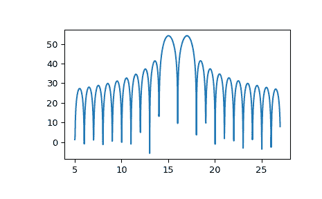

# `scipy.signal.ZoomFFT`

> 原文：[`docs.scipy.org/doc/scipy-1.12.0/reference/generated/scipy.signal.ZoomFFT.html#scipy.signal.ZoomFFT`](https://docs.scipy.org/doc/scipy-1.12.0/reference/generated/scipy.signal.ZoomFFT.html#scipy.signal.ZoomFFT)

```py
class scipy.signal.ZoomFFT(n, fn, m=None, *, fs=2, endpoint=False)
```

创建一个可调用的变焦 FFT 变换函数。

这是圆周单位周围等间距频率的啁啾变换（[`CZT`](https://docs.scipy.org/doc/scipy-1.12.0/reference/generated/scipy.signal.CZT.html#scipy.signal.CZT)）的特化，用于比计算整个 FFT 并截断更有效地计算 FFT 的一部分。

参数：

**n**整数

信号的大小。

**fn**类似数组

长度为 2 的序列[*f1*, *f2*]表示频率范围，或者标量，假定范围[0, *fn*]。

**m**整数，可选

评估点数。默认为*n*。

**fs**浮点数，可选

采样频率。例如，如果`fs=10`表示 10 kHz，则*f1*和*f2*也应以 kHz 为单位。默认的采样频率为 2，因此*f1*和*f2*的范围应在[0, 1]之间，以使变换保持在奈奎斯特频率以下。

**endpoint**布尔值，可选

如果为 True，则*f2*为最后一个样本。否则，不包括在内。默认为 False。

返回：

**f**ZoomFFT

可调用对象`f(x, axis=-1)`用于计算*x*上的变焦 FFT。

另请参阅

[`zoom_fft`](https://docs.scipy.org/doc/scipy-1.12.0/reference/generated/scipy.signal.zoom_fft.html#scipy.signal.zoom_fft)

用于计算变焦 FFT 的便捷函数。

注：

默认设置使得`f(x, 2)`等同于`fft.fft(x)`，如果`m > len(x)`，那么`f(x, 2, m)`等同于`fft.fft(x, m)`。

采样频率是信号*x*中样本之间的时间步长的倒数。单位圆对应从 0 到采样频率的频率。默认的采样频率为 2，因此*f1*和*f2*的值应在范围[0, 1)内，以保持变换在奈奎斯特频率以下。

请记住，变焦 FFT 只能插值现有 FFT 的点。它无法帮助解决两个分开的附近频率。只能通过增加采集时间来增加频率分辨率。

这些函数使用 Bluestein 算法实现（就像[`scipy.fft`](https://docs.scipy.org/doc/scipy-1.12.0/reference/fft.html#module-scipy.fft)一样）。[[2]](#r60ab76173d0a-2)

参考文献

[1]

Steve Alan Shilling，“啁啾变换及其应用研究”，第 29 页（1970 年）[`krex.k-state.edu/dspace/bitstream/handle/2097/7844/LD2668R41972S43.pdf`](https://krex.k-state.edu/dspace/bitstream/handle/2097/7844/LD2668R41972S43.pdf)

[[2]](#id1)

Leo I. Bluestein，“离散傅立叶变换的线性滤波方法”，东北电子研究与工程会议记录第 10 卷，218-219 页（1968 年）。

示例

要绘制变换结果，请使用类似以下的内容：

```py
>>> import numpy as np
>>> from scipy.signal import ZoomFFT
>>> t = np.linspace(0, 1, 1021)
>>> x = np.cos(2*np.pi*15*t) + np.sin(2*np.pi*17*t)
>>> f1, f2 = 5, 27
>>> transform = ZoomFFT(len(x), [f1, f2], len(x), fs=1021)
>>> X = transform(x)
>>> f = np.linspace(f1, f2, len(x))
>>> import matplotlib.pyplot as plt
>>> plt.plot(f, 20*np.log10(np.abs(X)))
>>> plt.show() 
```



方法

| [`__call__`](https://docs.scipy.org/doc/scipy/reference/generated/scipy.signal.ZoomFFT.__call__.html#scipy.signal.ZoomFFT.__call__) (x, *[, axis]) | 计算信号的奇异变换。 |
| --- | --- |
| [`points`](https://docs.scipy.org/doc/scipy/reference/generated/scipy.signal.ZoomFFT.points.html#scipy.signal.ZoomFFT.points)() | 返回进行奇异变换计算的点。 |
